# Baekjoon
## 백준 도전 中
# 2023-10-06 Friday(1)
* 24262 '알고리즘 수업 - 알고리즘의 수행 시간 1' 문제
    + 상수 나누기 하는 알고리즘의 수행 시간을 구하는 문제이다.
+ 수행 횟수는 1번이고 최고차항은 0이다.
+ 논문 쓰느라 쉬운문제를 풀었다.
***

<br>

# 2023-10-05 Thursday(1)
* 2503 '숫자 야구' 문제
    + 숫자 야구 게임을 코드로 구현해서 정답 가능성이 있는 답의 총 개수를 출력하는 문제이다.
+ 이 문제의 핵심인 각 자리 숫자의 값을 구해주는게 핵심이다.
```
gameData[cnt][0] = i * 100 + j * 10 + k;
```
+ 이제 이 문제를 배열을 쓰지 않고 구현 할 예정이다.
***

<br>

# 2023-10-04 Wednesday(1)
* 1402 '아무래도이문제는A번난이도인것같다' 문제
    + 두 숫자를 준다.
    + 각 A 와 B라고 할 때
    + A가 B가 될 수 있는지 판별하는 문제이다.
+ 1과 -1의 조합으로 어떤 B라도 만들 수 있기 때문에 정답은 yes이다.
***

<br>

# 2023-10-03 Tuesday(1)
* 6321 'IBM 빼기 1' 문제
    + 문자열을 입력으로 넣으면 아스키 코드 상으로 +1 된 문자열을 출력한다.
    + 예를 들어 HAL --> IBM 출력

+ size_t는 C언어에서 사용되는 데이터 타입 중 하나로, 양의 정수 값을 나타내느데 사용됩니다.
+ 문자열 함수에서 사용하여 문자열의 길이를 저장했다.
```
size_t length = strlen(str);
```
+ 이 함수는 Z가 들어왔을 때 다시 A로 돌리는 코드이다.
```
if (str[i] == 90)
    save[i] = str[i] - 25;
```
***

<br>

# 2023-10-02 Monday(1)
* 16431 '베시와 데이지' 문제
    + 
    + 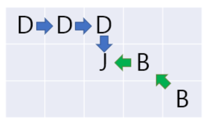
    + D, B, J 좌표가 주워질 때 D, B 중에 먼저 J에 도착하는지 구하는 문제이다.
+ D는 상하좌우만 움직일 수 있기 때문에 J의 x,y와 D의 x,y 좌표를 각각 빼고 다시 합쳐 주면 거리가 나온다.
+ B는  J의 x,y와 B의 x,y 좌표를 각각 빼고 둘중에 값이 큰게 거리가 된다.
+ 거리를 비교해서 답을 출력하면 된다.
+ 함수를 사용했다.
+ 삼항연산자를 사용했다.
```
return (x >= y) ? x : y;
```
***

<br>

# 2023-10-01 Sunday(1)
* 3029 '경고' 문제
    + 현재 시간과 폭탄을 던지는 시간 사이의 시간을 구하는 문제이다.
    + 적어도 1초는 기다린다.
+ 배열로 입력을 받았다.
+ 두 시간때가 같은지 검사를 하였다.
+ 같으면 하루를 더해 주었다.
```
for (int j = 0; j <= 2; j++) {
    if (now[j] == na[j])
        cnt++;
}
if (cnt == 3) {
    na[0] += 24;
}
```
+ 시는 24을 더해주고, 나머지는 60을 더해주었다.
+ 00:00:00 형태로 만들어 주었다.
```
printf("%02d:%02d:%02d", time[0], time[1], time[2]);
```
***

<br>

# 2023-09-30 Saturday(1)
* 1343 '폴리오미노' 문제
    + X로 만 이루어진 문자열을 주어졌을 때
    + A와 B로 덮어씌워서 새로운 문자열을 만들어야 한다.
    + 이때 AAAA와 BB 만 쓸 수 있다.
+ replace 함수를 사용해서 문자를 대체하여 문제를 풀었다.
```
S = S.replace('XXXX','AAAA')
S = S.replace('XX', 'BB')
```
+ 새 문자열 = 이전 문자열.replace(대체 될 문자열, 대체 할 문자열, 몇번 할지)
***

<br>

# 2023-09-29 Friday(1)
* 27323 '직사각형' 문제
    + 두 변의 길이를 주고 직사각형의 넓이를 출력하는 문제이다.
+ 오늘은 추석이다.
+ 그래서 쉬운 문제풀고 간다.
***

<br>

# 2023-09-28 Thursday(1)
* 28278 '스택2' 문제
    + 1 X: 정수 X를 스택에 넣는다. (1 ≤ X ≤ 100,000)
    + 2: 스택에 정수가 있다면 맨 위의 정수를 빼고 출력한다. 없다면 -1을 대신 출력한다.
    + 3: 스택에 들어있는 정수의 개수를 출력한다.
    + 4: 스택이 비어있으면 1, 아니면 0을 출력한다.
    + 5: 스택에 정수가 있다면 맨 위의 정수를 출력한다. 없다면 -1을 대신 출력한다.
+ C언어로 스택이 뭐가 필요한지는 알겠는데 구현하기가 어렵다.
***

<br>

# 2023-09-27 Wednesday(1)
* 2721 '삼각수의 합'
  + k x T(n) 구한 값을 출력하는 문제이다.
+ T(n)은 삼각수의 합 공식이다.
+ n x (n+1) / 2
***

<br>

# 2023-09-26 Tuesday(1)
* 25206 '너의 평점은' 문제
    + 과목명, 학점, 등급이 주워질 때
    + 전공 평점을 출력한다.
+ 배열로 선언한 문자열은 &을 붙이지 않는다.
```
scanf("%s %lf %s", subject, &num, grade);
```
+ A+, B+ 등 +는 0.5점으로 동일 하니까 전부 다 등급을 만들지 않고 한번만 해준다.
```
if (grade[0] == 65)
        temp = 4;
    else if (grade[0] == 66)
        temp = 3;
    else if (grade[0] == 67)
        temp = 2;
    else
        temp = 1;

if (grade[1] == 43) {
    temp += 0.5;
}
```
***

<br>

# 2023-09-25 Monday(1)
* 27110 '특식 배부' 문제
    + 후라이드, 양념, 간장 총 3가지 맛이 있을 때
    + 치킨 시킬 수 있는 마리 수 보다 작으면 그냥 시키면되고
    + 마리 수 보다 크면 시킬 수 있는 마리만 시킨다.
    + 총 시킬 수 있는 치킨의 마리 수를 출력하는문제이다.

+ 배열로 입력을 받아서 하였다.
+ 3개의 입력을 받으면 과정이 길어질것 같아서이다. 
```
scanf("%d %d %d", &a[0], &a[1], &a[2]);

for (int i = 0; i < 3; i++) {
    if (a[i] <= chicken) {
        sum += a[i];
    }
    else {
        sum += chicken;
    }
}
```
***

<br>

# 2023-09-24 Sunday(1)
* 13985 'Equality' 문제
    + 1 + 2 = 3이라는 문자열이 주워질 때
    + 이 식이 맞는지 판단하여 출력하는 문제이다.
+ fgets을 이용하여 버퍼 오버플로우를 방지하고
+ sscanf를 이용하여 입력을 쉽게 파싱하고 필요한 데이터를 추출 할 수 있다.
```
    fgets(input, sizeof(input), stdin);

    sscanf(input, "%d + %d = %d", &a, &b, &c);
```
***

<br>

# 2023-09-23 Saturday(1)
* 10769 '행복한지 슬픈지' 문제
    + 문자열에 :-) 와 :-( 의 개수 차이로 happy, sad, none, unsure 찾는 문제이다.
+ .count() 함수를 이용하여 쉽게 카운터를 하였다.
```
happy = S.count(":-)")
sad = S.count(":-(")
```
***

<br>

# 2023-09-22 Friday(1)
* 5217 '쌍의 합' 문제
    + 예를 들어 3을 만들 수 있는 숫자는 1과 2
    + 5는 1과 4, 2와 3이 있다.
    + 각 수가 주워질 때 관련된 짝을 구하는 문제이다.
***

<br>

# 2023-09-21 Thusday(1)
* 29751 '삼각형' 문제
  + 밑변과 높이가 주워질 때 넓이를 출력하는 문제이다.
***

<br>

# 2023-09-20 Wednesday(1)
* 13136 'Do Not Touch Anything' 문제
	+ 가로, 세로, CCTV 수용 범위가 주워질 때 최소 몇개의 CCTV가 필요한지 출력하는 문제이다.
+ 구하는 공식이다.
```
a = R//N + 1 if R%N else R//N
b = C//N + 1 if C%N else C//N
```
***
# 2023-09-19 Tuesday(1)
* 6378 '디지털 루트' 문제
    + 예를 들어 24 가 있을 때 2 + 4 = 6을 출력하고
    + 예를 들어 39 가 있을 때는 3 + 9 = 12 --> 1 + 2 = 3을 출력한다.
    + 1 자리 수가 나올 때 까지 위와 같은 과정을 반복하는 문제이다.
+ 구하는 코드
```
while (root >= 10) {
    root = root / 10 + root % 10;
}
```
***

<br>

# 2023-09-18 Monday(1)
* 5789 '한다 안한다' 문제
    + 0과 1로 구성된 문자열이 있다.
    + 이 문자열의 길이는 짝수로 되어있다.
    + 양 끝에서 숫자를 제거하면서 마지막 가운데 쌍이 같은지 다른지 판별하는 문제이다.
+ 문자열의 가운데 쌍을 찾는 코드이다.
```
A = int(len(number)/2 - 1)
B = int(len(number)/2)
```
***

<br>

# 2023-09-17 Sunday(1)
* 4766 '일반 화학 실험' 문제
    + 현재 온도 - 이전온도 값을 출력하는 문제이다.
+ 소수 2째 자리까지 구하는 방법이다.
```
printf("%.2f\n", temperature - temp);
```
***

<br>

# 2023-09-16 Saturday(1)
* 2667 '단지번호붙이기' 문제
    + 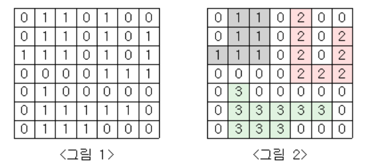
    + 크게 구역을 구하고
    + 각 구역마다 몇 개의 1이 확인하고 출력하는 문제이다.
+ dfs를 사용하였다.
+ 해당 행렬이 1이라면 0으로 저장해서 방문 표시를 한다.
```
if (graph[x][y] == 1) {
    graph[x][y] = 0;
    count++;
```
+ 4방향 중 어디로 이동할지 정하는 코드인데 정확하게 이해를 못했다.
```
for (int i = 0; i < 4; i++) {
    dfs(x + dx[i], y + dy[i]);
}
```
***

<br>

# 2023-09-15 Friday(0)
* 393일 동안 이어졌던 문제 풀기가 끊어졌다.
* DFS공부 끝내고 문제 풀이 없이 운동하러 갔다.
* 끊어져서 너무 아쉽다.
***

<br>

# 2023-09-14 Thursday(1)
* 7510 '고급 수학' 문제
    + 세 수를 입력 받아 직각 삼각형인지 판별하는 문제이다.
+ 세 수를 정렬하여 피타고라스 법칙을 사용하면된다.
***

<br>

# 2023-09-13 Wednesday(1)
* 2606 '바이러스' 문제
    + 그래프가 주워진다.
    + 1번 그래프와 연결된 노드를 카운터해서 출력하는 문제이다.
+ 연결된 노드들은 1로 만든다.
```
scanf("%d %d", &x, &y); // 방문한 노드들은 1로 만들기
a[x][y] = 1;
a[y][x] = 1;
```
+ 연결안된 노드들은 0으로 만든다.
```
for(int i = 1; i <= computer; i++){    
    for(int j = 1; j <= computer; j++){
        if (a[i][j] != 1)
            a[i][j] = 0;    // 방문하지 않는 노드들은 0으로 만들기
    }
}
```
+ 1번 컴퓨터는 제외한 노드들에 대해서 탐색한다.
```
for(int k = 2; k <= computer; k++){
    if(visit[k] == 1)
        ans++;
}
```
+ 연결되어있고 방문하지 않으면 dfs 탐색을 한다.
+ 탐색을 하면서 방문한 노드는 1로 처리한다.
```
int visit[SIZE];
int a[SIZE][SIZE];

void dfs(int start, int n){
    if(visit[start] == 1)
        return;
    visit[start] = 1;

    for(int i = 0; i <= n; i++){
        if(a[start][i] == 1 && visit[i] != 1)
            dfs(i, n);
    }
}
```
***

<br>

# 2023-09-12 Tuesday(1)
* 11024 '더하기 4' 문제
    + 공백으로 띄워진 여러 숫자를 한 줄에 받는다.
    + 이 숫자들을 다 더해서 출력하는 문제이다.
+ 1 2 3 4 5 들어오는 값들을 받을 때 사용한다.
```
arr = list(map(int, input().split()))
```
***

<br>

# 2023-09-11 Monday(1)
* 2804 '크로스워드 만들기' 문제
    + 두 문자열을 주는데 서로 겹치는 문자를 기준으로 가로 세로 크로스 시킨다.
    + 빈 공간은 . 을 이용해서 채우고 출력하는 문제이다.
+ 낱말 퀴즈 생각하면된다.
+ 전부 . 으로 빈공간 채운다.
```
arr = [['.'] * N for _ in range(M)]
```
+ 교차하는거 표현
```
for i in range(N):
    puzzle[row][i] = A[i]

for i in range(M):
    puzzle[i][col] = B[i]
```
***

<br>

# 2023-09-10 Sunday(1)
* 9933 '민균이의 비밀번호' 문제
    + 여러 문자열을 주는데 문자열을 뒤집었을 때 주워진 문자열과 같으면 문자열의 길이와 가운데 문자를 출력하는 문제이다.

+ 길이를 체크하고, 뒤집어서 문자열이 같은지 비교한다.
```
if len(word[i]) == len(word[j]) and word[i][::-1] == word[j]:
```
+ 문자열 길이와 가운데 문자를 출력한다.
```
print(len(word[i]), word[i][int(len(word[i])/2)])
```
***

<br>

# 2023-09-09 Saturday(1)
* 24267 '알고리즘 수업 - 알고리즘의 수행시간6' 문제
    + 반복문이 3개인 수식을 작성하고
    + 최고차항의 차수 3을 출력하면 되는 문제이다.

***

<br>

# 2023-09-08 Friday(1)
* 10093 '숫자' 문제
    + 두 숫자 사이에 몇 개의 숫자가 있는지 출력하고, 어떤 숫자들이 있는지 오름차순으로 출력하는 문제이다.

+ 두 정수의 크기를 비교해서 큰 숫자가 뒤로가게 만들어야한다.
```
if a > b:
    temp = a
    a = b
    b = temp
```
+ 두 정수 사이를 카운터하고 문자열로 저장한다.
```
for i in range(a+1, b):
    cnt += 1
    arr.append(str(i))
```
+ 숫자 사이들의 빈공간을 주기 위해서 공백을 준다.
```
print(' '.join(arr))
```
***

<br>

# 2023-09-07 Thursday(1)
* 6996 "애너그램" 문제
    + 두 문자열을 입력 받고 정렬 해준다.
    + 정렬한 문자열을 같은지 비교하여 애너그램인지 판별하는 문제이다.

+ 두 리스트를 비교하면 된다.
```
    x = sorted(list(a))
    y = sorted(list(b))

    if x == y:
        print("%s & %s are anagrams." %(a, b))
    else:
        print("%s & %s are NOT anagrams." %(a, b))
```
# 2023-09-06 Wednesday(1)
* 2563 '색종이' 문제
    + 두 좌표를 통해 사각형을 그린다.
    + 사각형이 겹칠 수 있다.
    + 총 사각형의 넓이를 구하는 문제이다.

+ 2차원 배열을 선언한다.
```
arr = [[0 for _ in range(101)] for _ in range(101)]
```
+ 좌표를 하나 씩 읽으면서 해당하는 곳에 1을 넣는다.
```
    for row in range(x, x+10):
        for col in range(y, y+10):
            arr[row][col] = 1
```
***

<br>

# 2023-09-05 Tuesday(1)
* 14920 '3n+1'문제
    + 짝수일 때는 n = n / 2
    + 홀수일 때는 n = 3 * n + 1
    + n값이 1의 값이 몇 번 만에 나오는지 카운트 하여 출력하는 문제이다.
+ 짝수 홀수를 조건문으로 나눠서 하면 된다.
***

<br>

# 2023-09-04 Monday(1)
* 9655 '돌 게임' 문제
    + 두명에선 번갈아 가면서 1개 또는 3개의 돌을 가지고 갈 수 있다.
    + 주워진 숫자가 주워질 때 누가 이기는지 출력하는 문제이다.
+ 홀수가 먼저 시작하기 때문에 주워진 숫자가 홀수면 홀수가 이긴다.
+ 나머지가 0이면 짝수가 이긴다.
```
if N % 2 == 0:
    print("CY")
else:
    print("SK")
```
***

<br>

# 2023-09-03 Sunday(1)
* 11053 '가장 긴 증가하는 부분 수열' 문제
    + 수열 A가 주어졌을 때
    + 가장 긴 증가하는 부분 수열을 구하는 문제이다.
+ 수열 A를 1로 초기화
```
dp = [1] * N
```
+ 순회하면서 둘중에 큰 값이 dp에 저장된다.
```
if A[i] > A[j]:
    dp[i] = max(dp[i], dp[j]+1)
```
+ 다이나믹 프로그래밍 알고리즘에서 사용되는 부분이다.
+ 가장 긴 증가하는 부분수열(Longest Increasing Subsequence, LIS)을 찾는 것이다.
***

<br>

# 2023-09-02 Saturday(1)
* 1764 '듣보잡' 문제
    + 들어본적 없는 사람과 본적없는 사람의 명단을 준다.
    + 들어본적도 없고 본적도 없는 사람이 몇명이고, 누구인지 출력하는 문제이다.

+ 각 각 set() 함수를 통해 중복을 제거 하고 두 리스트 합쳐준다.
+ 합친 리스트를 정렬한다.
```
result = sorted(list(set(L) & set(V)))
```
+ ["A", "B"] 이런 형식을 A \n B 형식으로 해준다.
```
for i in result:
    print(i)
```
+ 처음에는 반복문 2개를 이용하여 비교하였는데 시간복잡도 O(N^2)이라 시간초과 되었다.
***

<br>

# 2023-09-01 Friday(1)
* 2526 '싸이클' 문제
    + N, P 두 수를 준다.
    + N * N % P = temp를 반복해서 N * temp % P를 한다.
    + 여러번 하다 보면 싸이클이 생길건데 몇번 만에 나오는지 출력하는 문제이다.

+ 배열안에 나머지 값을 넣어서 같은 값이 올 때 반복문을 종료하고 출력하는 코드이다.
```
    if N_temp in arr:
        print(len(arr) - arr.index(N_temp))
        break

    arr.append(N_temp)
```
***

<br>

# 2023-08-31 Thursday(1)
* 5635 '생일' 문제
    + "이름 dd mm yyyy" 이런 형식으로 여러 명을 줄 때
    + 가장 나이 많은 사람과 나이가 적은 사람을 출력하는 문제이다.

+ 이름과 생년월일을 구분했다.
```
    temp1 = input()
    temp2 = temp1.split()

    Name = temp2[0]
    year = temp2[3]
    month = temp2[2]
    day = temp2[1]
```
+ 1월을 01로 1일을 01로 수정한다.
```
    if len(month) == 1:
        month = '0' + month
    if len(day) == 1:
        day = '0' + day
```
+ 문자열을 다 더해서 하나의 값 처럼 활용한다.
```
Number = year + month + day
```
+ 딕셔너리를 활용하여 이름과 생년월일을 같이 묶어서 활용하였다.
```
data = {}

data[Number] = Name

max_data = max(data.keys())
min_data = min(data.keys())

max_name = data[max_data]
min_name = data[min_data]
```
***

<br>

# 2023-08-30 Wednesday(1)
* 1389 '케빈 베이컨의 6단계 법칙' 문제
    + 사람 6명을 거치면 지구에 있는 모든 사람을 연결할 수 있다. 라는 문제이다.
    + 두 수가 주워지는 데 두 수는 서로 친구이다.
    + 친구에 친구 처럼 단계를 거칠 때 가장 작은 단계 수를 출력하는 문제이다.

+ bfs를 활용한다.
+ 친구를 확인하고 탐색하지 않은 친구는 탐색하고 방문 표시를 한다.
```
for i in graph[target]:
            if not visited[i]:
                visited[i] = visited[target] + 1
                queue.append(i)
```
***

<br>

+ 탐색 횟수를 체크한다.
# 2023-08-29 Tuesday(1)
* 2628 '햄버거 만들기' 문제
    + 빵과 패티 수를 준다.
    + 햄버거를 만들기 위해서는 빵 2개 패티 1개가 필요하다.
    + 최대 만들수 있는 햄버거 수를 구하여라

+ 빵의 수를 받고 나누기 2를 하여서 하나로 취급한다.
+ 아래 조건을 이용해서 만들수 있는 수량을 출력한다.
```
if bread >= meat:
    print(meat)
else:
    print(bread)    
```

<br>

***
# 2023-08-28 Monday(1)
* 1003 '피보나치 함수' 문제
    + 특정 N값이 주워질 때 피보나치 수열에서 N값 까지 0과 1을 몇 개 사용했는지 출력하는 문제이다.
+ 피보나치 수열에서 0과 1을 저장할 배열을 선언하고 0 (1,0)과 1 (0,1)을 따로 저장한다.
```
    int fibonacci[41][2];

    fibonacci[0][0] = 1;
    fibonacci[0][1] = 0;

    
    fibonacci[1][0] = 0;
    fibonacci[1][1] = 1;
```
+ 특정 N값 까지 구한게 아니라 전부 다 구해놓고 배열에 저장해둔다.
```
    for (int i = 2; i < 41; i++)
    {
        fibonacci[i][0] = fibonacci[i-1][0] + fibonacci[i-2][0];
        fibonacci[i][1] = fibonacci[i-1][1] + fibonacci[i-2][1];
    }
```
+ N 값이 들어오면 배열에 저장된 값을 출력한다.
```
    printf("%d %d\n", fibonacci[N][0], fibonacci[N][1]);
```
***

<br>

# 2023-08-27 Sunday(1)
* 11942 '고려대는 사랑입니다' 문제
    + 고려대학교만 출력하면 되는 문제이다.

***

<br>

# 2023-08-26 Saturday(1)
* 6778 'Which Alien?' 문제
    + 안테나 수와 외계인의 눈의 개수를 입력으로 준다.
    + 조건에 따라 외계인의 출신지가 다르다.
    - 최소 3개의 안테나와 최대 4개의 눈이 달린 트로이 화성인
    - 최대 6개의 안테나와 최소 2개의 눈이 달린 블라드 토성인
    - 최대 2개의 안테나와 최대 3개의 눈이 달린 그래미 수성인

+ 조건이 최대, 최소 혼란 스러웠다.
```
if antenna >= 3 and eye <= 4:
    print("TroyMartian")

if antenna <= 6 and eye >= 2:
    print("VladSaturnian")
    
if antenna <= 2 and eye <= 3:
    print("GraemeMercurian")
```
+ 휴가 가기전 쉬운거 클리어 하고 간다. ㅎㅎ
+ 이제 휴가가야지
***

<br>

# 2023-08-25 Friday(1)
* 25191 '치킨댄스를 추는 곰곰이를 본 임스' 문제
    + 치킨 수와 콜라, 맥주의 개수가 주워졌을 때 치킨을 최대 수를 출력하는 문제이다.

+ a//2+b 이 식만 활용하면 된다.
***

<br>

# 2023-08-24 Thursday(1)
* 15964 '이상한 기호' 문제
    + 두 수를 입력 받아 (A+B)×(A-B) 이 식이 들어있는 함수를 선언하여 결과값을 출력하는 문제이다.
+ 서브데스크2를 충족 시키기 위해서 데이터 타입을 double을 사용하였다.
***

<br>

# 2023-08-23 Wednesday(1)
* 1408 '24' 문제
    + 두 시간의 차를 구하는 문제이다.
+ 두 시간 중 어디가 큰 지 확인하는 코드이다.
```
time = h2 * 3600 + m2 * 60 + s2 - (h1 * 3600 + m1 * 60 + s1);
```
+ 만약 두번째 시간대가 첫번째 시간대보다 작으면 하루를 더해준다.
```
if time < 0:
    time += 3600 * 24
```
+ 00:00:00 두자리 수를 표현 할 때 사용한다.
```
print(f"{h:02d}:{m:02d}:{s:02d}")
```
+ 00:00:00 입력 받을 때 정수만 분리하는 방법이다.
```
h1, m1, s1 = map(int, input().split(":"))
```
***
+ C언어에서 00:00:00 입력 받을 때 정수만 분리하는 방법이다.
```
    scanf("%8s", input);
    sscanf(input, "%d:%d:%d", &d, &e, &f);
```
+ 00:00:00 두자리 수를 표현 할 때 사용한다.
```
printf("%02d:%02d:%02d", g, h, i);
```

<br>

# 2023-08-22 Tuesday(1)
* 9095 '1, 2, 3 더하기' 문제
    + 예를 들어 1, 2, 3을 가지고 4를 만드는 방법은 총 7가지이다.
    + 다른 수가 주워질 때 1, 2, 3을 가지고 만들 수 있는 총 가지 수를 출력하는 문제이다.

+ 다이내믹 프로그래밍 문제로 규칙을 찾아야 하는 문제이다.
+ 이 개념을 배울 때 피보나치로 배웠는데 그 때는 이미 계산된 값 2개를 활용했는데 이번에는 3개를 활용하는 문제였다.

+ 규칙은 f(n) = f(n-1) + f(n-2) + f(n-3) 이다.

***

<br>

# 2023-08-21 Monday(1)
* 15781 '헬멧과 조끼' 문제
    + 여러 개의 헬멧 방어력과 조끼 방어력이 있을 때
    + 두개의 최대값을 구하여 총 방어력을 출력하는 문제이다.

+ 1 2 3 4 5 이런 입력값을 배열로 받고 싶을 때 사용
```
    for (int i = 0; i < N; i++)
    {
        scanf("%d", &halmet[i]);
        //getchar();
    }
```
+ 배열에서 max 값을 찾는 방법
```
    for (int H = 0; H < N; H++)
    {
        if (halmet[H] > H_max)
            H_max = halmet[H];
    }
```
+ 파이썬이였으면 간단하게 풀었을 문제를 C로 풀려고 하니까 어렵다.
***

<br>

# 2023-08-20 Sunday(1)
* 1991 '트리순회' 문제
    + 트리가 주워지고 전위, 중위, 후위 순회하여 출력하는 문제이다.

+ 트리의 구조체를 만드는 방법이다.
```
typedef struct Node
{
    char ele;
    struct Node *left;
    struct Node *right;
}Node;
```
+ 전위 순회 할 수 있게 하는 코드이다. 다른 순회는 전위의 순서를 바꿔서 구성하면 된다.
```
void print_pre(Node *H)
{
    if (H != NULL)
        printf("%c", H -> ele);
    if (H -> left != NULL)
        print_pre(H -> left);
    if (H -> right != NULL)
        print_pre(H -> right);
}
```
+ 트리 공부를 하고 C언어로 제출 하였다.
+ C언어가 기억나지 않고, 어려워서 코드를 참고하였다. [코드참고](https://evga7.tistory.com/35)
***

<br>

# 2023-08-19 Saturday(1)
* 5397 '키로거' 문제
    + "<<BP<A>>Cd-" 이런 문자열을 줄때 <, > 이거는 커서이고 - 는 문자를 빼는 기호이다.
    + 최종적으로 나오는 문자열을 출력하는 문제이다.

+ 커서이동은 pop과 append를 잘 활용하면 된다.
```
    for I in enter:
        if I == "<":
            if letter:
                symbol.append(letter.pop())
                #print(letter)
                #print(symbol)
        
        elif I == ">":
            if symbol:
                letter.append(symbol.pop())

        elif I == "-":
            if letter:
                letter.pop()

        else:
            letter.append(I)
``` 
+ 연결 리스트를 공부하고 풀려고 했는데 스택으로 풀었다.
+ 이렇게 푸는건지 모르겠다.
***

<br>

# 2023-08-18 Friday(1)
* 20053 '최소, 최대2' 문제
    + 주워진 숫자들 중에서 최솟값과 최댓값을 출력하면되는 문제이다.
+ 입력하는 숫자들을 리스트로 받고 리스트 안에서 min함수와 max함수를 활용하여 풀면된다.
***

<br>


<br>

***
# 오늘은 백준 문제를 시작한지 365일이 되는 날이다.

<br>

# 2023-08-17 Thursday(1)
* 16815 'Star in Parentheses' 문제
    + 문자열 구조과 (*) 이렇게 되어있을 때 마다 카운트 하여 출력하는 문제이다.
+ 문자열 리스트로 받아서 반복문을 활용한다.
+ ( 와 * 는 스택에 담는다.
+ ( ) 연속으로 드러오는 경우 ( 스택에서 뺀다.
+ 스택에 ( * 있을 때 ) 들어오면 카운트 하고, * , ( 순으로 스택에서 빼고 다시 * 스택에 넣는다.

```
for i in range(len(arr)):
    if arr[i] == "(":
        check.append("(")

    elif arr[i] == "*":
        check.append("*")

    elif arr[i-1] == "(" and arr[i] == ")":
        check.pop()

    else:
        if check[len(check)-2] == "(" and check[len(check)-1] == "*" and arr[i] == ")":
            check.pop()
            check.pop()
            check.append("*")
            cnt += 1
```
+ *을 끝 까지 남겨야 한다는게 가장 중요한 포인트이다.
***

<br>

# 2023-08-16 Wednesday(1)
* 10799 '쇠막대기' 문제
    + ()(((()())(())()))(()) 이런 형식으로 입력을 받는다.
    + () 이 기호는 레이저로 막대기를 자른다.
    + (((()))) 레이저 바깥쪽 괄호 쌍은 3개의 쇠막대기의 길이를 뜻한다.
    + 쇠막대기의 길이와 레이저 위치가 주워 질 때 잘려진 조각의 수를 출력하는 문제이다.

<br>

+ ( 기호가 들어올 때는 그대로 push하면 된다.
+ ) 이 기호가 왔을 때 2가지 경우가 있다.
    1. ) 이 기호 앞에 ( 온다면 레이저를 뜻한다. 이럴 때는 스택에 담긴 ( 이 기호의 수를 누적합 하면된다.
    2. ) 이 기호 앞에 ) 있다면 막대기의 끝을 의미하므로 올 때 마다 +1 을 누적합 하면된다.

+ 문제는 이해 했는데 위에 2가지 경우를 생각하지 못했다.
+ 처음 접근 방법은 괄호안에 레이저 수를 확인하고 +1 을 해주는 형식으로 생각했었다.
+ 다른 풀이를 보다가 두 가지 경우의 수가 있다는 것을 확인하고 적용해서 풀었다.
***

<br>

# 2023-08-15 Tuesday(1)
* 2979 '트럭 주차' 문제
    + 총 3대에 트럭이 있다.
    + 1,2,3대 주차 할 때 받는 요금이 다르고
    + 각 주차한 시간이 다를 때
    + 총 지불해야하는 요금은 얼마인지 출력하는 문제이다.

<br>

+ 가장 마지막에 나가는 시간을 찾아서 2차원 행렬의 크기를 알고
+ 각 시간마다 주차 누적 카운터를 하여 주차 대 수 행렬을 만든다.
+ 이것을 가지고 1,2,3 일 때 조건을 이용하여 총 요금을 계산한다.

<br>

+ 입력받은 수를 바로 2차원 행렬로 만드는 방법이다. 
```
arr = [list(map(int, input().split())) for _ in range(3)]
```
+ 나가는 시간 중에 최대값을 구하는 방법이다.
```
n = max(arr[0][1], arr[1][1], arr[2][1])
```
+   누적 주차 대 수 를 구하는 코드이다. 
```
for truck in arr:
    for i in range(truck[0]-1, truck[1]-1):
        board[i] = board[i] + 1

```
<br>

# 2023-08-14 Monday(1)
* 15649 'N과 M (1)' 문제
    + 1 ~ N 까지 자연수 중에서 중복 없이 M개를 고른 수열을 출력하는 문제이다.

<br>

+ 백트래킹을 체크하는 배열과 수열을 저장하고 삭제하는 배열을 만들어서 활용한다.
+ 재귀함수 백트레킹을 하면 밑에 있는 코드는 실행이 안된다.
+ return을 하고 나서야 재귀함수 밑에 코드 arr.pop()이 실행된다.
```
    for i in range(1,N+1):
        if not check[i]:
            check[i] = True
            arr.append(i)
            backtracking(N, M, arr, check)
            arr.pop()
            check[i] = False
```
+ 백트래킹(Backtracking) 개념을 공부하고 풀어본 문제이다.
+ 재미있는 알고리즘이다.
***
<br>

# 2023-08-13 Sunday(1)
* 2997 '네 번째 수' 문제
    + 정렬이 되지 않은 등차 수열을 이루는 3개의 숫자를 준다.
    + 3개의 숫자를 이용하여 완벽한 등차수열을 만들기 위해서 하나의 숫자를 찾는다.
    + 찾은 하나의 숫자를 출력하는 문제이다.

+ 경우 1: 4 6 8 같이 중간에 빠진 경우 없을 때는 10을 출력한다.
+ 경우 2: 1 4 10 같이 중간에 빠진 경우 7을 출력한다.
```
if arr[1] + (arr[1] - arr[0]) == arr[2]:
    print(arr[2] + (arr[1] - arr[0]))
else:
    print(arr[2] - (arr[1] - arr[0]))
```
***
<br>

# 2023-08-12 Saturday(1)
* 1931 '회의실 배정' 문제
    + 한개의 회의실이 있고 여러 회의가 있다.
    + 회의의 시작 시간과 끝나는 시간이 주워질 때
    + 회의를 할 수 있는 최대의 수를 출력하는 문제이다.

* 끝나는 시간을 먼저 정렬하고 시작하는 시간을 정렬 해준다.
+ 정렬을 하기 위해 sort함수를 이용하였다.
```
arr.sort(key= lambda x:(x[1], x[0]))
```
+ 예를 들어 (a, b)가 있을 때 위 코드를 실행하면 b를 먼저 정렬하고 a를 정렬한다.
* 반복문을 통해 전체 회의를 다 확인할 때
+ a 과 b 보다 작을 때 카운터 한다.
+ temp = b 를 하여 다음 행렬의 a >= temp 비교하여 카운터를 한다.

* 정렬 보다는 조건을 정의 하는데 시간을 많이 사용하였다.
***
<br>

# 2023-08-11 Friday(1)
* 5052 '전화번호 목록' 문제
    + 예를 들어 많은 전화번호가 있을 때
    + 시작번호가 112로 되어있으면 경찰서로 바로 전화가 간다.
    + 이때를 일관성 없는 전화번호라고한다.
    + 많은 전화번호 중 일관성있는지 없는지 판단하여 출력하는 문제이다.

+ 처음에는 간단히 112같이 특정 번호가 일치하는지 확인하고 츨력하였다.
+ 이 문제를 시작한 이유는 Trie알고리즘을 공부하고 도전한 문제이다.
+ 처음에는 쉽게 풀어보았고 <-- 거의 풀었지만 정답 인정이 안됨
+ Trie알고리즘을 활용해서 풀었다.
+ 하지만 아직 배우지 않은 클래스 개념들을 사용하니까 코드를 이해하기 어려웠다.
+ 아직 파이썬 공부가 많이 안되어있다.
***
<br>

# 2023-08-10 Thursday(1)
* 4892 '숫자 맞추기 게임' 문제
    + 처음 생각하는 숫자를 가지고 여러 사칙연산을 거치고 나서 처음의 숫자가 무엇인지 맞추는 문제이다.
+ 조건에 따라 문제를 풀면된다.
+ 테풍으로 인한 휴가로 간단한 문제를 풀었다.
***
<br>

# 2023-08-09 Wednesday(1)
* 1715 '카드 정렬하기' 문제
    + 주워진 숫자를 어떻게 묶느냐에 따라 숫자가 다른데
    + 이럴 때 최솟값을 구하는 문제

+ heapq.heappush를 몰라서 GPT의 도움을 받았다.
    + 예를 들어, arr이 [2, 5, 7, 10]이라고 가정해봅시다. 
    + 초기에 배열 arr은 정렬되어 있습니다. 
    + 이제 heapq.heappop을 두 번 호출하여 최소 값을 두 개 꺼내옵니다.

        1. pre = heapq.heappop(arr)를 실행하면 pre는 2가 됩니다. 그리고 arr은 [5, 10, 7]로 변경됩니다.
        2. cur = heapq.heappop(arr)를 실행하면 cur는 5가 됩니다. 그리고 arr은 [7, 10]으로 변경됩니다.


    + 이제 pre와 cur의 값을 더한 결과인 7을 arr에 다시 추가합니다. 
    + 이때 heapq.heappush(arr, pre + cur)를 사용하면 최소 힙 속성이 유지됩니다. 따라서 arr은 [7, 7, 10]이 됩니다.

    + 즉, heapq.heappush(arr, pre + cur)는 두 개의 최소 값을 합쳐서 다시 최소 힙 구조를 유지하면서 배열에 추가하는 역할을 합니다.
***
<br>

# 2023-08-08 Tuesday(1)
* 24511 'queuestack' 문제
    + 여러 스택과 큐를 사용해서 남아있는 숫자를 출력하는 문제이다.

+ 스택은 그냥 들어온값이 바로 리턴 값이라 큰 의미가 없다.
+ 큐는 값이 들어오면 나가는 값을 다시 다른 큐에 저장한다.
+ 여기서 큐를 서로 다르게 보는것보다 하나의 큐로 봐야한다.
+ 솔직히 무슨말인지 거의 이해 못하고 그림을 보고 이렇게 되겠구나 하면서 풀었다.
***
<br>

# 2023-08-07 Monday(1)
* 27866 '문자와 문자열' 문제
    + 문자열이 주워지고
    + 몇 번째 알파벳을 출력할 것인지 정해주고
    + 그것을 출력하면 되는 문제이다.

+ 오늘은 휴가라서 쉬운문제 풀고 휴가를 즐기겠다.
***
<br>

# 2023-08-06 Sunday(1)
* 5354 'J박스' 문제
    + 테두리는 #으로 하고 내부는 J로 하여 박스형태로 만드는 문제이다.
+ 조건에 맞게 반복문을 사용해서 출력해주면 된다.
***
<br>

# 2023-08-05 Saturday(1)
* 24883 '자동완성' 문제
    + N 또느 n 일 때만 "Naver D2" 출력하고
    + 나머지 문자는 "Naver Whale" 출력하는 문제이다.

+ 시간이 없었어 쉬운 문제를 풀었다.
***
<br>

# 2023-08-04 Friday(1)
* 2810 '컵홀더' 문제
    + 좌석의 양 끝에는 컵홀더가 있고, 사람과 사람사이에 컵홀더가 있다.
    + 하지만 커플 사이는 컵홀더가 없다.
    + 최대 컵홀더를 쓸 수 있는 사람의 수를 출력하는 문제이다.

+ 커플이 왔을 때 카운터를 올려주고 플래그도 1로 하여 커플이 있다는것을 확인한다.
+ 전체 인원에서 커플카운터/2를 빼고 커플이 있으면 1을 더해준다.
```
for i in range(chair):
    if human[i] == "L":
        cnt += 1
        flag = 1
#print(cnt)

if flag == 1:
    print(chair - int(cnt / 2) + 1)
else:
    print(chair - int(cnt / 2))
```
+ 큐만 계속 풀어서 그런지 계속 큐로만 생각했다.
+ 그냥 규칙만 찾으면 되는 문제였다.
***
<br>

# 2023-08-03 Thursday(1)
* 12873 '기념품' 문제
    + 1부터 주워진 숫자까지 원형 큐가 있을 때
    + 시계방향으로 돌면서 단계마다 사람을 탈락시칸다.
    + 탈락시키는 기준은 단계^3 값으로 원형큐를 돌면서 걸린 사람을 탈락
    + 최종 남은 사람을 출력한다.

+ 탈락시키는 기준 코드화
```
cut = (i ** 3) % member
```
+ rotate 개념을 오늘 자세히 알아보고 사용했는데 너무 편하다.
```
i = 1

while queue:
    if len(queue) == 1:
        print(queue.popleft())
        break

    cut = (i ** 3) % member

    queue.rotate(-cut+1)
    temp = queue.popleft()
#    print(queue)
#    print(temp)
    i += 1
    member -= 1
```
***
<br>

# 2023-08-02 Wednesday(1)
* 1837 '암호제작' 문제
    + 두 소수의 곱이 주워질 때 
    + k 보다 작은 소수의 곱으로 이루어졌을 때 
    + 좋은 암호, 안좋은 암호 판별하는 문제이다.

+  초깃값에서 변경 발생 --> 안 좋은 암호문 발생
```
if bad_number != K:
    print('BAD', bad_number)
else:
    print('GOOD')
```
***
<br>

# 2023-08-01 Tuesday(1)
* 9094 '수학적 호기심' 문제
    + (a^2+b^2+m)/(ab) 이 식에서 (a,b) 정수의 쌍의 개수를 구하는 문제이다.

+ 제곱 하는 방법은 a ** 2 를 하면 된다.
```
if (i ** 2 + j ** 2 + m) % (i * j) == 0:
```
+ 반복문이 3개라 시간초과를 걱정했는데 역시 시간초과가 발생하였다.
***
<br>

# 2023-07-31 Monday(1)
* 11586 '지영 공주님의 마법 거울' 문제
    + 2차원 행렬을 상하좌우 로 반전 시키는 문제이다.

+ *는 파이썬에서 "unpacking" 연산자로 사용됩니다. *를 사용하면 리스트나 튜플 등의 컨테이너 데이터 타입 안에 있는 요소들을 개별적인 값들로 풀어주는 역할을 합니다.
```
if k == 1:    # 원본 출력
    print(*mirror, sep='\n')
elif k == 2:    # 좌우 반전
    print(*[i[::-1] for i in mirror], sep='\n')
```
***
<br>

# 2023-07-30 Sunday(1)
* 2863 '이게 분수?' 문제
    + A B   |   C A     |   D C     |   B D 
    + C D   |   D B     |   B A     |   A C
    + 이렇게 90도 씩 회전하면서 최대가 되는 값을 찾을려면 몇 번 돌려야지 찾는 문제이다.

+ 위 4가지 식을 한 배열에 넣고 그중에서 최대값이 몇번째 인덱스에 있는지 출력한다.
```
print(arr.index(max(arr)))
```
***
<br>

# 2023-07-29 Saturday(1)
* 14713 '앵무새' 문제
    + 앵무새가 긴 문장을 외우고 있지만 빈칸 마다 텀이 있다.
    + 이 텀 마다 다른 앵무새가 외우고 있는 문장을 말한다.
    + 앵무새가 말한 말을 한 문장으로 만들고 주워진 최종 문장과 비교해서 가능한지 불가능한지 판별하는 문제이다.

+ 앵무새가 외워고 있는 문장과 최종문장을 queue에 각각 담는다.
+ 앵무새의 말을 반복하면서 최종문장과 맞으면 pop을 한다.

+ 배열안에 여러 개의 deque를 저장하는 방법이다.
```
for i in range(N):
    arr.append(deque(map(str, input().split())))
```
***
<br>

# 2023-07-28 Friday(1)
* 3078 '좋은 친구' 문제
    + 자신의 위치에서 k값 까지의 사이에 여러 이름이 있을 때
    + 자신의 이름 길이와 같은 경우를 출력하는 문제이다.

+ 처음에는 구현은 하였는데 반복문을 두 번사용하여 시간초과로 계속 틀렸다.

+ 다음 부분이 어려웠다.
```
    if i > interval:    # 등수 차이 값을 벗어 났을 때
        data[name[i - interval - 1]] -= 1   # 상관없는 학생들 제거

    cnt += data[length] # 이름 길이가 같은 친구를 쌍으로 추가

    data[length] += 1   # 이름의 길이를 저장하는 리스트에 자신을 추가
```
***
<br>

# 2023-07-27 Thursday(2)
* 1237 '정ㅋ벅ㅋ' 문제
+ 문제 : 이 문제를 푸는 자 우주를 정ㅋ벅ㅋ한다.
+ 진짜 어려웠다.
+ 힌트 없이 풀어보기를 바랍니다.
***
<br>

# 2023-07-27 Thursday(1)
* 4880 '다음 수' 문제
    + 어떤 수열의 연속한 세개의 숫자가 주워졌을 때, 이 수열이 등차수열인지 등비수열인지 판단하고 다음 항을 출력하는 문제이다.

+ 등차수열과 등비수열 각 경우에 맞게 식을 만들어주면된다.
+ 주의할점은 등비수열을 구할 때는 0이 들어가면 안된다.
***
<br>

# 2023-07-26 Wednesday(1)
* 2346 'Bursting balloons' 문제
    + 1부터 주워진 숫자 까지 풍선이 있고, 어떤 풍선을 터트려야 할지 알려주는 숫자들이 있다.
    + 이 숫자들은 양수와 음수로 이루어져 있으며 이동해야하는 값을 알려준다.

+ 두 리스트를 묶는 작업을 하는 함수가 zip함수이다.
```
balloon = []

for i in range(repetition):
    balloon.append(i)

order = list(map(int, sys.stdin.readline().split()))

zipped = zip(balloon, order)
zip_dict = dict(zipped)

queue = deque(zip_dict.items())
print(queue)
```
+ deque.rotate(-1)은 반시계 방향으로 1칸 회전, rotate(1)는 시계방향으로 1칸 회전 
```
if shift_amount > 0:
    queue.rotate(-(shift_amount-1))
else:
    queue.rotate(-shift_amount)
```
+ deque를 이용해서 원형 큐처럼 한것이다.
***
<br>

# 2023-07-25 Tuesday(1)
* 1526 '가장 큰 금민수' 문제
    + 4와 7의 숫자만 사용가능 할 때
    + 주워진 숫자를 넘지 않으면서 4와 7를 조합하여 가장 큰 수를 출력하는 문제이다.

+ 주워진 숫자를 문자로 하여 문자를 순회하면서 4와 7이 들어있는지 확인하여 문제를 풀면된다.
***
<br>

# 2023-07-24 Monday(1)
* 15828 'Router' 문제
    + 라우터의 버퍼 용량과 패킷을 순서대로 주워질 때 마지막에 버퍼에 남아있는 패킷을 출력하거나 없으면 없다는 표시를 하는 문제이다.
    + 패킷 값으로 0이 들어오면 먼저 들어왔던 큐를 처리한다.
    
+ 아쉬운것은 큐에서 꺼내는 과정을 두번 반복해서 작성했다. 
+ 하나로 할 수 있을 것 같은데 그냥 하고 보니까 되어서 제출 하였다.
```
    if len(queue) < buffer:
        if packet != 0:
            queue.append(packet)
        elif packet == 0:
            queue.popleft()

    elif packet == 0:
        queue.popleft()
```
+ deque([]) --> [] : 출력이 큐 형식에서 리스트로 바꾸고
+ [] --> 1 2 3 : 리스트 형식을 정수만 표시되게 바꾸었다.
```
    temp = list(queue)
    temp = map(str, temp)
    result = ' '.join(temp)
    print(result)
```
***
<br>

# 2023-07-23 Sunday(1)
* 3190 '뱀' 문제
    + 길이가 1인 뱀이 한 칸 씩 이동할 때 사과를 먹으면 길이가 1 증가한다.
    + 방향을 언제 전환 하는지 어디로 해야하는지가 주워질때 뱀이 죽기 직전 까지의 시간을 출력하는 문제이다.
    + 벽을 부딪히거나 자기 자신의 몸에 부딪히면 죽는다.

+ 아래는 삼항 연산자이다. d가 0이면 nd에 3을 대입하고 아니면 nd에 d-1을 대입한다. 
```
nd = 3 if d == 0 else d - 1
```
+ 아래는 info 빈 딕셔너리를 생성해서 key - value 값을 저장한다.
+ info = {3: "D"} 이런식으로 시간을 key값으로 하고 방향을 value값으로 하였다.
```
info = {}
l = int(input())
for _ in range(l):
    sec, direct = input().split()
    info[int(sec)] = direct
```

+ 테스트 케이스 2번이 이해하는데 오래 걸렸고, 코드 작성도 너무 어렵고 힘들었다.
***
<br>

# 2023-07-22 Saturday(1)
* 4949 '균형잡힌 세상' 문제
+ (,) 또는 [,] 이 와 같은 패턴으로 문장이 속에서 대칭 적으로 이루어 졌는가를 판단하는 문제이다.
+ 문제를 보고 자료구조 시간 때 배웠던 사칙연산 스택이 생각이 났다.
+ 해당 조건을 잘 맞춰주면 된다.
***
<br>

# 2023-07-21 Friday(1)
* 4493 '가위 바위 보?' 문제
+ 가위 바위 보를 하여 많이 이긴 사람이 누구인지 표시하거나, 무승무를 표시하는 문제이다.
+ 나는 모든 경우의 수를 다 했는데, 분명 쉬운 방법이 있을 텐데 아직은 잘 모르겠다.
***
<br>

# 2023-07-20 Thursday(1)
* 13335 '트럭' 문제
+ 다리 길이가 L이고, 최대 하중 무게는 W일 때 
+ 각 무게를 가진 트럭이 최대 하중을 넘지 않으면서 모든 트럭이 지날갈때 까지 시간이 총 얼마 걸리는 문제이다.
+ 다리 위에 올라가있는 무게와 다음 들어올 트럭의 무게를 더해서 최대 하중을 넘지 않으면 되는건 이해했는데
+ 트럭과 트럭 사이에 공백을 넣어야 한다는 생각을 하지 못해서 결국 다른 코드를 참고했다.
+ 다리에 대해서 pop과 apend를 계속 해줘야하는게 핵심이다.
***
<br>

# 2023-07-19 Wednesday(1)
* 15235 'Olympiad Pizza' 문제
    + 줄을 서서 피자를 한 조각씩 받아 갈 수 있다. 주워진 만큼 피자를 먹기 위해 줄을 선다.
    + 다 먹으면 줄에서 빠진다.
    + 몇 차례를 기다려야 모든 피자를 다 먹을 수 있는지 구하는 문제이다.

+ enumerate() 함수는 반복 가능한 객체(리스트, 튜플, 문자열 등)를 순회하면서 각 원속의 인덱스와 값을 함께 반환하는 내장 함수이다.
+ 예시)
```
for index, value in enumerate(iterable):
    # 인덱스와 값에 대한 작업 수행
    # index 변수에는 현재 요소의 인덱스가 저장되고, value 변수에는 현재 요소의 값이 저장됨 
fruits = ['apple', 'banana', 'orange']

for index, fruit in enumerate(fruits):
    print(index, fruit)
```
+ 결과 값
```
0 apple
1 banana
2 orange
```
+ 적용)
```
    while queue:
        index, left = queue.popleft()
        cnt += 1
        answer[index] = cnt
        left -= 1

        if left == 0:
            continue
        else:
            queue.append((index, left))
```
+ [1, 2, 3, 4] --> 1 2 3 4
```
print(" ".join(str(answer[i]) for i in range(repetition)))
```
***
<br>

# 2023-07-18 Tuesday(1)
* 25381 'ABBC' 문제
+ AB 또는 BC 연속으로 오는 문자열은 삭제 시킬 수 있다.
+ 삭제 횟수를 출력하는 문제이다.
+ 큐를 사용해서 문제를 풀었다. 하지만 문자열 크기 때문에 계속 틀렸다.
+ 아래와 같이 크기를 지정해주고 조건을 수정해서 맞췄다.
```
check = [False] * 300001
```
***
# 2023-07-17 Monday(1)
* 1158 '요세푸스 문제' 문제
+ 1부터 주워진 숫자 까지 구성된 리스트가 있을 때
+ 요세푸스 순열에 따라 해당 순서에 있는 숫자를 제외시키고 끝 까지 반복을 한다.
+ [ 기호를 < 로 교체하는 방법이다.
```
print(str(result).replace('[','<').replace(']','>'))
```
***
<br>

# 2023-07-16 Sunday(1)
* 1012 '유기농 배추' 문제
+ 1과 0으로 이루어진 행렬이 있다.
+ 1이 연결되어 있는 구역이 몇 개 있는지 출력하는 문제이다.
+ 2차원 행렬에서 BFS를 활용할 때 쓰는 공식 같은 코드인것 같다.
+ 이틀전 미로 탐색 문제에서도 아래와 비슷한 코드를 사용했다.
```
dx = [-1, 1, 0, 0]
dy = [0, 0, -1, 1]

def BFS(x, y):
    queue = [(x, y)]
    matirx[x][y] = 0

    while queue:
        x,y = queue.pop(0)

        for i in range(4):
            nx = x + dx[i]
            ny = y + dy[i]

            if nx < 0 or nx >= M_row or ny < 0 or ny >= M_col:
                continue

            if matirx[nx][ny] == 1:
                queue.append((nx, ny))
                matirx[nx][ny] = 0
```
***
<br>

# 2023-07-15 Saturday(1)
* 2161 '카드1' 문제
+ 1 부터 주워진 숫자 까지 오름차순으로 된 리스트를 만든다.
+ 이 리스트의 인덱스 짝수는 pop하여 pop 리스트에 담고 홀수는 오름차순된 리스트의 마지막으로 간다.
+ 위 과정을 반복하여 pop 리스트를 출력하면 되는 문제이다.
+ 처음에는 from collections import deque를 사용해서 풀려고 했는데 잘 안되어서
+ 간단하게 pop과 append를 이용해서 풀었다.
***
<br>

# 2023-07-14 Friday(1)
* 2178 '미로 탐색' 문제
+ 1은 길, 0은 벽 으로 구성된 행렬이 있을 때 해당 도착지 까지 몇번만에 가는지 카운트 하는 문제이다.
+ 그래프 알고리즘 세미나 준비하면서 배웠던 개념들과 큐를 이용해서 풀었다.
+ 라이브러리로 큐를 사용했지만 실제로 큐까지 구현해서 하라고 했으면 못 풀었다.
***
<br>

# 2023-07-13 Thursday(1)
* 1333 '부재중 전화' 문제
+ 노래 + 쉬는시간과 벨소리 + 쉬는 쉬간 두 시간이 있을 때 벨 소리를 들을 수 있는 가장 빠른 시간을 구하는 문제이다.
+ 개념은 알겠는데 코드로 구현하는게 어려웠다.
+ 전체 시간대에 대한 배열을 선언하고 배열이 True이면 벨 소리를 못 들은것이고 False이면 벨 소리를 들은것으로 했다.
***
<br>

# 2023-07-12 Wedesday(1)
* 25238 '가희와 방어율 무시' 문제
+ 메이플 몬스터 방무 관련 문제이다.
+ 또 수요일 놓쳤다.
+ 발표 자료 만드느라 잊고 있었다.
***
# 2023-07-11 Tuesday(1)
* 10409 '서버' 문제
+ 여러 시간을 순서대로 더하면서 주워진 시간을 넘지 않을 때 까지 더한 횟수를 출력하면 되는 문제이다.
+ 처음에는 증가하면서 더하는것으로 풀었는데 계속 틀려서 반대로 주워진 시간 값에서 여러 시간을 뺐다.
```
for i in temp:
    Time -= i
    if Time >= 0:
        s_sum += 1
    else:
        break
```
***
<br>

# 2023-07-10 Monday(1)
* 18258 '큐 2' 문제
+ push, pop, size 등 등 여러 명령어와 숫자가 주워질 때 명령어 따라 어떻게 출력되는지 표시하는 문제이다.
+ 처음에는 책을 보고 큐 자체를 구현을 해서 문제를 풀었다.
+ push, pop 등은 되는데 front와 back이 안되어서 코드를 빼겼다.
+ [[코드](https://velog.io/@tunaman95/%EB%B0%B1%EC%A4%80-18258%EB%B2%88-%ED%81%90-2-Python)] 여기는 큐 라이브러리를 사용해서 풀었다.
+ 큐 라이브러리 가져오는 방법이다.
```
from collections import deque
```
+ 꼭 큐 구현 성공하고 싶다.
***
<br>

# 2023-07-09 Sunday(1)
* 2167 '2차원 배열의 합' 문제
+ 2차원 행렬이 있을 때 주워진 범위에 들어있는 행렬의 모든 값을 더해서 출력하는 문제이다.
+ python3로 하면 시간초과라 뜨고 PyP3로 제출했다. --> 수정이 필요하다.

* 2차원 행렬 초기화 하는 방법이다.
```
arr = [[0 for _ in range(B+1)] for _ in range(A+1)] # 열 3 |||, 행 2 --
```
*  2차원 행렬 입력하는 방법이다.
```
for i in range(1, A+1):
    temp = list(map(int, sys.stdin.readline().split()))
    for j in range(1, B+1):
        arr[i][j] = temp[j-1]
```
* 해당 범위 만큼 더하는 방법이다.
```
    for u in range(i, x+1):
        for w in range(j, y+1):
            result += arr[u][w]
```
***
<br>

# 2023-07-08 Saturday(1)
* 1843 '나머지와 몫이 같은 수' 문제
+ 주워진 수로 나눴을 때 몫과 나머지 값이 같은 어떤 수를 모두 더해서 출력하는 문제이다.
+ 처음에는 2,000,000까지 반복 할려고 했으나 시간이 문제였다.
+ 수학적으로 다시 구현 해보았다.
```
A / N = 몫...나머지
A = 몫 * N + 나머지
몫 == 나머지
A = 몫 * N + 몫

--->> s_sum += i * number + i
```
***
# 2023-07-07 Friday(1)
* 2355 '시그마' 문제
+ 시그마 공식으로 풀면 되는 문제이다.
+ 하지만 계속 틀린 이유는  (-2,147,483,648 ≤ A, B ≤ 2,147,483,647) 때문이다.
+ A > B 가 크면 원하는 답이 나오지 않는다. 그래서 min, max로 구분 해주면 된다.
+ 시그마 공식은 (n * (n+1)) // 2 이다.
***
# 2023-07-06 Thurseday(1)
* 1475 '방 번호' 문제
+ 주워진 숫자들을 1번 ~ 9번 까지 번호가 있는 스티커 세트로 만들어야할 때 최대 세트 수를 출력하는 문제이다.
+ 초기화 하는 방법
```
sticker = [0] * 10  # initialization
```
+ 6과 9는 반대로 하면 똑같기 때문에 같이 사용할 수 있다.
```
for i in str(number):
    if i == "6" or i == "9":
        if sticker[6] == sticker[9]:    # [...0...0]
            sticker[6] += 1             # [...1...0]
        else:
            sticker[9] += 1             # [...1...1]

    else:
        sticker[int(i)] += 1            # 비어 있는 곳 1로 채우기
```
+ 리스트의 값 중 큰 수가 총 세트의 수다.
```
print(max(sticker))                     # 가장 큰 수가 세트 수
```
+ 어려웠다.
***
# 2023-07-05 Wedesday(1)
* 14470 '전자레인지' 문제
+ 주워진 조건에 맞게 식을 구현하면 되는 문제이다.
+ 예비군 다녀와서 놀다가 하루 놓쳤다. 으악!!!!!!!!!
***
# 2023-07-04 Tuesday(1)
* 19532 '수학은 비대면 강의입니다' 문제
+ ax + by = c
+ dx + ey = f
+ a, b, c, d, e, f 값이 주워졌을 때 x, y 값을 구하는 문제
+ 연립일차 방정식을 푸는 공식 중에 크래머 공식을 이용해서 풀었다.
+ 크래머 공식은 처음 보았다.
+ 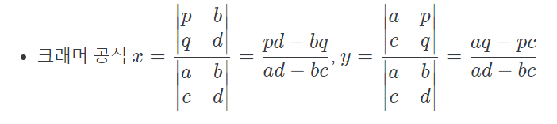
***
# 2023-07-03 Monday(1)
* 2947 '나무 조각' 문제
+ 섞여있는 1, 2, 3, 4, 5를 오름차순으로 정리 하는 순서를 출력하는 문제이다.
+ -1을 안해주면 에러가 뜬다.
```
for i in range(len(tree)-1):
```
+ 정답과 비교하기 위해서
```
answer = [1, 2, 3, 4, 5]
    if tree == answer:
        break
```
***
# 2023-07-02 Sunday(1)
* 2985 '세 수' 문제
+ 세 수가 주워질때 조합을 해서 올바른 사칙 연산을 출력하는 문제이다.
+ 예1) 5 3 8 주워지면 5+3=8 출력
+ 예2) 5 15 3 주워지면 5=15/3 출력
***
# 2023-07-01 Saturday(1)
* 5523 '경기 결과' 문제
+ A와 B가 숫자를 제시하여 크기 비교하여 큰 숫 자를 제시하면 이길 때 총 이긴 횟수를 출력하는 문제이다.
+ 단순 비교 문제라 쉬운 문제이다.
*** 
# 2023-06-30 Friday(1)
* 2960 '에라토스테네스의 체' 문제
+ 에라토스테네스의 체를 구현하고 몇 번째에 어떤 수가 지워지는지 출력하는 문제이다.
+ 0으로 초기화 하는 방법 짧게 한 줄로 하는 코드
```
prime = [0 for i in range(N+1)] # 0으로 초기화
```
+ 에라토스테네스의 체를 구현
```
for i in range(2, N+1):
    for j in range(i, N+1, i):  # i 부터 N+1까지 i 만큼 증가
        if prime[j] == 0:
            prime[j] = 1
            net.append(j)   # 삭제 되는거 담기
    if len(net) >= K:
        break
```
***
# 2023-06-29 Thursday(1)
* 1568 '새' 문제
+ 1부터 오름차순으로 주워진 숫자를 빼서 0이 될 때까지 걸리는 단계를 출력하는 문제이다.
+ 오름차순 >= 주워진 숫자가 작아지고 있을 때 
+ 다시 1로 돌아가서 오름차순으로 주워진 숫자를 뺀다.
+ 디버깅 덕분에 풀었다.
***
# 2023-06-28 Wedesday(1)
* 1476 '날짜 계산' 문제
+ 범위가 각 1 부터 15, 28, 19 까지 있는 달력 체계가 있는데 우리가 아는 365일 체계로 환산하면 몇 년도가 나오는지 출력하는 문제이다.
+ 각 나머지연산을 이용해서 전부 0이 나올 때 까지 구해본다.
```
while True:
    if ((i - Earth) % 15 == 0) and ((i - Sun) % 28 == 0) and ((i - Moon) % 19 == 0):
        break
    i += 1
```
+ 이해와 규칙을 찾는데 너무 오래 걸렸다.
***
# 2023-06-27 Tuesday(1)
* 2846 '오르막길' 문제
+ 주어진 숫자들 중에 증가하는 구간이 가장 큰 값을 출력하는 문제이다.
+ 아래 코드는 리스트를 0으로 초기화 하는 코드, 없어도 에러는 안뜨는데 밑줄로 크다고 뜸
```
height = []

for i in range(repetition):
    temp = 0
    height.append(temp)
```
+ climb리스트를 이용해서 수가 증가하다가 끊기면 해당 숫자를 저장하고, 해당 리스트를 max 함수를 이용해서 max 값을 구했다.
```
for i in range(repetition-1):
    if height[i] < height[i + 1]:
        temp += height[i + 1] - height[i]

    else:
        climb.append(temp)
        temp = 0

climb.append(temp)

print(max(climb))
```
***
# 2023-06-26 Monday(1)
* 11170 '0의 개수' 문제
+ 주워진 두 숫자 범위 사이에서 0의 개수가 몇개인지 출력하는 문제이다.
+ 몫이 0이 될 때 까지 mod 10을 하여 0의 갯수를 구한다.
```
    for i in range(start, end + 1):
        if i == 0:
            cnt += 1
        temp = i
        while temp != 0:
            if temp % 10 == 0:
                cnt += 1
            temp = int(temp / 10)
```
***
# 2023-06-25 Sunday(1)
* 12605 '단어순서 뒤집기' 문제
+ 주어진 문장을 띄어쓰기 기준으로 거꾸로 출력하면 되는 문제이다.
```
for k in range(1, repetition+1):
    sentence = list(input().split(" ")) # 띄어쓰기 기준으로 나누고 리스트 저장
    temp = []
    for i in range(len(sentence)):
        element = sentence[i]
        temp.append(element)

    temp = ' '.join(temp[::-1]) # 뒤집고 리스트 형태를 탈출
    print(f"Case #{k}: {temp}")
```
***
# 2023-06-24 Saturday(1)
* 2783 '삼각 김밥' 문제
+ 1000g 램 기준 가격이 최소인 값을 출력하는 문제이다.
+ 아래의 식을 이용하면 gram당 가겨을 알 수 있다.
```
    A_store = (1000 / A_gram) * A_price
```
***
# 2023-06-23 Friday(1)
* 17614 '369' 문제
+ 1 부터 주워진 숫자 까지 있을 때 3,6,9가 들어간 횟수를 출력하는 문제이다.
+ 10으로 나눈 나머지 값을 가지고 3,6,9가 들어간것을 확인했다.
```
for i in range(0, repetition + 1):
    check = i

    while check != 0:
        check_mod = check % 10

        if check_mod == 3 or check_mod == 6 or check_mod == 9:
            cnt += 1
        check = int(check / 10)
```
+ 문제의 주워진 조건 중에 "원래의 제약조건 이외에 아무 제약조건이 없다." 라는 조건을 달성해야 100점이다.
+ 해당코드를 파이썬으로 돌리면 58점이 나온다.
+ pypy3에 돌리면 100점이 나온다.
+ 어디를 수정해야 하면지 모르겠다.
***
# 2023-06-22 Thursday(1)
* 10179 '쿠폰' 문제
+ 원가에서 20%를 할인된 값을 출력하면 되는 문제이다.
+ 소수점 2째 자리까지 출력하는 방법이다.
```
print(f"${discount:.2f}")
```

# 2023-06-21 Wednesday(1)
* 17263 'Sort 마스터 배지훈' 문제
+ 정렬해서 마지막 인덱스 값만 출력하면 되는 문제이다.
***
# 2023-06-20 Tuesday(1)
* 24266 '알고리즘 수업 - 알고리즘의 수행 시간5' 문제
+ 빅오가 얼마인지 출력하는 문제이다.
+ 반복문이 3개라서 시간복작도가 n^3이다.
***
# 2023-06-19 Monday(1)
* 14696 '딱지놀이' 문제
+ 여러 모양의 딱지가 있을 때 각각에 점수가 다르다 아래에 조건을 이용해서 누가 이겼는지 판별하는 문제이다.
    + 만약 두 딱지의 별의 개수가 다르다면, 별이 많은 쪽의 딱지가 이긴다.
    + 별의 개수가 같고 동그라미의 개수가 다르다면, 동그라미가 많은 쪽의 딱지가 이긴다.
    + 별, 동그라미의 개수가 각각 같고 네모의 개수가 다르다면, 네모가 많은 쪽의 딱지가 이긴다.
    + 별, 동그라미, 네모의 개수가 각각 같고 세모의 개수가 다르다면, 세모가 많은 쪽의 딱지가 이긴다.
    + 별, 동그라미, 네모, 세모의 개수가 각각 모두 같다면 무승부이다.
***
# 2023-06-18 Sunday(1)
* 10448 '유레카 이론' 문제
+ 자연수가 주어졌을 때, 그 정수가 정확히 3개의 삼각수의 합으로 표현될 수 있는지 없는지 판단해서 1 또는 0을 출력하면 된다.
+ 연속으로 반복문을 3번 쓰는건 오랜만이다.
```
for i in triangle:
    for j in triangle:
        for k in triangle:
            if i+j+k <= 1000:
                eureka[i+j+k] = 1
```
***
# 2023-06-17 Saturday(1)
* 14720 '우유 축제' 문제
+ 주어진 숫자가 0,1,2 있을 때 0,1,2 다시 0,1,2 순서대로 했을 때 최대 회수를 구하는 문제이다.
+ if milk_list[i] == count % 3:
***
# 2023-06-16 Friday(1)
* 2851 '슈퍼 마리오' 문제
+ 주워지는 10개의 숫자 중 몇개를 뽑아서 100에 가깝게 만들어서 출력하는 문제이다.
+ 첫번째 점수는 무조건 포함해야한다.
+ 숫자들을 차례대로 더해가면서 1000이 넘어가는 시점에서 if문을 사용해서 더했을 때와 안 더했을 때 비교해서 출력한다.
```
if score - 100 > 100 - (score - j):
    score -= j
```
***
# 2023-06-15 Thursday(1)
* 1919 '애너그램 만들기' 문제
+ 두 영어 단어가 철자의 순서를 바꾸면 같아질 수 있다. 이런 관계를 애너그램이라고 한다. 두 단어가 주워지고 한 글자씩 지워서 같은 단어가 되었을 때 길이를 구하는 문제이다.
+ 입력받은 문자열을 리스트로 만들고, 중복값을 제거한 리스트 길이를 반환해주었다.
***
# 2023-06-14 Wednesday(1)
* 4796 '캠핑' 문제
+ 주원진 숫자를 가지고 캠핑장을 최대 몇일 사용할 수 있는지 구하는 문제이다.
+ P일 중 L일 동안만 사용할 수 있다. 휴가는 V일 만큼 받았다.
+ ((V//P) * L) + min((V%P), L) 이 문제를 풀기 위한 수식이다.
+ ((V//P) * L) 총 휴가일수 V일중에 P일에 L일만큼 사용할 수 있다. 즉, 1주에 L일만큼 사용가능하다.
20//8일 경우 2이므로 1주당 5일만큼 2주를 사용할 수있기 때문에 10일이 나온다.
+ min((V%P),L) 20%8일 경우 나머지가 4이므로 4와 연속가능일수 5중에 4를 선택하여 더한다.
+ 최솟값을 선택하는 이유는 나머지가 5가 넘을 수 있기 때문이다.
***
# 2023-06-13 Tuesday(1)
* 2740 '행렬 곱셈' 문제
+ N*M크기의 행렬 A와 M*K크기의 행렬 B가 주어졌을 때, 두 행렬을 곱해서 출력하는 문제이다.
+ 
```
A_x, A_y = map(int, input().split())
A = [list(map(int, input().split())) for _ in range(A_x)]
```
+ 첫번째 행렬 처럼 저장할 수 있다.
***
# 2023-06-12 Monday(1)
* 1094 '막대기' 문제
+ 길이 64인 막대기를 주워진 길이로 만들어야 하는 문제이다.
+ 주워진 막대기를 반으로 나눠서 해당 길이를 만들어야 한다.
+ 나머지 연산자 2를 이용하여 2의 개수를 출력하면 된다.
***
# 2023-06-11 Sunday(1)
* 24723 '녹색거탑' 문제
+ 높이에 따라 내려올 수 있는 방법을 출력하는 문제이다.
+ 
+ 높이가 1 증가할 때 마다 내려갈 수 있는 경우가 2가지씩 증가하는 규칙이 있다.
```
print(2 ** jump)
```
***
+ 거듭제곱을 이용 할 때는 A ** B를 활용하면 A^B를 표현할 수 있다.
# 2023-06-10 Saturday(1)
* 24265 '알고리즘 수업 - 알고리즘의 수행 시간 4' 문제
+ 시간 복잡도 계산하는 문제이다.
+ 
***
# 2023-06-09 Friday(1)
* 1357 '뒤집힌 덧셈' 문제
+ 두 수가 주워지면 각 각 한번 자리수를 뒤집어서 더하고 더한값을 다시 뒤집어 출력하는 문제이다.
+ 공백을 기준으로 두 수를 받는 방법
```
input_str = input()
x = list(input_str.split()[0])
y = list(input_str.split()[1])
```
+ 쪼개진 값들을 한 문자열로 바꿔주는 방법, x = ''.join(x) 
+ 역순으로 하는 방법 [::-1], print(int(Finish_reversed[::-1])) 
***
# 2023-06-08 Thursday(1)
* 11098 '첼시를 도와줘' 문제
+ 가장 큰 몸값을 가진 선수를 찾아 출력하는 문제이다.
+ 공백을 기준으로 나누는 방법 
```
    soccer_player = input()
    money = int(soccer_player.split()[0])
    name = list(soccer_player.split()[1])
```
+ ['M', 'a', 'r', 'a', 'd', 'o', 'n', 'a'] 이런 리스트를 result = ''.join(max_name) 한 문장으로 연결해주는 방법
***
# 2023-06-07 Wednesday(1)
* 3059 '등장하지 않는 문자의 합' 문제
+ 대문자 문자열을 받는데 이 중에서 없는 대문자의 아스키 코드값의 총 합을 출력 하는 문제이다.
+ total_possible_sum = (ord('A') + ord('Z')) * (ord('Z') - ord('A') + 1) // 2
+ A부터 Z까지의 아스키 코드 값의 합이다. 등차수열의 합의 공식을 이용한거다.
+ 이번에는 개념은 쉬운데 구현이 어려웠다.
***
# 2023-06-06 Tuesday(1)
* 2711 '오타맨 고창영' 문제
+ 틀린 위치와 문자열을 줄 때 틀린위치의 문자를 빼고 문자열을 출력하는 문제이다.
+ A공백B 공백을 기준으로 ["A", "B"]를 구할 수 있다.
```
    str = input()
    num = int(str.split()[0])
    name = list(str.split()[1])
```
***
# 2023-06-05 Monday(1)
* 17863 'FYI' 문제
+ 555로 시작하는 숫자가 있으면 YES, 없으면 NO를 출력하는 문제이다.
+ if num[:3] == '555': # 555 판별
***
# 2023-06-04 Sunday(1)
* 9063 '대지' 문제
+ 좌표가 여러개 주워지는데 가로 세로의 최대값을 구해서 땅의 면적을 구하는 문제이다.
+ 이 코드를 사용하면 1 2 \n 3 4 \n 5 6 의 입력을 한 줄 리스트로 받을 수 있다.
```
for _ in range (re):
    num = input()   # 한 줄 입력 받음
    values = num.split() # 입력된 줄을 공백으로 분리하여 값들을 리스트로 얻음
    array.extend(values) # 분리된 값을 기존 리스트에 추가
```
+ i를 이용해서 인덱스 번호를 홀 짝 구분 하여 인덱스 안에 있는 값을 활용할 수 있게 해준다.
```
odd = []
even = []
for i in range(len(array)):
    if i % 2 != 0:
        odd.append(array[i])
    else:
        even.append(array[i])
```
***
# 2023-06-03 Saturday(1)
* 15969 '행복' 문제
+ 주워진 숫자들 중에 최대 점수와 최소 점수 차이를 출력하는 문제이다.
***
# 2023-06-02 Friday(1)
* 1598 '꼬리를 무는 숫자 나열' 문제
+ 
+ 11 부터 33 까지 가로 세로 길이가 8이다 이런식으로 두 수가 주워졌을 때 거리를 출력하는 문제이다.
+ 배열이기 때문에 입력값에 대해서 -1을 하고 나온 값을 몫과 나머지를 구해서 더하고 그것을 절대값 취해서 더해주면 답이 나온다.
***
# 2023-06-01 Thursday(1)
* 4641 'Doubles' 문제
+ 주워진 숫자에 2를 곱하여 나온 값이 주워진 숫자들에 안에 몇개 있는지 출력하는 문제이다.
+ for i in range(len(num_list) - 1): # 길이를 가지고 반복을 할려면 마지막에 -1을 해야 오류가 안뜬다.
***
# 2023-05-31 Wednesday(3)
* 10867 '중복 빼고 정렬하기' 문제
+ 중복된 숫자들이 있을 때 중복을 빼고 오름차순으로 정렬해서 출력하는 문제이다.
+ temp = list(set(list(map(int, input().split())))) # set 쓰면 중복을 막아준다.
+ print(*sorted(temp)) # *을 쓰면 리스트의 []를 빼고 출력한다.
***
# 2023-05-31 Wednesday(2)
* 10474 '분수좋아해?' 문제
+ 주어진 두 숫자를 가지고 몫 나머지 / 분모 형태로 출력하면 되는 문제이다.
***
# 2023-05-31 Wednesday(1)
* 11441 '합 구하기' 문제
+ 숫자가 나열 되어있을 때, 일정 구간 A : B 를 주면 들어있는 숫자들을 더해서 출력하면 되는 문제이다.
+ 처음에는 슬라이싱해서 풀었는데 시간초과로 계속 틀렸다.
+ 찾아보니 누적합을 이용하면 시간을 줄일 수 있다고해서 바꿔보았다.
+ 누적 합 구하는 공식
```
prefix_sum = [0] * (num1 + 1)

for i in range(1, num1 + 1):
    prefix_sum[i] = prefix_sum[i-1] + num_list[i - 1]
```
+ 빠른 입력받기
```
import sys

num1 = int(sys.stdin.readline())
```
***
# 2023-05-30 Tuesday(1)
* 16673 '고려대학교에는 공식 와인이 있다' 문제
+ KC + PC2 주워지는 K, C, P 값을 이 공식에 대입해서 풀면되는 문제이다.
***
# 2023-05-29 Monday(1)
* 3036 '링' 문제
+ 톱니바퀴의 반지름이 주워지고 첫번째 톱니바퀴가 1바퀴 돌면 다른 톱니바퀴는 몇바퀴는 도는지 분수형태로 출력하는 문제이다.
+ 입력을 8 4 2 공백 포함 받아서 리스트 형태로 저장 [8, 4, 2]
```
ring = input()
ring_list = list(map(int, ring.split()))
```
+ 최대공약수 사용하기 위해서는 math의 gcd
```
import math
    gcd = math.gcd(ring_list[0], ring_list[i])
    print(f"{ring_list[0]//gcd}/{ring_list[i]//gcd}")
```
***
# 2023-05-28 Sunday(1)
* 24264 '알고리즘 수업-알고리즘의 수행시간 3' 문제
+ 반복문이 중첩된 알고리즘이 있을 때 빅-O를 묻는 문제이다.
+ 첫번째 출력은 n*n이고, 두번째는 n^2 최고 차수를 출력하면 된다.
***
# 2023-05-27 Saturday(1)
* 14490 '백대열' 문제
+ 입력으로 A:B 가 주워졌을 때 각 수를 최대한 약분한 수를 출력하는 문제이다.
+ gcd = math.gcd(A, B) # A와 B의 최대 공약수를 계산
+ reduced_A = A//gcd # 최대공약수로 나눠주면 약분된 값이 나온다.
```
import math

gcd = math.gcd(A, B)

reduced_A = A//gcd
reduced_B = B//gcd
```
***
# 2023-05-26 Friday(1)
* 14656 '조교는 새디스트야!!' 문제
+ 순서에 맞지 않는 숫자들이 포함된 숫자 문자열을 입력 할 때 순서에 틀린 경우를 출력하는 문제이다.
+ 순서에 맞게 리스트 만들기
```
array = []

for i in range(1, student + 1):
    array.append(i)
```
***
# 2023-05-25 Thursday(1)
* 9550 '아이들은 사탕을 좋아해' 문제
+ 주워지는 숫자는 사탕의 수량인데 한 사람당 먹을수있는 양을 주고 최대 몇명까지 먹을수 있는지 구하는 문제이다.
```
 candy = input()
 candy_list = list(map(int, candy.split()))
```
+ 입력을 1 2 3 받기 위해서
***
# 2023-05-24 Wednesday(1)
* 5361 '전투 드로이드 가격' 문제
+ 미리 정해진 금액과 수량이 주워질때 총 가격을 출력하는 문제이다.
+ 입력 받는형식
```
part = input()  # "1 2 3" 과 같은 입력을 받음
numbers = part.split()  # 공백으로 숫자들을 분리하여 리스트로 저장
numbers = [int(num) for num in numbers] # 문자열을 정수로 변환하여 리스트에 저장
```
+ formatted_sum = '{:.2f}'.format(sum) # 소수 둘째자리가지 출력하는 방법
***
# 2023-05-23 Tuseday(1)
* 14215 '세 막대' 문제
+ 세 수가 입력으로 주워질 때 가장 큰 삼각형의 둘레를 출력하는 문제이다.
+ 가장 큰수를 제외한 2수의 합이 가장 큰수 보다 크면 전체 둘레 합을 출력하고 작다면 2수의 합에 *2 -1 을 하면 된다.
+ 깔끔하지 않게 문제를 풀었다.
***
# 2023-05-22 Monday(1)
* 10821 '정수의 개수' 문제
+ 10,20,30,40,50 예시와 같이 콤마로 구분대 숫자들이 몇개가 있는지 출력하는 문제이다.
+ split(",")를 사용해서 구분해서 구하였다.
***
# 2023-05-21 Sunday(1)
* 12790 'Mini Fantasy War' 문제
+ 입력으로 8개의 숫자를 주는데 이 입력을 조합해서 전투력은 출력하는 문제이다.
+ 노가다 형식으로 풀었고 조건을 잘봐야하는 파트가 있다.
+ 다른 사람들은 효율적으로 풀었다.
***
# 2023-05-20 Saturday(1)
* 11557 'Yangjojang of The Year' 문제
+ 학교이름과 술 량을 공백을 사용해서 한 줄로 입력 받을 때 어느 학교가 술의 양이 많은지 학교 이름을 출력하는 문제이다.
+ 입력으로 둘다 받고 술량만 School_alcohol = int(School_alcohol) 정수로 바꿔줘서 비교하면 된다.
***
# 2023-05-19 Friday(1)
* 5576 '콘테스트' 문제
+ 총 20개의 숫자가 주어질 때 1 ~ 10, 11 ~ 20 두 부분으로 나누어 큰 수 3개의 합을 출력하는 문제이다.
+ 정렬 --> 역순 --> 상위 3개 추출 --> 3개의 합
***
# 2023-05-18 Thursday(1)
* 11006 '남욱이의 닭장' 문제
+ 닭의 전체 다리와 닭의 수를 주워질 때 다리가 잘린 닭과 정상 닭의 수를 출력하는 문제이다.
+ 다리가 잘린 닭 = 닭의 수 * 2 - 닭의 전체 다리 수
+ 정상인 닭의 수 = (닭의 전체 다리 수 - 다리가 잘린 닭) // 2
***
# 2023-05-17 Wednesday(1)
* 11023 '더하기 3' 문제
+ 숫자가 공백을 포함해서 한 줄로 입력될때 총 합을 구하는 공식
+ 입력을 리스트로 받아서 sum()함수를 이용해 답을 구했다.
***
# 2023-05-16 Thuesday(1)
* 5893 '17배' 문(제
+ 이진수 형탱의 숫자를 입력받으면 10진수로 인식하게하고 17을 곱해서 다시 2진수로 출력하는 문제이다.
+ decimal = int(binary,2) #2진수 --> 10진수
+ binary = bin(decimal) #10진수 --> 2진수
+ binary = binary[2:] #0b 제거
***
# 2023-05-15 Monday(1)
* 2789 '유학 금지' 문제
+ 문자열이 주어질 때 각 철자에 C, A, M, B, R, I, D, G, E에 해당하는 철자를 빼고 출력하면 되는 문제이다.
+ 입력받은 문자열과 비교하며 같다면 빈 문자열("")을 넣어준다.
***
# 2023-05-14 Sunday(1)
* 24263 '알고리즘 수업 - 알고리즘의 수행시간 2' 문제
+ 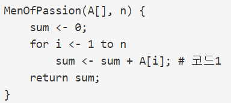
+ 위 코드의 시간 복잡도를 구하는 공식이다.
+ n번 더하는 함수이므로, 시간 복잡도는 n이다.
***
# 2023-05-13 Saturday(1)
* 17608 '막대기' 문제
+ 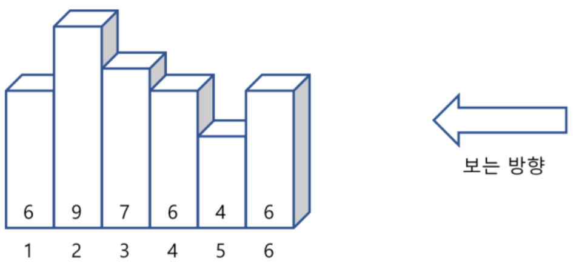 
+ 위 그림의 예시일 때 보여지는 막대의 개수를 출력하는문제이다.
+ 리스트에 값을 넣고 최대값을 리스트의 맨 오른쪽으로 잡아준다.
***
# 2023-05-12 Friday(1)
* 2291 '사나운 개' 문제
+ 두 시간대가 주워진다 시작시간과 끝나는 시간이 있을 때 입력되는 3수가 이 시간대에 몇번 포함되는지 푸는 문제이다.
+ if 0 < i % (A+B) <= A: 
+ 이 식을 통해 포함되는지 판별할 수 있다.
***
# 2023-05-11 Thursday(1)
* 11966 '2의 제곱인가?' 문제
+ 주어진 숫자가 2의 제곱인가 확인하는 문제이다.
+ 주어진 값과 주어진 - 1 값을 비트 연산해서 제곱인지 아닌지 판단하였다.
+ if check & (check - 1) == 0:
***
# 2023-05-10 Wednesday(1)
* 3004 '체스판 조각' 문제
+ 주어진 숫자 만큼 사각형을 분리할때 최대 분리 갯수를 출력하는 문제이다.
+ 주어진 숫자를 2로 나눈다.
+ 나눈 값을 각각 몫 = 가로, 주어진 숫자 - 몫 = 세로 일 때
+ (가로 + 1) * (세로 + 1) = 최대 분리 개수
***
# 2023-05-09 Tuesday(1)
* 17496 '스타후르치' 문제
+ 최종일, 성장일, 칸 수, 가격의 숫자가 주어졌을 때 최종일전 까지 성장일, 칸 수, 가격을 조합해서 얼마나 돈을 벌 수있는지 문제이다.
+ i * grow_Day + 1 <= finish_Day # 최종일 까지 몇 번 수확이 가능한지 구하는 식
+ (count - 1) * room * price # 수확 횟수, 칸 수, 가격 조합해서 최종합 가격을 출력
***
# 2023-05-08 Monday(1)
* 25314 '코딩은 체육과목입니다' 문제
+ 4의 배수의 값이 주어질대 long == 4 느낌, long 문자를 몇 번 출력하는 문제이다.
+ ex) input : 20 --> output : long long long long long int
***
# 2023-05-07 Sunday(1)
* 5598 '카이사르 암호' 문제
+ 문자열을 입력하면 해당 문자에 3번째 건너에 있는 문자열을 출력하는 문제이다.
+ D 입력 -> A 출력, A입력 -> X 출력
+ 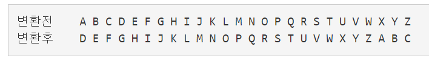 
+ ord('A') -> 65
+ chr(65) -> A
***
# 2023-05-06 Saturday(3)
* 10773 '제로' 문제
+ 숫자를 주어지면 스택에 담고 0이 들어오면 스택에서 하나씩 뺀다. 스택에 모든 합을 구하는 문제이다.
+ 0이 들어오면 arr.pop(len(arr) - 1) 이렇게 뺀다.
+ arr.pop() 이렇게 사용해도 된다.
+ arr.append(num) 스택에 추가
+ 처음에는 내가 하고 싶은 대로 코딩했는데 그게 정답이라서 놀랐고 다른 사람들도 이렇게 했다는 게 더 놀랐다.
***
# 2023-05-06 Saturday(2)
* 13300 '방 배정' 문제
+ 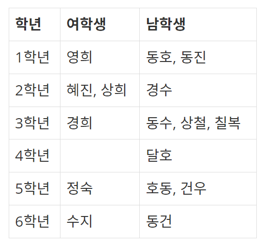
+ 입력으로 전체 학생수, 방 인원제한, 성별, 학년 이렇게 주워졌을 때 총 방의 수를 구하는 문제이다.
+ 사진에서는 3학년 남학생 같은경우 2명을 초과했기 때문에 방을 2개 배정해야한다. 그럼으로 전체 방의 개수는 12개이다.
```
room_count = 0
for i in range(6):
    for j in range(2):
        room_count += counter[j][i] // room
        if counter[j][i] % room > 0:
            room_count += 1
```
+ 모든 인덱스가 방 인원제한으로 나눠서 해당 방 개수를 구하고 방인원 초과 인원에 대해서는 방을 추가해준다.
+ counter = [[0, 0, 0, 0, 0, 0], [0, 0, 0, 0, 0, 0]]  # 초기화
+ 2차원 배열을 초기화하는 방법
***
# 2023-05-06 Saturday(1)
* 2921 '도미노' 문제
+ 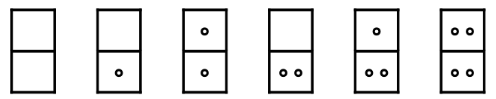
+ n이 주워졌을 때 0부터 n까지 모든 조합의 합을 구하면 되는 문제이다.
+ 그림은 n이 2로 주워졌을 때 모든 점들을 더하면 12가 나온다.
+ 도미노가 2칸이기 때문에 반복문을 2개 사용한다면 모든 조합을 구할 수 있다.
***
# 2023-05-05 Friday(1)
* 9506 '약수들의 합' 문제
+ 숫자가 주어지면 자신을 제외한 모든 약수들의 합과 같으면 자신의 숫자와 약수들을 출력하는 문제이다.
+ 이런 숫자를 완전수라고 한다.
+ 6 = 1 + 2 + 3
```
print(f"{num} = {' + '.join(map(str, rest[:-1]))}")     
    #join 메서드는 이용해서 문자열을 구분자로 이용하여 리스트의 모든 요소를 연결해주는 메서드 입니다.
    #map 함수를 이용하여 리스트의 모든 요소를 문자열로 반환한 후 join 메서드를 사용하면 간단하게 리스트 안에 있는 모든 숫자를 하나의 문자열로 연결할 수 잇습니다.
    #6 = 1 + 2 + 3 한 줄로 출력
```
***
# 2023-05-04 Thursday(1)
* 1284 '집 주소' 문제
+ 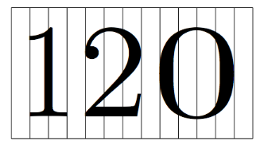
+ 1은 공간 2를 차지하고 0은 4를 차지한다. 나머지 숫자는 3칸을 차지하고 공백과 공백사이에 빈칸이 존재한다.
+ 해당 숫자만큼 크기를 카운터하고 리스트의 전체 길이에 + 1를 해주면 문자사이의 공간을 알 수 있다.
+ 파이썬에는 switch/case 문이 없다. 3.10부터는 match/case가 생겨겼다고는 해서 써봤는데 어떻게 쓰는지 모르겠다.
***
# 2023-05-03 Wednesday(1)
* 10811 '바구니 뒤집기' 문제
+ 두 수를 입력하면 두 수 사이의 범위 만큼 역순을 취하고 출력하는 문제이다.
+ arr[a-1:b] = reversed(arr[a-1:b])   # reversed함수는 인자로 전달된 시퀀스 자료형을 뒤집어서 반환하는 함수
+ print(' '.join(map(str, arr)))  # [3, 4, 1, 2, 5] --> 3 4 1 2 5 
***
# 2023-05-02 Tuesday(1)
* 10178 '할로윈의 사탕' 문제
+ 두 수를 주어졌을 때 몫과 나머지를 출력하는문제이다.
+ A // B = 몫
+ A % B = 나머지
***
# 2023-05-01 Monday(1)
* 2857 'FBI' 문제
+ 5개의 문자열이 주워졌을 때 "FBI" 단어가 들어가 문자열을 찾아 해당 인덱스 번호를 출력하면 되는 문제이다.
+ for i, string in enumerate(input_list):     # enumerate() 함수는 인덱스의 번호를 알고 싶을 때 사용
+ 사실 enumerate 잘 모르겠다.
+ print(' '.join(map(str, result_list)))  # [1, 3, 5] --> 1 3 5 로 출력
+ 이거는 기억하고 있어야겠다.
***
# 2023-04-30 Sunday(1)
* 2903 '중앙 이동 알고리즘' 문제
+ 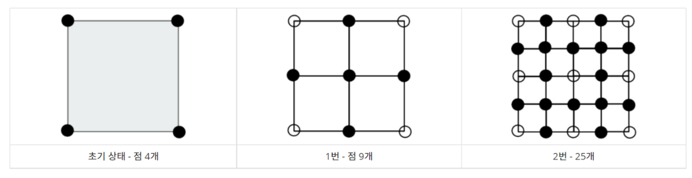
+ 한 변에 놓일 점의 개수를 구한 뒤 제곱하면 된다.
+ (2^n + 1)^2
***
# 2023-04-29 Saturday(1)
* 4504 '배수 찾기' 문제
+ 첫 번째 주어진 숫자를 가지고 다음에 오는 숫자들과의 관계가 배수인지 아닌지 판별하는 문제이다.
+ 파이썬에는 do while 문이 없다고 한다.
***
# 2023-04-28 Friday(1)
* 9295 '주사위' 문제
+ 두 주사위 값을 주어지고 두 주사위에 합한값을 출력하면 되는 문제이다.
+ print(f"Case {i}: {dice1 + dice2}") f를 사용하면 ""문자열 안에서도 반복문에 사용하는 i값이나 구하고자 하는 값을 사용 할 수 있다.
***
# 2023-04-27 Thursday(1)
* 10813 '공 바꾸기' 문제
+ 숫자가 주어질 때 마다 swap 을 해서 최종적으로 바구니에 들어있는 숫자를 출력하면 되는 문제이다.
***
# 2023-04-26 Wednesday(1)
* 2959 '거북이' 문제
+ 4개의 숫자로 사각형의 최대 크기를 구하는 문제이다.
+ 가장 짧은 선분과 2번째로 긴 선분을 구하면 최대 크기를 구할수 있다.
+ 정렬을 한 다음 가장 큰수를 빼서 2번째로 긴 선분을 구하였다.
```
S_rec = sorted((rec)) # 4개의 수를 정렬
M_rec = S_rec[:-1]  # 가장 큰수 빼기
```
***
# 2023-04-25 Tuesday(1)
* 1247 '부호' 문제
+ 누적합을 했을 때 합이 0, >, < 비교해서 0, +, - 출력하면 되는 문제이다. 들어가는 숫자의 값이 많이 큰 문제이다.
+ 그냥 풀면 시간초과로 틀린다.
+ 그래서 입력값을 빠르게 받을 수 있는 함수를 써야한다.
```
import sys
number = int(sys.stdin.readline())
```
+ 이 코드는 표준 입력을 받기 위해 sys모듈의 stdin 객체를 사용한다는 특징이 있습니다. 표준 입력으로 받는 값이 많은 경우 input() 함수 대신에 sys.stdin.readline()을 사용하면 속도가 향상될 수 있습니다. 이때 입력값이 문자열로 반환되므로, int(), float()등의 함수를 이용해 형 변환을 해주어야 합니다.
***
# 2023-04-24 Monday(1)
* 2605 '줄 세우기' 문제
+ 숫자를 입력받고, 0이면 이동없고 나머지 숫자만큼 앞에 인덱스를 넘어서 이동한다. 최종 인덱스를 출력하는 문제이다.
+ line = list(map(int, input().split())) # [0, 1, 2, 3, 4, 5]
+ food.insert(line[i], i+1) # insert 함수의 첫번째 인수는 삽입할 위치를 지정하는 인덱스, 두 번째는 인수는 삽입할 요소
+ reverse = food[::-1] # 인덱스 뒤집기
+ reverse1 = " ".join(str(i) for i in reverse) # join() 함수는 문자열을 연결하는 메서드이다. 문자열을 이용하여 리스트나 튜플을 하나의 문자열로 합칩니다.
***
# 2023-04-23 Sunday(1)
* 1453 '피시방 알바' 문제
+ 원하는 자리 번호를 입력 받을 때 중복되는 숫자가 몇번 나오는가 출력하는 문제이다.
+ chair = list(map(int, input().split())) # [1, 2, 3]
+ overlap = len(list(set(chair))) # set함수는 중복 된 값들을 제거하고 남은 고유의 값 개수, len은 전체 길이
***
# 2023-04-22 Saturday(1)
* 13752 '히스토그램' 문제
+ 해당 숫자 만큼 "=" 문자를 출력하면 되는 문제이다.
***
# 2023-04-21 Friday(1)
* 2592 '대표값' 문제
+ 숫자 10개가 주어질때 평균과 최빈값을 구해야한다.
+ count = [0] * (1000 + 1) # 개수를 셀 0 ~ 1000까지의 리스트를 0으로 초기화
+ count[num] += 1 # 해당 num의 개수를 +1 씩 해준다.
+ print(count.index(max(count))) # count에 있는 인덱스 숫자가 가장 큰값을 출력
***
# 2023-04-20 Thursday(1)
* 1173 '운동' 문제
+ 운동을 하면 심장박동수가 올라간다 그리고 최대 심박수에 도달하면 쉬었다가 심박수가 내려가면 다시 운동을 하는데 이때 목표했던 시간에 도달하는데 총 몇 분 걸리는지 출력하는 문제이다.
+ 조건 중에 휴식을 취하면 맥박이 초기 맥박보다 내려갈수 없다는 조건이 있었는데 그것을 만족하지 못해서 시간이 많이 걸렸다.
***
# 2023-04-19 Wednesday(1)
* 17009 'Winning Score' 문제
+ 두 팀의 농구 점수를 비교해서 이겼을 때 해당팀을 출력하거나, 비겼을 때 출력하면 되는 문제이다.
+ 함수 만들어서 문제를 풀었다.
***
# 2023-04-18 Tuesday(1)
* 5073 '삼각형과 세 변' 문제
+ 세 변의 값을 주어졌을 때 삼각형을 만들 수 있는가 확인하고 된다면 무슨 형태인지 출력하는 문제이다.
```
maxTemp = max(T1, T2, T3)
minTemp = min(T1, T2, T3)
midTemp = T1 + T2 + T3 - maxTemp - minTemp

if maxTemp >= minTemp + midTemp:
    print("Invalid")
```
+ maxTemp >= minTemp + midTemp 이 조건에서 많이 틀렸다. 각 변에 제곱을 하고 비교하는 것으로 착각하고 있었다.
***
# 2023-04-17 Monday(1)
* 3034 '앵그리 창영' 문제
+ 사각형 안에 막대기가 들어갈 수 있는가 확인하는 문제이다.
+ 가로, 세로, 대각선을 체크해서 구분하면 된다.
***
# 2023-04-16 Sunday(1)
* 15000 'CAPS' 문제
+ 소문자로 입력받은 문자열을 대문자로 출력하면 되는 문제이다.
***
# 2023-04-15 Saturday(1)
* 4458 '첫 글자를 대문자로' 문제
+ 문장을 받으면 첫 글자만 대문자로 만들고 나머지 문자열을 출력하면 되는 문제이다.
+ 첫 글자를 대문자를 바꾸기 위해서 문자열[0].upper() 함수를 사용하였다.
+ 첫 글자 이후 문자열을 구하기 위해서 문자열[1:]을 사용하여 첫글자만 슬라이싱하고 나머지 출력하였다.
***
# 2023-04-14 Friday(1)
* 3047 'ABC' 문제
+ A < B < C  이에 맞는 세수가 주어지는데 세수를 이 형식에 맞게 출력하면 되는 문제이다.
***
# 2023-04-13 Thesday(1)
* 10798 '세로읽기' 문제
+ 5문장이 주어질 때 읽는 방법을 세로로 하여 전체를 한 문장으로 만드는 문제이다.
```
words = []
for i in range(5):
    input_a = input()
    words.append(input_a)
```
```
words = [input() for i in range(5)]
```
+ 이렇게 한 문자으로 줄이는 것을 리스트 컴프리헨션(list comprehension)으로 리스트를 만드는 간결한 방법이다.
***
# 2023-04-12 Wednesday(1)
* 10569 '다면체' 문제
+ 꼭지점의 수 - 모서리 수 + 면의수 = 2라는 공식이 있다. 꼭지점의 수와 모서리 수를 주고 면의 수를 출력하는 문제이다.
+ 절댓값 함수는 abs()이다.
***
# 2023-04-11 Tuesday(1)
* 1159 '농구경기' 문제
+ 농구 선수 이름 중에 성이 같은 5명이 있는지 확인하고 있다면 성을 출력하는 문제이다.
+ 리스트를 이용해서 첫 글자만 받고 카운트를 사용해서 5명 되는지 판단한다.
***
# 2023-04-10 Monday(1)
* 5988 '홀수일까 짝수일까?' 문제
+ 그냥 숫자를 보고 홀짝 판별하는 문제이다.
+ 이 문제가 왜 이 난이도에 있는지 모르겠다.
***
# 2023-04-09 Sunday(1)
* 24416 '알고리즘 수업 - 피보나치 수 1' 문제
+ 피보나치 구현 문제이다.
+ 의사코드 보고 작성만 하면 되는 문제이다.
***
# 2023-04-08 Saturday(1)
* 11005 '진법 변환 2' 문제
+ 주어진 10진수를 지정한 진법으로 바꾸는 문제이다.
+ s += str(arr[N%B])  # arr[N%B]는 나머지 문자를 추가하고 N을 N//B로 초기화 한다.
+ print(s[::-1])  # 오른쪽이 옛날 문자니까 뒤접어서 출력한다.
***
# 2023-04-07 Friday(1)
* 10984 '내 학점을 구해줘' 문제
+ 해당과목의 학점을 전부 더해서 전체 학점을 구하고, 해당과목에 대한 학점과 점수를 곱해서 누적합을 하여 전체학점으로 나눠주면 평점(GPA)가 나온다. 전체학점과 평점을 출력하는 문제이다.
+ print(int(sum1), round(average,1))
+ float형식을 int형으로 반올림 함수 round(반올림 할 숫자, 자릿수)
***
# 2023-04-06 Thursday(1)
* 1260 'DFS와 BFS' 문제
+ 인공지능 수업 때 DFS와 BFS에 대해서 말하고 있어 공부해보았다.
+ 개념은 알겠는데 코드로 나타낼 수 가 없어 블로그에 있는걸 보고 작성했다.
+ [코드참고](https://junsik-hwang.tistory.com/75)
****
# 2023-04-05 Wednesday(1)
* 1440 '타임머신' 문제
+ 시:분:초 가 있을 때 시,분, 초를 조합해서 읽을 수 있는 경우의 수를 출력하는 문제이다.
+ 시 1 ~ 12, 00 ~ 59 분,초 가 있을 때 01:02:03은 어디가 시,분,초 인지 알 수 가 없지만, 01:59:59 일 때는 01이 시침 자리라는것을 알 수 있다.
+ itertools는 파이썬에서 반복 가능한(iterable) 객체들을 다루기 위한 유용한 함수들을 모아놓은 모듈입니다. 
+ permutations 함수는 iterable 객체의 모든 순열을 반환해줍니다. 즉, 주어진 iterable의 원소들을 순서에 상관없이 모든 조합을 만들어줍니다.
+ 최대 경우의 수는 6입니다.
***
# 2023-04-04 Tuesday(1)
* 11283 '한글2' 문제
+ 한글로 된 글자 한개가 들어왔을때 사전순으로 몇번째 글자인지 출력하는 문제이다.
+ 처음에는 배열로 조합하였는데 안맞아서 함수를 찾아보니 ord()내장 함수가 있었다.
+ ord()는 파이썬 내장 함수 중 하나로, 유니코드 코드 포인트 값을 반환합니다.
+ 문자를 해당하는 유니코드 정수 값으로 변환해주는 함수입니다.
+ ord('A')를 호출하면 65를 반환합니다.
***
# 2023-04-03 Monday(1)
* 15829 '상금 헌터' 문제
+ 두 수가 주워지는데 두 수는 각 대회에 순위이다. 순위에 맞는 상금 합을 출력하는 문제이다.
+ 1번째 대회는 range(i+1) 상금을 받을 수 있는 순위이고, 2번째 대회는 range(2**i) 상금을 받을 수 있는 순위이다.
***
# 2023-04-02 Sunday(1)
* 23825 'SASA 모형을 만들어보자' 문제
+ 문자 S,A 의 갯수를 주고 SASA 조합을 최대 몇 개 만들 수 있는지 알아보는 문제이다.
+ 두 갯수를 2로 나누기해서 작은 쪽을 출력하면 풀 수 있다.
***
# 2023-04-01 Saturday(1)
* 9325 '얼마?' 문제
+ 차에 총 가격과 옵션 수량과 가격에 따라 총 금액을 출력하는 문제이다.
+ 문제를 읽고 식만 작성하면 풀수있는 문제이다.
***
# 2023-03-31 Friday(1)
* 10214 'Baseball' 문제
+ 연세대와 고려대가 득점한 총합을 비교해서 어디가 이겼는지 출력하는 문제이다.
+ 입력 받을 때 마다 누적합을 이용하면 된다.
***
# 2023-03-30 Thursday(1)
* 1297 'TV 크기' 문제
+ 대각선 길이, 높이비율, 너비비율을 주고 높이와 너비 구하는 문제이다.
+ b = ((inch**2)/(((w/h)**2) + 1))**0.5   #피타고라스 비율 구하는 공식
+ a = (b*w)/h
+ print(math.floor(b), math.floor(a)) # math.floor = 소수점 이하 버리기는 함수
***
# 2023-03-29 Wednesday(1)
* 16204 '카드 뽑기' 문제
+ 앞면과 O,X과 있고 뒷면에도 O,X가 있을 때 양면에 모양이 같은 카드가 최대가 될 때 수량을 출력하는 문제이다.
+ 처음여러 경우의 수를 했는데, 경우의 수가 빠져서 틀려서 다르게 생각 해보았다.
+ min(M, K) + N - max(M, K) 그래서 이 식이 나왔다.
***
# 2023-03-28 Tuesday(1)
* 14924 '폰 노이만과 파리' 문제
+ 문제는 정말 긴데 예제만 보면 바로 식 만들어서 풀 수 있는 문제이다.
+ 양 쪽에 기차가 똑같은 속도로 가운데로 달릴 때, 가운데 있는 파리가 세로축으로 얼마나 왔다갔다 하는지 거리를 출력하는 문제이다.
+ 시간 = 거리 // 2 * 기차 속도 -> 시간 * 파리 속도
***
# 2023-03-27 Monday(1)
* 2745 '진법변환' 문제
+ 임의의 진법 수와 N이 주어지고 이것을 10진수로 바꾸어 출력하는 문제이다.
+ ZZZZZ 36진법을 가지고 10진법으로
+ Z * 36^4 + Z * 36^3 + Z * 36^2 + Z * 36^1 + Z * 36^0 = 60466175
+  for i, n in enumerate(N):
+ for문의 구문 for i, n in enumerate(N):은 enumerate(N)으로 생성된 객체를 이용하여 각 요소의 인덱스를 i에, 해당 요소의 값을 n에 할당하는 것을 반복적으로 수행합니다.
***
# 2023-03-26 Sunday(1)
* 1070 '수도요금' 문제
+ 수도 요금을 구하는 방법이 2가지가 있는데 두가지 방법 중 최소비용을 출력하는 문제이다.
+ 문제를 잘 읽고, 구현만 하면 되는 재미있는 문제이다.
***
# 2023-03-25 Saturday(1)
* 10102 '개표' 문제
+ A,B 로 구성된 문자열이 있을 때 A > B, A < B, A == B 구분해서 출력하는 문제이다.
+ 문자열을 쪼개는 방법
```
vote = input()
choose = list(vote)
```
***
# 2023-03-24 Friday(1)
* 11004 'K번째 수' 문제
+ temp = list(map(int, input().split())) #1 2 3 4 5 형식 받는 방법
+ temp.sort() #정렬하는법
+ temp[k - 1] # 원하는 k 값의 인덱스에 들어 있는값 출력
***
# 2023-03-23 Thursday(1)
* 23795 '사장님 도박은 재미로 하셔야 합니다' 문제
+ 그만 할 때 까지 계속 숫자를 더하고 출력하면 된다.
***
# 2023-03-22 Wednesday(1)
* 10810 '공 넣기' 문제
+ 3개의 숫자를 주는데 처음과 두번째는 범위이고, 세번째는 1번과 2번 사이에 채워넣을 숫자이다.
+ 모든 과정을 끝내고 최종 배열에 남아있는 수를 출력하는 문제이다.
+ 1 2 3 -> 3 3 0 0 0
+ 3 4 4 -> 3 3 4 4 0
+ 1 4 1 -> 1 1 1 1 0
+ 2 2 2 -> 1 2 1 1 0
+ arr = [0] * N #arr 0으로 초기화
+ print(arr[x],'',end ='')    #한 줄로 출력
***
# 2023-03-21 Tuesday(1)
* 11656 '접미사 배열' 문제
+ 단어가 주어질때 알파벳 순서대로 출력하고 해당 알파벳 뒤에 모든 문자를 저장하고 다음 알파벳 순서를 찾고 다시 뒤에 모든 문자를 저장하는것 반복해서 모든 문장을 리스트에 전부 저장하고 출력하는 문제이다.
+ backjoon이 있을 때 b보다는 a가 빠르기 때문에 ackjoon 출력하고 다음 b차례이기 때문에 backjoon 출력한다.
*** 
# 2023-03-20 Monday(1)
* 10610 '30' 문제
+ 주어진 숫자가 있는데 한자리씩 조합해서 30의 배수가 되는 가장 큰수를 만드는 문제
+ 주어진 숫자에 0이 없거나, 3의 배수가 없으면 30배의 배수가 없는것으로 판별할 수 있다.
***
# 2023-03-19 Sunday(1)
* 11728 '배열 합치기' 문제
+ A,B배열을 합쳐서 정렬하면 되는 문제이다.
***
# 2023-03-18 Saturday(1)
* 1026 '보물' 문제
+ 두 리스트가 있을 때 S = A[0] × B[0] + ... + A[N-1] × B[N-1] 최종 S 값을 최솟값을 출력하는 문제이다.
+ 이때 B리스트는 재배열 하면 안된다.
+ 첫번째는 재배열하면 안된다는것을 어기고 A를 내림차순으로 B를 오르차순으로 하여 답을 구할 수 있지만 문제에 어긋나기때문에 다른 방법을 찾았다.
+ 각 리스트에서 최솟값과 최댓값을 구해서 곱하고 더한 다음 두 리스트에서 최솟값과 최댓값을 pop시켰다.
+ sorted_A = sorted(A, reverse=True)  #reverse = True 내림 차순 왼쪽에 큰숫자 오른쪽 작은 숫자
+ A.pop(A.index(min(A)))      # A리스트에서 최솟값을 pop한다.
+ B.pop(B.index(max(B)))      # B리스트에서 최댓값을 pop한다.
***
# 2023-03-17 Friday(1)
* 3460 '이진수' 문제
+ 10진수 값을 받아서 2진수로 변환하고 1이 위치하고 있는 인덱스 번호를 출력하는 문제이다.
+ method = bin(int(input()))[2:]  # 0b1101에서 0b를 제거해주기 위해서 사용
+ if method[-i-1] == '1':     # method에 담긴 2진수를 역순으로 보기 위해서
+ print(i, end = ' ')     # i번째 인덱스 출력하고 빈 공간을 추가로 출력
***
# 2023-03-16 Thursday(1)
* 10995 '별 찍기 - 20' 문제
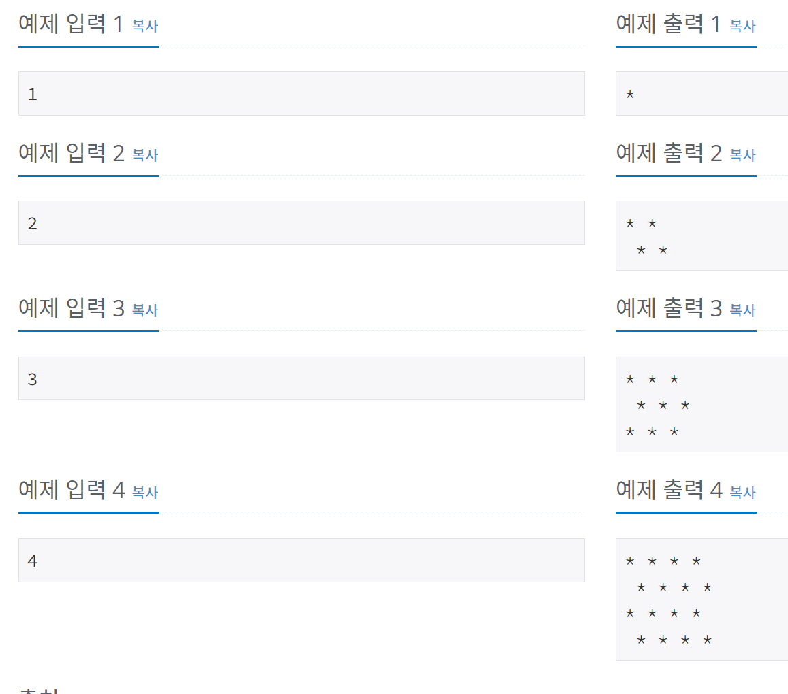
+ 짝수 번 째는 앞에 공백이 있었어 힘들었다.
+ 공백있다 없다 구분해서 없으면 기본 출력으로 하고 있으면 공백이후 출력하게 하였다.
+ 반복문 끝날때 마다 space를 계속 열고 잠그고 했다.
*** 
# 2023-03-15 Wednesday(1)
* 2720 '세탁소 사장 동혁' 문제
+ 돈이 주어지면 거스름 동전을 몇개 줘야 하는 문제이다.
+ print(' '.join(map(str, count))) count리스트의 모든 요소를 문자열로 변환한 후, 공백문자를 구분자로 사용하여 하나의 문자열로 연결합니다.
***
# 2023-03-14 Thusday(1)
* 14935 'FA'문제
+ 숫자가 입력되면 첫번째 숫자와 자릿수를 곱해서 값이 반복될때 까지 하는데 반복되면 FA를 출력하고, 안되면 NFA를 출력한다.
+ 이 문제가 웃긴게 무조건 FA만 나온다. 순간 반례가 있나 생각해봐도 없었어 그냥 print("FA")했는데 맞았다.
+ 너무 신기해서 찾아보니 이게 답이였다.
***
# 2023-03-13 Monday(1)
* 10103 '주사위 게임' 문제
+ A = 100, B = 100 의 숫자가 있을 때 서로 주사위를 굴려서 낮은 숫자가 나온사람이 패배이며 패배자는 상대의 숫자 만큼을 전체 점수인 100점에서 빼서 최종 남은 점수를 출력하는 문제이다.
+ a,b = map(int, input().split()) 한번에 값을 2개 받을 때 사용
***
# 2023-03-12 Sunday(1)
* 10820 '문자열 분석' 문제
+ 문자열이 주어졌을 때 소문자, 대문자, 숫자, 공백이 몇 개 있는지 출력하는 문제이다.
+ 몇 개의 문자열이 들어오는지 모르기에 sys.stdin,readline()을 사용한다.
+ sys.stdin.readline()은 개행문자('\n')를 받는다. 개행 문자를 없애기 위해서 rstrip('\n')을 사용한다.
+ islower() - 소문자 판별, isupper() - 대문자 판별, isdigit() - 숫자 판별
***
# 2023-03-11 Saturday(1)
* 11382 '꼬민 정민' 문제
+ 숫자 3개가 주어질 때 총합을 구하는 문제이다.
+ 오늘은 시간이 없어 간단한 문제를 풀었다.
***
# 2023-03-10 Friday(1)
* 9085 '더하기' 문제
+ 숫자를 입력 받아서 총합을 구하는 문제이다.
***
# 2023-03-09 Thusday(1)
* 3040 '백설 공주와 일곱 난쟁이' 문제
+ 9개의 숫자가 있을 때 7개의 숫자를 더해서 100을 만들어야 한다.
+ 100을 만들때 사용하지 않는 두 수를 찾아 리스트에서 빼고 나머지를 출력하는 문제이다.
+ 브루트포스 알고리즘으로 반복문을 2개 사용해서 9개의 모든 숫자를 더한 값에서 두개를 빼면서 값을 구했다.
+ sum - i - j == 100
+ 리스트에서 필요없는 숫자를 빼내는 함수는 arr.pop() --> pop() 함수이다.
***
# 2023-03-08 Wednesday(1)
* 14489 '치킨 두 마리' 문제
+ 2개의 통장이 있을 때 남은 금액의 합이 치킨 두 마리를 살 수있으면 2마리 사고 남은 금액을 안된다면 두 통장의 잔고를 합쳐서 출력하는 문제이다.
+ 조건이 잘 못되었는지 계속 틀렸다. 아직도 왜 틀린지 모르겠다.
+ 두 마리를 살 수 있을 때는 알겠는데 못 살 때 경우를 자세히 나눠 주었을 때 틀리고, else로 한번에 묶어서 하니까 정답이였다.
***
# 2023-03-07 Tuesday(1)
* 2965 '캥거루 세마리' 문제
+ x축 위에 3점이 있을 때 가운데 있는 점이 최대 몇 칸 움직일 수 있는지 구하는 문제이다.
***
# 2023-03-06 Monday(1)
* 1267 '핸드폰 요금' 문제
+ 2가지 요금제가 있을 때 둘 중에 요금이 적게 나오는 쪽의 이니셜과 그 요금을 출력하는 문제이다.
+ 
```
    Y = ((B[i] // 30) + 1) * 10
    M = ((B[i] // 60) + 1) * 15
```
# 2023-03-05 Sunday(1)
* 5543 '상근날드' 문제
+ 햄버거 3종류, 음료 2종류의 값을 주고 세트메뉴를 조합할 때 가장 최소금액을 출력하는 문제이다.
+ 리스트에 값을 이어서 붙여주는 함수는 append()함수이다.
***
# 2023-03-04 Saturday(1)
* 15894 '수학은 체육과목입니다' 문제</br>
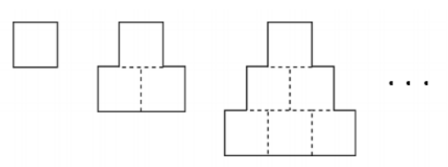
+ 실선으로 된 도형의 둘레를 구하는 문제이다.
+ 처음에는 식이 길었는데 간단히 하니까 블록 * 4 로 만들 수 있었다.
***
# 2023-03-03 Friday(1)
* 2476 '주사위 게임' 문제
+ 주사위 3개를 던져 1.같은 숫자3번, 2.같은 숫자2번, 3.같은 숫자가 하나도 없을 때 각 경우를 나누고 각 경우마다 계산식을 가지고 있는데 이 3가지 방법 중 가장 높은 금액을 출력하는 문제이다.
+ 처음에는 리스트를 받아서 반복문 2개를 사용해서 하나씩 비교를 해서 했지만, 다른 사람들의 코드를 보니 바로 값과 값을 비교해서 문제를 풀었다.
***
# 2023-03-02 Thusday(1)
* 5524 '입실 관리' 문제
+ 대문자와 대소문자 썩여서 들어온 문자들을 소문자로 바꿔서 출력해주는 문제이다.
+ a로 문자열로 받아서 소문자로 바꿔주는 lower()함수 앞에 붙여줘야 한다.
```
    a = str(input())
    print(a.lower())
```
***
# 2023-03-01 Wenesday(1)
* 10833 '사과' 문제
+ 사과 % 학생 = 남은 사과의 총 합을 구하는 문제이다.
***
# 2023-02-28 Tuesday(2)
* 4378 '쿼티' 문제</br>
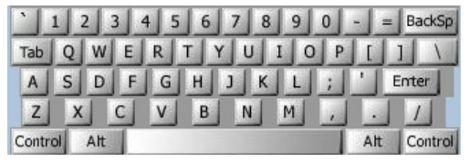</br>
+ 문자가 하나씩 밀려서 입력하였을 때 원래 문장을 출력하는 문제이다.
+ O S, GOMR YPFSU/ --> I AM FINE TODAY.
+ [코드참고](https://brightnightsky77.tistory.com/318)
***
# 2023-02-28 Tuesday(1)
* 2935 '소음' 문제
+ 두 숫자와 연산자를 입력해서 나온 숫자를 출력하는 문제이다.
***
# 2023-02-27 Monday(1)
* 1076 '저항' 문제
+ 첫번째 숫자와 두번째 숫자를 문자 합치기 하여 세번째 숫자를 곱해서 출력하는 문제이다.
+ ex) 4, 7, 100 --> 47 * 100 = 4700
***
# 2023-02-26 Sanday(1)
* 10996 '별 찍기 - 21' 문제
+ 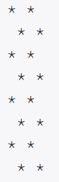
```
for i in range(star):
    print(('*'+' ')*(star - star//2))
    print((' ' + '*')*(star//2))
```
***
# 2023-02-25 Saturday(1)
* 15700 '타일 채우기 4' 문제
+ 가로 * 세로가 있을 때 2*1 과 1*2 타일이 몇 개 들어가는지 알아보는 문제이다.
***
# 2023-02-24 Friday(3)
* 24060 '알고리즘 수업 - 병합정렬 1' 문제
+ 병합정렬이 끝나면 기록된 순서의 해당하는 숫자를 출력하는 문제이다.
+ 4 5 1 3 2 숫자들이 있을 때 7번째 저장된 숫자는 3이다.
+ [코드참고](https://my-coding-notes.tistory.com/581?category=957026)
***
# 2023-02-24 Friday(2)
* 5063 'TGN' 문제
+ 조건에 따라 광고를 할지말지 정하는 문제이다.
+ 광고를 했을 때 수익 - 광고 비용 =,>,< 광고를 하지 않았을 때 수익 이 3조건에 따라 적절한 단어를 출력하면 된다.
***
# 2023-02-24 Friday(1)
* 13866 '팀 나누기' 문제
+ 4개의 숫자가 있을 때 최솟값과 최댓값을 더하고 나머지 2숫자를 더해서 서로 뺀 숫자를 절댓값 취해서 출력하는 문제이다.
+ 절댓값 함수 abs() 이다.
***
# 2023-02-23 Thursday(1)
* 1547 '공' 문제
+ 공은 첫번째에 고정되어 있을 때 컵 3개를 여러번 순서를 바꾸고 마지막에 공을 덮고 있는 컵을 맞추는 문제이다.
+ 파이썬 스와은 C처럼 할 필요 없이 a,b = b,a로 바로 할 수 있다.
```
arr = [1, 2, 3]

for _ in range(repetiton):
    x, y = map(int, input().split())

    xi = arr.index(x)
    yi = arr.index(y)

    arr[xi], arr[yi] = arr[yi], arr[xi]
```
***
# 2023-02-22 Wednesday(1)
* 1212 '8진수 2진수' 문제
+ 8진수로 입력 받아서 2진수로 출력하는 문제이다.
+ num = int(input(), 8)   # 입력을 8진수로 받기
+ b = format(num, 'b')    # 0b 2진수라는 것을 알려주는 문자 생략
# 2023-02-21 Tuesday(1)
* 2460 '지능형 기차2' 문제
+ 내린 사람과 찬 사람을 빼고 더하여 최대값을 찾아 출력하는 문제이다.
***
# 2023-02-20 Monday(1)
* 2506 '점수계산' 문제
+ 정답을 맞추면 1점 씩 가산점이 붙고. 틀리면 가산점이 없어진다 이때 최종 점수를 출려하는 문제이다.
***
# 2023-02-19 Sunday(1)
* 2875 '대회 or 인턴' 문제
+ 여자2 : 남자1 비율로 팀을 만들때 최대 몇 팀 까지 만드는 문제이다.
+ 이때 인턴쉽으로 빠져을 경우도 추가해줘야 한다.
+ while woman >= 2 and man >= 1 and woman + man >= intern + 3: # 2명 , 1명 팀 만들 수 있고, 인턴쉽도 보낼 수 있는 수 일때
+ 남/여 각 최소 인원 1명, 2명 인턴쉽 가는 최소 인원에 3명 더해주기
***
# 2023-02-18 Saturday(1)
* 1654 '랜선 자르기' 문제
+ 랜선의 길이를 움직여 랜선 개수를 채우는 문제이다.
+ 이분탐색으로 해야 시간 초과를 하지 않는다.
***
# 2023-02-17 Friday(1)
* 4470 '줄번호' 문제
+ i. 문자 형식으로 출력하는 문제이다.
***
# 2023-02-16 Thursday(1)
* 19944 '뉴비의 기준은 뭘까?' 문제
+ 조건에 따라 뉴비, 올드비, TLE를 구분해주면 되는 문제이다.
***
# 2023-02-15 Wednesday(1)
* 2010 '플러그' 문제
+ 숫자를 입력 받을 때마다 계속 더하고, 멀티탭을 장착 할 수 있는 한 자리를 빼야하기 때문에 더할 때 마다 -1 해주면 되는 문제이다.
+ input()받으니까 시간초과로 계속 틀렸다.
+ sys.stdin.readline()함수로 해결하였다.
***
# 2023-02-14 Tuesday(1)
* 11655 'ROT13' 문제
+ 입력받은 문장을 아스키코드 숫자 기준으로 13칸 이동해서 출력하는 암호 문제이다.
+ ord() 함수는 문자를 유니코드 정수로 변환 할 수 있다.
+ ord('A') == 65
+ chr() 함수는 우니코드 정수를 받아서 문자로 반환 할 수 있다.
+ chr(65) == 'A'
***
# 2023-02-13 Monday(1)
* 4299 'AFC 윔블던' 문제
+ 두 팀이 획득한 점수의 합과 차만 주고 각 팀의 점수를 구하는 문제이다.
+ 음수가 나오는 조건을 작성해야 틀리지 않는다.
***
# 2023-02-12 Sunday(1)
* 2902 'KMP는 왜 KMP일까?' 문제
+ 단어 - 단어 - 단어 구조를 가진 문자열이 있을 때 단어의 첫번째 만 출력하는 문제이다.
***
# 2023-02-11 Saturday(1)
* 10824 '네 수' 문제
+ 4개의 숫자를 입력 받는데 첫번째와 두번째를 한 문장으로 묶고, 다음 2수도 앞에처럼 묶어서 정수로 변환하여 두 묶음을 더하는 문제이다.
+ 예시) 10, 20, 30, 40 이 있을 때 1020 + 3040 = 4060
+ number = list(map(str, input(). split())) 리스트로 문자열을 받아서 출력할때 정수로 바꾸어서 출력하였다.
***
# 2023-02-10 Friday(1)
* 9093 '단어 뒤집기' 문제
+ 전체 문장을 뒤집는 문제가 아니고 공백을 두고 각 단어를 다 뒤집어야한다.
+ I am happy today
+ I ma yppah yadot

* input() vs sys.stdlin.readline()
+ 차이점 1
    + input()은 파라미티로 prompt message를 반든다. (prompt message는 사용자의 명령을 받아들을 준비가 되었음을 나타내는 메시지입니다.)
    + sys.stdlin.readline()는 prompt message를 파라미터로 받지 않는다.

+ 차이점 2
    + input()은 입력값 맨 끝의 개행 문제를 삭제한 후 리턴한다.
    + sys.stdin.readline()은 맨 끝의 개행 문자를 포함한다.
    + 따라서 문자열을 저장하는 경우 rstrip()을 추가한다.

+ 요약
    + input()은 prompt message를 출력하고, 개행 문자를 삭제한 후 리턴하기 때문에 sys.stdin.readline()에 비해 느리다.
***
# 2023-02-09 Thursday(1)
* 2566 '최댓값' 문제
+ 9행 9열이 있을 때 가장 큰 값을 찾고, 어디있는지 위치를 출력하는 문제이다.
***
# 2023-02-08 Wednesday(1)
* 10992 '별 찍기 - 17' 문제
+ 마지막줄은 별을 다 표현하고, 나머지는 별과 별사이에 공백으로 채우는 문제이다.
+ C 보다 파이썬이 직관적으로 바로 보여서 생각하기 수월했다.
***
# 2023-02-07 Tuesday(1)
* 1292 '쉽게 푸는 문제' 문제
+ 1부터 계속 증가하는 수열이 있을 때 (122333444455555...) 일정 구간이 주어지면 그 사이값을 다 더해서 출력하는 문제이다.
+ 3 ~ 7이라고 가정하면 2+3+3+3+4 = 15가 나온다.
+ sys.stdin.readline()이 input() 보다 입력이 빠르다. 쓰기위해서는 sys클래스를 사용해야한다.
```
import sys
a, b = map(int, sys.stdin.readline().split())
```
***
# 2023-02-06 Monday(1)
* 1676 '팩토리얼 0의 개수' 문제
+ 주어진 숫자의 팩토리얼 중에 끝짜리가 0인 팩토리얼이 몇개인지 출력하는 문제이다.
+ 모든 팩토리얼을 구하여 팩토리얼의 길이를 구하고 길이만큼 반복을 하면서 10으로 나눠 0으로 떨어지는 숫자를 찾아서 카운터 해주면 된다.
+ % 나머지를 구하는 연산자이다.
+ // 나눗셈 몫(정수만) 나눗셈을 하되 소수점을 없애고, 정수만 구하는 연산자이다.
***
# 2023-02-06 Monday(1)
* 5565 '영수증' 문제
+ 전체 금액에서 9개의 금액을 모두 빼고 남은 금액을 출력하는 문제이다.
+ 변수 없이 들어오는 숫자를 바로 뺄 수 있다.
```
for _ in range(9):
    total -= int(input())
```
***
# 2023-02-05 Sunday(2)
* 1075 '나누기' 문제
+ 나눠야 할 숫자가 있는데 뒤에서 두 자리를 적절이 조절해서 바로 나누어 떨어지게 하는 숫자를 만들어서 뒷자리 2개만 출력하는 문제이다.
+ list[:-2] 뒤에서 두자리만 슬라이싱
+ list[-2:] 처음부터 뒷자리 2개만 남겨 놓고 전부 슬라이싱
***
# 2023-02-05 Sunday(1)
* 2501 '약수 구하기' 문제
+ 처음 주어진 숫자에 대해 약수를 구하고 두번째 주어진 숫자에 해당하는 값을 출력하는 문제이다.
+ arr.append(i) 반복을 하면서 i 값을 배열에 저장, i값을 덧 붙여준다. 
***
# 2023-02-04 Saturday(1)
* 5355 '화성 수학' 문제
+ 특수문자가 뜻하는 숫자와 연산자가 있다. 그것을 가지고 사칙연산 하는 문제이다.
+ eval(expression)는 매개변수로 받은 expression(사칙연산 식)같은거을 문자열로 받어서 실행하는 함수이다.
+ %s는 문자열을 서식에 맞추어 출력해준다. (문자열만 해당됨)
+  mars = list(map(str, input().split()))  # 문자열을 각 토근으로 쪼개서 받겠다.
***
# 2023-02-03 Friday(1)
* 1966 '프린터 큐' 문제
+ 입력한 숫자가 남은 큐 즁에서 가장 큰수가 될 때 까지 검사를 하면 되는 문제이다.
+ queue = deque(list(map(int, sys.stdin.readline().split())))
+ C보다는 파이썬이 자료구조 길이가 짫아서 괜찮은것 같다.
***
# 2023-02-02 Thusday(1)
* 10886 '0 = not cute / 1 = cute' 문제
+ 홀수값을 입력 받아 0이 많은지 1이 많은지에 따라 값을 출력하는 문제이다.
+ 종료 함수는 exit() 이고 main 문으로 나갈 때는 def정의를 해주고 return(def 정의 이름) 해주면 정의한 함수를 나올 수 있다.
***
# 2023-02-01 Wedesday(1)
* 2693 'N번째 큰 수' 문제
+ 입력 받은 숫자 들 중에 3번 째로 큰 숫자를 출력하는 문제이다.
+ 문자열.split() 문자열을 구분자로 나눠주는 함수이다.
***
# 2023-01-31 Tuesday(1)
* 10815 '숫자 카드' 문제
+ 여러 숫자 카드를 입력하고, 검사 카드와 비교해서 있으면 1 없으면 0 을 출력하는 문제이다.
+ import sys는 sys.stdin.readline()을 쓰기위해서 사용한다.
+ 반복문으로 여러 줄을 입력 받을 때 input()으로 받으면 시간초과가 발생 할 수 있다.
+ map은 반복 가능한 객체(리스트 등)에 대한 각각의 요소들을 저장된 함수로 처리해주는 함수입니다.
+ a,b,c에 대한 int 형 변환(예시)
***
# 2023-01-31 Tuesday(1)
* 1032 '명령 프롬프트' 문제
+ 첫번째 문장을 기준으로 다음 입력된 문장이 다를 때, 정확하게 각 토큰 마다 다를 때 해당 위치에 '?' 삽입하는 문제이다.
+ '구분자'.join(리스트) 함수 사용해서 문자를 문자열로 바꿔 주웠다. ->  ['l', 'i', 's', 't'] -> ['list']
***
# 2023-01-30 Monday(1)
* 2576 '홀수' 문제
+ 입력 받은 7개의 숫자 중에 홀수를 찾아서 모두 더 한값과 최솟값을 찾아 출력하는 문제이다.
+ C언어로 했으면 최솟값 찾을 때 temp를 이용해서 swap했을건데 파이썬은 min(list) 하니까 바로 찾을 수 있었다.
***
# 2023-01-29 Sunday(2)
* 1977 '완전제곱수' 문제
+ 주어진 범위안에 있는 완전제곱수를 구해서 최솟값과 모도 더한값을 출력하는 문제이다.
+ 처음에는 반복을 두번 해서 O(n^2)이라서 시간 초과 나왔다.
***
# 2023-01-29 Sunday(1)
* 10816 '숫자 카드 2' 문제
+ 카운팅 정렬 같은 문제이다. 하지만 다른 점은 카운팅 정렬은 양수만 되었는데 이건 음수도 가능하다.
+ if (*(int*)lhs > *(int*)rhs) 이런 코드 처음 보는것 같다.
+ 언제 쯤 이런 문제를 풀 수 있을까?
+ [코드참고](https://wonsjung.tistory.com/2)
***
# 2023-01-28 Saturday(3)
* 1099 '별 찍기 - 16' 문제
+ 기존에는 연속으로 별을 찍었고 이번에는 "*_" 별찍고 공백만 넣어 주면 되는 문제이다.
***
# 2023-01-28 Saturday(2)
* 11866 '요세푸스 문제 0' 문제
+ 사람 숫자가 주어지고 몇 번째 부터 죽일지 정하고 해당 숫자 만큼 증가하면서 죽이고 사람 숫자를 초과 하면 다시 처음 부터 사람을 카운트 하면서 죽인다.
+ 이때 죽은 사람 순번을 표현하는 문제이다.
+ 요세푸스문제 처음 보았을 때 원형으로 앉아 있다고 해서 원형 큐를 생각 했는데 원형 큐를 잘 몰라서 배열로 풀어보았다.
+ index = (index + add) % human 배열을 다시 처음으로 돌리기 위한 코드이다.
***
# 2023-01-28 Saturday(1)
* 2914 '저작권' 문제
+ 분모와 평균값을 주고 분자의 최솟값을 구하는 문제이다.
+ 분자를 구하면 올림하여서 제출하면 끝이다.
+ 처음에는 평균값에 0.01을 빼서 했는데 다른 코드를 참고하니 분모 * (평균 - 1) + 1 해서 구했다.
+ math.h 와 ceil을 쓰면 올림을 할 수 있다.
***
# 2023-01-27 Friday(1)
* 10866 '덱' 문제
+ 요즘 자료구조 문제들을 풀고 있는데 너무 어렵다.
+ [코드참고](https://sedangdang.tistory.com/27)
***
# 2023-01-26 Thusday(1)
* 2164 '카트2' 문제
+ 자료구조를 어떻게 구현 하는지 모르겠다.
+ 코드를 참고하니 원형큐를 사용해서 풀었다.
+ [코드참고](https://blog.naver.com/kim-nan-hee/221901814483)
<br/>
<br/>

<br/>
<br/>
***
# 2023-01-25 Wednesday(1)
* 2587 '대표값2' 문제
+ 5개의 숫자가 주워질때 1.평균값, 2. 중간값 구하는 문제이다.
+ 평균은 주어진 수를 전부 더해줘서 5를 나눠서 풀었다.
+ 중간값을 구하기 위해서 병합정렬을 사용하여 중간값을 구하였다.
***
# 2023-01-24 Tuesday(1)
* 10845 '큐' 문제
+ 큐 자료구조 문제이다.
+ 아직은 큐 자료구조 코드 안보고는 못 만들겠다.
+ [코드참고](https://velog.io/@shinhs9902/%EB%B0%B1%EC%A4%80-10845%EB%B2%88)
***
# 2023-01-23 Monday(1)
* 11047 '동전 0' 문제
+ 얼마전에 풀었던 전자레인지 문제와 비슷했다.
+ 그리드 알고리즘의 기본 문제인 최소로 거스름돈을 주는 문제이다.
+ 금액이 2배, 5배 번갈아 가면서 증가한다.
+ 처음에는 입력을 배열 크기 만큼 직접 만들어 주었다. 
+ 정답은 맞는데 계속 틀리게 나와서 다시 문제를 보니 입력을 직접 넣는거라서 밑에 코드가 필요가 없었다.
```
if (i % 2 == 0)
    coin[i] = coin[i - 1] * 2;  //짝수일 때는 2배
else
    coin[i] = coin[i - 1] * 5;  //홀수일 때는 5배
```
+ 그리드 알고리즘으로 푼 거스름돈 문제이다. 
```
while (money != 0) {
    cnt = cnt + (money / coin[testCase - 1]);
    money = money % coin[testCase - 1];
    testCase--;
}
```
***
# 2023-01-22 Sunday(1)
* 6359 '만취한 상범' 문제
+ N = 5
처음 감옥의 상태 = 0 0 0 0 0 <br/>
1라운드 진행 후 = 1 1 1 1 1 <br/>
2라운드 진행 후 = 1 0 1 0 1 <br/>
3라운드 진행 후 = 1 0 0 0 1 <br/>
4라운드 진행 후 = 1 0 0 1 1 <br/>
5라운드 진행 후 = 1 0 0 1 0 <br/>
+ 방이 0이면 1로 1은 0으로 바꿔주고 숫자 1인 방을 모두 몇 개인지 구하는 문제이다.
+ 처음에는 dp로 풀었는데 라운드를 넘지 않거나 같을 때 까지 i값을 제곱한 수에 -1을 하니 해당 값이 나왔다.
+ 그덕분에 코드의 길이와 속도 등이 훨씬 빨라졌다.
***
# 2023-01-21 Saturday(1)
* 15873 '공백 없는 A + B' 문제
+ 10+10, 10+숫자, 숫자+10, 숫자+숫자 4가지 경우를 잘 분기해서 풀면 되는 문제이다.
+ 처음에는 문자열 배열을 사용해서 쪼개서 계산을 할려고 하였다.
+ 그러다가 숫자 10과 100으로 나누면 되는것을 확인하고 방법을 바꾸었다.
***
# 2023-01-20 Friday(1)
* 17091 '단어 시계' 문제
+ 분 = 0이면 "o' clock"을 사용하고, 1 ≤ 분 ≤ 30은 "past"를, 30 < 분이면 "to" 각 상황에 맞게 선택하고 문장을 출력 하는 문제이다.
+ 시침, 분침에 대한 모든 단어를 작상해야한다.
***
# 2023-01-19 Thursday(1)
* 1920 '수 찾기' 문제
+ N,M개의 숫자로 이루어진 수열을 입력받아, 수열 M의 숫자가 수열N에 있으면, 1, 아니면 0을 출력하는 문제이다.
+ 이진탐색을을 위한 쿽소트를 사용해서 풀었다.
***
# 2023-01-18 Wednesday(1)
* 10162 '전자레인지' 문제
+ 5분 1분 10초 단위로 전체 시간을 빼기해서 0으로 만들때 각 몇 번 사용했는지 출력하는 문제
```
    A300 = time / 300;
    time %= 300;
    B60 = time / 60;
    time %= 60;
    C10 = time / 10;
    time %= 10;
```
***
# 2023-01-17 Tuesday(1)
* 1259 '팰린드롬수' 문제
+ 문자 0이 들어갈때 까지 계속 숫자 입력이 가능하고 숫자(문자)가 주어지면 팰리드롬인지 판단하는 문제이다.
+ char strNumber[100000] = ""; char배열 초기화 하는 문장이다. 매번 생각이 안난다.
```
    if (strNumber[i] != strNumber[strlen(strNumber) - 1 - i]) {
    palindrome = 0;
    }
```
***
# 2023-01-16 Monday(1)
* 11399 'ATM' 문제
+ 주어진 숫자를 정렬해서 누적합을 각 인덱스에 저장하고 그 인덱스를 전부 더하는 문제이다.
+ 정렬은 퀵정렬을 사용하였다.
+ 배열은 동적 할당으로 2개를 사용하였다.
+ 정렬 사용하는게 재미있다.
***
# 2023-01-15 Sunday(1)
* 2822 '점수 계산' 문제
+ 8개의 숫자를 정렬하여 큰 숫자 5개의 합을 구하고 5개의 값들의 인덱스를 나열하는 문제이다.
+ 정렬은 버블정렬을 사용하였다.
+ 입력 배열, 인덱스를 구할 때 필요한 배열, 크기를 바꿀 때 필요한 배열 총 3개의 배열을 사용하였다.
***
# 2023-01-14 Saturday(1)
* 1236 '성 지키기' 문제
+ 행에 X표시가 있는지 확인 하고 있으면 임시 행의 값을 -1을하고 다음 행으로 넘어간다.
+ 열에 X표시가 있는지 확인 하고 있으면 임시 열의 값을 -1을하고 다음 열로 넘어간다.
+ 행과 열을 바꿀 때는 반복문을 2번 쓰고 i,j를 반대로 쓰면 된다.
***
# 2023-01-13 Friday(1)
* 2669 '직사각형 네개의 합집합의 면적 구하기' 문제
+ 주어진 좌표 8개를 가지고 사각형을 그리면 사각형 4개가 생성되는데 이때 사각형의 넓이는 구하는 문제이다.
+ 사각형이 겹치면 겹치는 넓이는 빼줘야 한다.
+ 처음에는 두 사각형 범위 안에 겹치면 빼줄려고 했으나 사각형 3, 4가 생길때마다 하는걸 어떻게 하는지 몰라서 다시 생각하게 되었다.
+ 2차원 배열을 선언해서 해당 범위에 있는 칸을 색칠하고, 다시 반복문을 사용하여 색칙한 부분만 더해서 출력하였다.
***
# 2023-01-12 Thursday(1)
* 2163 '초콜릿 자르기' 문제
+ 초콜릿을 자르면 2조각이 나온다. 전체 크기에서 1 * 1 크기까지 몇 번 자르는지 구하는 문제
+ 첫 정답은 C언어로 두번째는 파이썬으로 풀었다.
+ map함수   저장할 변수 = map(함수이름, 대응할 일련의 요소)
***
# 2023-01-11 Wednesday(1)
* 11549 'Identifying tea' 문제
+ 정답이 주어지고, 5개의 테스트케이스가 있을 때 정답이 몇 개있는지 찾는 문제이다.
***
# 2023-01-10 Tuesday(1)
* 10988 '팰린드롬인지 확인하기' 문제
+ 우영우 처럼 앞뒤가 같은 단어를 찾는 문제
+ 앞뒤가 같기 때문에 배열의 전체를 / 2 까지만 저장
+ 다른 배열을 선언해서 정렬되어있는 배열과 역순으로 저장되어있는 배열 비교
+ 역순배열은 배열의 끝 -1 - i 로 선언 \n 문자 빼주기
***
# 2023-01-09 Monday(1)
* 1009 '분산처리' 문제
+ a,b 두 수가 주워졌을 때 a^b % 10하여 1의 자리 수를 구하는 문제이다.
+ 작은 수는 괜찮은데 9^635 같은 수는 너무 범위가 크기 때문에 다른 방법으로 해야했다.
+ 1의 자리만 계속 곱해주면 되기 때문에 제곱을 할 때마다 % 10 나누기 해서 구했다.
***
# 2023-01-08 Sunday(1)
* 13458 '시험 감독' 문제
+ 시험장 * 학생수 = 1조 이므로 int 범위를 벗어난다. 그렇기에 long long을 사용해야 한다.
+ #include <math.h> 라이브러리 중에 ceil(올림)을 사용해야한다.
+ supervisor += ceil(student[i] * 1.0 / lookB) 이번 문제에 가장 중요한 식은것 같다.
+ 처음에 내가 풀었던 문제는 나누기와 범위때문에 시간초과로 틀렸다고 나왔다.
+ [코드참고](https://wisdom-990629.tistory.com/entry/C-%EB%B0%B1%EC%A4%80-13458%EB%B2%88-%EC%8B%9C%ED%97%98-%EA%B0%90%EB%8F%85)
***
# 2023-01-07 Saturday(1)
* 5356 'Triangles' 문제
+ 입력 5 A <br/>
+ 출력<br/>
A<br/>
BB<br/>
CCC<br/>
DDDD<br/>
E E E E E<br/>
+ Z일 때는 다시 A로 돌아오게 만들어야 한다.
***
# 2023-01-06 Friday(1)
* 1100 '하얀 칸' 문제
+ 흰색 칸이 0,0 에서 시작 하기 때문에 흰색 칸 행+열을 하면 짝수가 나온다.
+ 흰색 칸 && 말 있는 칸을 카운터 하면 된다.
***
# 2023-01-05 Thursday(2)
* 2738 '행렬 덧셈' 문제
+ 두 행렬을 더하는 문제이다.
***
# 2023-01-05 Thursday(1)
* 20500 'Ezreal 여눈부터 가네 ㅈㅈ' 문제
+ DP 골드 문제이며, 첫 골드 문제이다.
+ [코드참고](https://chinpa.tistory.com/40) 그대로 작성했다.
+ 어떤 두 수를 더한 값의 나머지는 그 두 수 각각의 나머지의 합의 나머지와 같다.

|자리수|나머지 0인 수의 개수|나머지5인 수의 개수|나머지10인 수의 개수|
|:------:|:---:|:---:|:---:|
|1|0|1|0|
|2|1|0|1|
|3|1|2|1|
|4|3|2|3|
***
# 2023-01-04 Wednesday(1)
* 16199 '나이 계산하기' 문제
+ 만나이, 세는 나이, 연나이 구하는 문제
***
# 2023-01-03 Tuesday(1)
* 1010 '다리 놓기' 문제
+ 다리 연결 하는 문제인데 다리가 겹치지 않게 연결 해야한다.
+ 조합공식 mCn 사용
***
# 2023-01-02 Monday(1)
* 1037 '약수' 문제
+ 주어지는 숫자 중에 최솟값과 최댓값만 구해서 곱하면 된다.
***
# 2023-01-01 Sunday(1)
* 11729 '하노이 탑 이동 순서' 문제
+ 자료구조하면서 처음 배웠던 문제
+ 파이썬을 잘 몰라서 [코드참고](https://study-all-night.tistory.com/6)
***
# 2022-12-31 Saturday(1)
* 1436 '영화감독 숌' 문제
+ 666, 1666, .... , 6661 ....  등등 666이 들어간 숫자만 찾기
+ 브루드포스 문제이며, 입력한 숫자가 위의 패턴에 몇번째 숫자를 가르키는지 찾는 문제
+ 파이썬으로 풀어보았다.
***
# 2022-12-30 Friday(1)
* 2864 '5와 6의 차이' 문제
+ 5 -> 6 으로 6 -> 5 변환해서 최솟값과 최댓값을 구하는 문제
+ 문자열로 받아서 각 숫자를 변환하고, 문자열을 숫자로 바꾸어 계산하였다.
+ stdlib.h 헤더 파일과 atoi() 함수를 사용했다.
***
# 2022-12-29 Thursday(1)
* 7567 '그릇' 문제
+ ( ( 순서로 나올 때 +5
+ ( ) 순서로 나올 때 +10
+ ) ) 순서로 나올 때 +5
+ ) ( 순서로 나올 때 +10
***
# 2022-12-28 Wednesday(1)
* 1002 '터렛' 문제
+ 두 원이 같을 때
+ 두 원의 접접일 2개일 때, 반지름1 + 반지름2 > 거리, 반지름1 - 반지름2 < 거리 
+ 두 원의 접접일 1개일 때, 반지름1 + 반지름2 == 거리, 반지름1 - 반지름2 == 거리   
+ 두 원의 접접이 없을 때
***
# 2022-12-27 Tuesday(1)
* 2153 '소수 단어' 문제
+ 대문자와 소문자를 구분해주는 함수를 처음 사용해보았다. 정말 편한것 같다.
``` 
#include <ctype.h>
if (isupper(word[i]))
else if (islower(word[i]))
```
***
# 2022-12-26 Monday(1)
* 2455 '지능형 기차' 문제
+ 배열을 이용해서 +,-만 해주면 되는 문제
***
# 2022-12-25 Sunday(5)
* 5426 '비밀 편지' 문제
+ 배열을 2개 생성 -> 배열 1에는 암호화된 문자열, 배열 2에는 원래 문자열 저장
+ [코드참고](https://brightnightsky77.tistory.com/55)
# 2022-12-25 Sunday(4)
* 14467 '소가 길을 건너간 이유 1' 문제
+ 소가 몇번 위치를 바꾸었는지 확인, 최솟값 구하기
+ [코드참고](https://beginnerdeveloper-lit.tistory.com/6)
***
# 2022-12-25 Sunday(3)
* 1681 '줄 세우기' 문제
+ 해당 라벨 숫자가 들어가 숫자는 제외하고 사람 수 만큼 라벨링 하기
+ 369게임을 생각하면 될것 같다.
***
# 2022-12-25 Sunday(2)
* 5613 '계산기 프로그램' 문제
+ C로 풀었을때 + 와 -가 되지 않았다. 버퍼 클리어를 해줘도 같은 현상 박복
+ 결국 파이썬으로 풀었다.
+ 안되는 이유를 모르겠다.
***
# 2022-12-25 Sunday(1)
* 5585 '거스름돈' 문제
+ if문을 활용해서 거스름돈 범위를 정해서 빼주면서 카운터로 잔돈 갯수 확인
***
# 2022-12-24 Saturday(1)
* 5086 '배수와 약수' 문제
+ if문을 활용해서 약수와 배수 그리고 두 수와 연관없을때를 표현하는 문제이다.
***
# 2022-12-23 Friday(1)
* 10990 '별 찍기 15' 문제
+ 입력을 받을때마다 별표시 하는건 처음이다.
***
# 2022-12-22 Thursday(1)
* 2523 '별 찍기 13' 문제
+ 별 찍기 12번 반대로 하면된다.
***
# 2022-12-21 Wednesday(1)
* 2052 '별 찍기 12' 문제
+ 별 찍기를 많이 연습했는 하였지만 한번에 정답을 맞출수가 없다.
# 2022-12-20 Tuesday(1)
* 15726 '이칙연산' 문제
+ 잠이와서 실수를 많이 하였다.
***
# 2022-12-19 Monday(1)
* 1145 '적어도 대부분의 배수' 문제
+ 급하게 풀었는데 맞춰서 다행이다.
***
# 2022-12-18 Sunday(1)
* 3058 '짝수를 찾아라' 문제
+ 짝수를 구해서 짝수합을 구하고, 짝수중에 최솟값을 구하는 문제
***
# 2022-12-17 Saturday(1)
* 9610 '사분면' 문제
+ 처음으로 스스로 동적할당을 써야할 이유를 알고 정확하게 문제에 적용한것 같다.
***
# 2022-12-16 Friday(1)
* 2953 '나는 요리사다' 문제
+ 처음에는 1차원 배열로 풀었었는데, 다시 생각해보니 2차원 배열 쓰는게 가독성 측에서 좋을것 같아서 바꾸었다.
***
# 2022-12-15 Thursday(1)
* 2748 '피보나치 수 2' 문제
+ 90까지 구하기 위해서 동적 프로그래밍 개념을 사용했고
+ int 범위를 벗어나기 때문에 long long int를 사용해 범위를 늘려주었다.
***
# 2022-12-14 Wednesday(1)
* 19698 '헛간 청약' 문제
+ 삼항연사자를 써서 풀었다.
+ printf("%d\n", cow < answer ? cow : answer);
***
# 2022-12-13 Tuesday(1)
* 1924 '2007년' 문제
+ 1월 달일때 따로 처리해주고, 1월 이후는 각 월에 맞는 값을 더해줘서 % 7를 해서 요일을 구한다.
*** 
# 2022-12-12 Monday(1)
* 20499 'Darius님 한타 안 함?' 문제
+ scanf("%d/%d/%d", &kill, &death, &assist)
+ 설정을 / 해줘야 / 입력 할 수있다.
***
# 2022-12-11 Sunday(1)
* 2747 '피보나치 수' 문제
+ 재귀함수로 풀었으나 시간이 많이 걸려서 틀렸다.
+ 제귀함수는 O(n^2)이다. 그래서 반복문을 사용해서 풀어서 정답을 맞추었다.
```
    int num, a = 0, b = 1, c;
    scanf("%d", &num);

    if (num < 2) {
        if (num == 0)
            printf("0\n");
        else
            printf("1\n");
    }
    else {
        for (int i = 0; i < num - 1; i++) {
            c = b + a;
            a = b;
            b = c;
        }
        printf("%d\n", c);
    }
```
***
# 2022-12-10 Saturday(1)
* 2231 '분해합' 문제
+ 브루드포스 알고리즘 문제로서 주어진 값에서 자릿수를 구하여 * 9를 하여 시작할 범위를 구해서 하면 문제 풀면 된다.
+ 하지만 내가 푼 문제는 1부터 다 검사하는 방법으로 풀었다.
+ [코드참고](https://loding.tistory.com/82)
***
# 2022-12-09 Friday(1)
* 7568 '덩치' 문제
+ scanf("%d %d", &body[i][0], &body[i][1]);
+ 값을 이렇게 받을 수 있다는 것을 알게되었다.
***
# 2022-12-08 Thursday(1)
* 16486 '운동장 한 바퀴' 문제
+ 원 둘레 = 2 * 반지름 * 3.141592
***
# 2022-12-07 Wednesday(1)
* 17362 '수학은 체육과목 입니다 2' 문제
+ 오랜만에 스위치문을 써서 풀어보았다.
```
    case 2:
    case 0:
        printf("2\n");
        break;
```
***
# 2022-12-06 Thursday(1)
* 2490 '윷놀이' 문제
+ 코드는 첫번째 입력을 하면 출력이 안된다. 2번 째 부터 답이 뜬다. 이렇게 되면 원래는 틀린것인데 답은 이상하게도 맞다. 신기하다. 인터넷은 비쥬얼 스튜디오의 오류라고 한다.
***
# 2022-12-05 Monday(1)
* 15439 'Vera and Outfits' 문제
+ 입력 * (입력 - 1)
***
# 2022-12-04 Sunday(1)
* 17388 '와글와글 숭고한' 문제
+ 처음에는 배열을 사용해서 오름차순으로 하여 가장 낮은 학교 점수는 구했으나, 배열이 바뀌면서 학교를 특정 할 수 없었다.
+ 그래서 각 학교마다 변수를 선언하였다.
***
# 2022-12-03 Saturday(1)
* 2445 '별 찍기 -8' 문제  
    \*&nbsp; &nbsp; &nbsp; &nbsp; &nbsp; &nbsp; &nbsp; &nbsp; \*  
    \*\*&nbsp; &nbsp; &nbsp; &nbsp; &nbsp; &nbsp; \*\*  
    \*\*\*&nbsp; &nbsp; &nbsp; &nbsp; \*\*\*  
    \*\*\*\*&nbsp; &nbsp; \*\*\*\*  
    \*\*\*\*\*\*\*\*\*\*  
    \*\*\*\*&nbsp; &nbsp; \*\*\*\*  
    \*\*\*&nbsp; &nbsp; &nbsp; &nbsp; \*\*\*  
    \*\*&nbsp; &nbsp; &nbsp; &nbsp; &nbsp; &nbsp; \*\*  
    \*&nbsp; &nbsp; &nbsp; &nbsp; &nbsp; &nbsp; &nbsp; &nbsp; \*
+ 조금씩 그려보면서 풀었다.
***
# 2022-12-02 Friday(1)
* 11945 '뜨거운 붕어빵' 문제
+ 입력받은 배열을 역순으로 출력하는 문제이다.
```
    for ( int i = 0; i < row; i++ ) {
        scanf("%s", str);
        for (int j = col-1; j >= 0; j-- ) {
            printf("%c", str[j]);
        }
        printf("\n");
    }
```
***
# 2022-12-01 Thursday(1)
* 5575 '타임 카드' 문제
+ 배열을 가지고 사칙연산해서 문제를 풀었다.
+ 코드를 줄일 필요성이 있다.
***
# 2022-11-30 Wednesday(1)
* 10987 '모음의 개수' 문제
+ 문장을 받아서 문자로 나누어 모음이 있는지 확인했다.
***
# 2022-11-29 Tuesday(1)
* 11948 '과목선택' 문제
+ 내림차순으로 정렬하여 특정 범위를 더한값과 다른값을 더하는 문제이다.
+ 내림차순으로 정리하는 방법을 알게되어서 기쁘다.
```
    for (int i = 0; i < 4; i++) {
        for (int j = i + 1; j < 4; j++) {
            if (a[i] < a[j]) {
                temp = a[i];
                a[i] = a[j];
                a[j] = temp;
            }
        }
    }
```
***
# 2022-11-28 Monday(1)
* 2309 '일곱 난쟁이' 문제
+ 처음에는 7개의 숫자를 가지고 모든 경우의 수를 구할려고 했는데 너무 많아서 힌트를 보았다.
+ 9개의 합 - 7개의 합 = 결과값을 가지고 하면 경우의 수가 많이 줄어서 풀수 있겠되었다. 
+ 사고의 전환이 필요한 문제였다.
+ [코드 설명]("https://kagus2.tistory.com/7")
***
# 2022-11-27 Sunday(1)
* 3053 '택시 기하학' 문제
+ 유클리드는 알았지만 비 유클리드인 택시 기하학은 처음 들었다.
+ 공식 반지름 * 반지름 * 2 이다.
***
# 2022-11-26 Saturday(1)
* 5338 '마이크로소프트 로코' 문제
+ 로고출력하면된다.
+ 따로 \해줄 필요도 없는 간단한 문제
***
# 2022-11-25 Friday(1)
* 5597 '과제 안 내신 분..?' 문제
+ 입력한 숫자의 있는지 없는지 구분하는 문제
+ 하나하나 비교하기 위해서 반복문 사용
+ 비교하기 위한 기준 배열 만들기 1 ~ 30
+ 반복문을 너무 많이 사용했다. 줄일 수 있는 방향을 생각하지 못했다.
***
# 2022-11-24 Thursday(1)
* 2798 '블랙잭' 문제
+ 브루트포스 문제, 경우의 수 전부 더해 보는 문제
+ 3장의 카드 -> for 3번 사용
+ [코드참고]("https://mjeong9316.tistory.com/162")
***
# 2022-11-23 Wednesday(1)
* 10807 '개수 세기' 문제
+ 몇 개 등장하는지 표시하는 문제인데, 몇 번째 등장하는 것으로 착각해 틀렸다.
+ 카운터 써서 구하고자 하는 숫자와 같은 수가 몇번 등장하는지 맞추는 문제이다.
***
# 2022-11-22 Tuesday(1)
* 3009 '네 번째 점' 문제
+ 조건문을 잘 생각하면 되는 문제
+ 배열 크기를 잘 못생각해서 계속 틀렸다.
*** 
# 2022-11-21 Monday(1)
* 24086 '身長 (Height)' 문제
+ 두 입력 받아서 사칙연산하는 문제
***
# 2022-11-20 Sunday(2)
* 10768 '특별한 날' 문제
+ if - else if - else 를 잘 구분해서 풀어야하는 문제이다.
***
# 2022-11-20 Sunday(1)
* 15963 'CASIO' 문제
+ if-else 문제이다.
***
# 2022-11-19 Saturday(1)
* 10699 '오늘 날짜' 문제
+ 처음 출력 보는 형식이다. 기억하고 있어야겠다.
```
#include <stdio.h>
#include <time.h>

int main()
{
    struct tm *t;
    time_t timer;
    timer = time(NULL);
    t = localtime(&timer);

    printf("%d-%02d-%02d", t->tm_year + 1900, t->tm_mon + 1, t->tm_mday);
    return 0;
}
```
***
# 2022-11-18 Friday(1)
* 11718 '그대로 출력하기 1' 문제
+ 어제 풀었던 문제와 똑같은 코드이다.
***
# 2022-11-17 Thursday(1)
* 11719 '그대로 출력하기 2' 문제
+ 공백도 같이 출력하는 문제이다.
+ 이 방식은 기억해두고 있으면 좋을것 같다.
+ EOF (End Of File) 조건으로, 입력이 끝날 때까지 루프를 반복한다.
```
    while(scanf("%c", &a) != EOF)
        printf("%c", a);
```
***
# 2022-11-16 Wednesday(1)
* 10953 'A+B-6' 문제
+ 문제는 쉬운데 내가 scanf에 대해서 잘 몰랐다.
+ scanf("%d,%d")가 있을 때 중간에 콘마(,)도 같이 타이핑 하면 출력한다.
+ 오늘 처음알았다.
***
# 2022-11-15 Tuesday(1)
* 15680 '연세대학교' 문제
+ 조건에 따라 출력이 달라지는 문제
+ 비상용--
***
# 2022-11-14 Monday(1)
* 11943 '파일 옮기기' 문제
+ 배열을 이용해 사칙연산 하는 문제
+ 어떻게 풀어야 할지 처음에는 당황스러웠는데 여러 조합을 통해 이해하고 바로 코드로 구현 하였다.
***
# 2022-11-13 Sanday(1)
* 11721 '열 개씩 끊어 출력하기' 문제
+ scanf("%s", arr) 문자는 주소값을 가지고 있기 때문에 &를 붙이지 않아도 된다.
+  if ((i + 1)  % 10 == 0) 10개씩 끊기 위해서 이 식을 사용했다.
***
# 2022-11-12 Saturday(1)
* 10817 '세 수' 문제
+ 조건을 헷갈리지 않도록 조심하자
***
# 2022-11-11 Friday(1)
* 10101 '삼각형 외우기' 문제
+ if-else 만 잘 사용하면 쉽게 맞출수 있는 문제이다.
***
# 2022-11-10 Thusday(1)
* 5532 '방학 숙제' 문제
+ for (int i = 1; ;i++) 무한으로 돌릴 때
+ 비상용 코드 사용
***
# 2022-11-09 Wednesday(1)
* 7287 '등록' 문제
+ 시간이 없어 간단한 문제를 풀었다.
+ 내가 푼 문제 수를 정확히 작성해야 맞는 문제이다.
+ 출력양식 그대로 했다가 틀렸다.
***
# 2022-11-08 Tuesday(1)
* 10156 '과자' 문제
+ 간단한 사칙연산 문제
+ 조건을 잘 생각해야하는 문제
***
# 2022-11-07 Monday(1)
* 25703 '포인터 공부' 문제
+ 포인터 문제를 풀어 볼려고 검색했는데 포인터 모양을 출력하는 문제였다.
+ 1,2,3 줄 까지 따로 경우를 나눠어서 출력해야한다.
+ 4번째 줄 부터 ***포인터 문자와 증가하는 정수를 같이 나타내야 하는데 한 문장으로 안되서 문장을 3문장으로 분리해서 표현하였다.
```
printf("int ");
    for (int j = 0; j < i + 2; j++) {
        printf("%c", star);
    }
    printf("ptr%d = &ptr%d;\n", i + 2, i + 1);
```
***
# 2022-11-06 Sunday(1)
* 2530 '인공지능 시계' 문제
+ 현재 시간 + 추가시간 구하는 문제
+ 코드가 너무 지저분한것 같다. 분명 줄일수있을것 같은데
```
    second += cook % 60;
    time1 = cook / 60;
    if (time1 >= 60) {
        hour += time / 60;
        minute += time1 % 60;
    }
    else 
        minute += time1;

    if (second >= 60) {
        minute += second / 60;
        second %= 60;
    }
    if (minute >= 60) {
        hour += minute / 60;
        minute %= 60;
    }
    if (hour >= 24)
        hour %= 24;
```
***
# 2022-11-05 Saturday(2)
* 10797 '10부제' 문제
+ 배열에 값을 저장해서 찾고자 하는 숫자가 몇번 나오는지 묻는 문제이다.
***
# 2022-11-05 Saturday(1)
* 3046 'R2' 문제
+ 간단한 미지수 X 구하는 문제
***
# 2022-11-04 Friday(1)
* 2444 '별 찍기 - 7' 문제
+ 저번에도 언급했지만 범위가 너무 어렵다.
+ 공책에 써서 해보자
***
# 2022-11-03 Thursday(1)
* 5717 '상근이의 친구들' 문제
+ 입력 값을 합해서 출력하는 문제
+ 0 0 다음 0 출력 하면안됨
***
# 2022-11-02 Wednesday(1)
* 11365 '!밀비 급일' 문제
+ scanf로는 띄어쓰기를 받을 수 없어 gets를 사용
***
# 2022-11-01 Tuesday(1)
* 2845 '파티가 끝나고 난 뒤' 문제
+ 배열을 이용해서 연산하고 다시 배열에 저장하는 문제
***
# 2022-10-31 Monday(1)
* 9316 'Hello Judge' 문제
+ 출력문 빠진거 없는지 확인하기
+ 비상용 문제 하나 사용
***
# 2022-10-30 Sunday(1)
* 2446 '별 찍기 - 9' 문제
+ 별 찍기 문제는 틀은 알겠는데 매번 할때 마다 범위가 헷갈린다.
+ 그래도 이제는 하다보면 맞춘다.
***
# 2022-10-29 Saturday(1)
* 1932 '정수 삼각형' 문제
+ dp문제는 처음 보는 구조이다.
+ 기본 개념없이 코드 자체만 이해하고 넘어가지만 다음에는 개념을 파악해야겠다.
+ [개념설명](https://travelerfootprint.tistory.com/164)
+ [코드설명](https://velog.io/@kimmainsain/C%EC%96%B8%EC%96%B4-%EB%B0%B1%EC%A4%80-1932-%EC%A0%95%EC%88%98-%EC%82%BC%EA%B0%81%ED%98%95)
***
# 2022-10-28 Friday(1)
* 4562 'No Brainer' 문제
+ 영어단어 위주로 해석을 하니 정확하게 할 수 가 없었어 답답하다.
+ 좀 더 어려운 문제에 도전해야하는데 매일 쉬운것만 하니 조급하다.
***
# 2022-10-27 Thursday(1)
* 5554 '심부름 가는 길' 문제
+ 반복으로 입력을 받을때 &time[i] 반복 변수를 넣어줘야한다.
+ 컴파일 있다면 수정이 가능한데 손코딩으로 하면 실수하는것을 알 수 없다.
```
    for (int i = 0; i < 4; i++) {
        scanf("%d", &time[i]);
        sum += time[i];
    }
```
***
# 2022-10-26 Wednesday(1)
* 1550 '16진수' 문제
+ 진법 변환 문제에 대해서 많이 공부를 안한것 같다.
```
    scanf("%X", &input);

    printf("%d\n", input);
```
***
# 2022-10-25 Tuesday(1)
* 10808 '알파벳 개수' 문제
+ 처음에는 알파벳 전체에 대해서 표현 했는데 진짜 단순히 구성했었다.
+ EOF라는 파일 종료 코드를 사용해보았다.
+ [EOF 사용법](https://ansan-survivor.tistory.com/1301)
+ 초반에 이런 종류의 문제를 풀었는데 왜 생각이 않났을까?
```
    while (scanf("%c", &str) != EOF) {
        if (97 <= str && str <= 122)
            arr[str - 97]++;
        else
            break;
    }
```
***
# 2022-10-24 Monday(1)
* 8545 'Zadanie próbne' 문제
+ 문자뒤집기 문제이다.
+ 나는 반복문을 써서 뒤집었는데 틀렸다.
+ 다른 사람들은 임시저장을 통해서 뒤집었다.
```
    char arr[4] = "";   // arr 전부 0으로 초기화
    int count = 0;
    int i = 0;
    int temp;
    gets(arr);

    while (arr[i++] > 0)
        count++;
    
    for (i = 0; i < count / 2; i++) {
        temp = arr[i];
        arr[i] = arr[count - i - 1];
        arr[count - i - 1] = temp;
    }
```
***
# 2022-10-23 Sunday(1)
+ 별 문제는 할 때마다 헷갈린다.
+ 이런 문제를 미리 메모장으로 풀어봐서 다행이다.
```
for (int i = input; i > 0; i--)
    {
        for (int j = input - i; j > 0 ; j--)
            printf(" ");
        for (int k = 2 * i - 1; k > 0; k--)
            printf("*");
        printf("\n");
    }
```
***
# 2022-10-22 Saturday(1)
+ 최소 공배수를 구할 때는 유클리드 호재법 사용하기
+ 혼자 생각하다가 공식을 보았다.
```
int gcd(int x, int y) {
    int temp;

    while (y > 0) {
        temp = x;
        x = y;
        y = temp % y;
    }
    return x;
}
```
***
# 2022-10-21 Friday(1)
+ 파이썬으로 문제를 풀었다.
+ C언어로 푼 사람은 다 틀렸다. 왜 틀린지 모르겠다.
+ 문제 자체는 정말 쉬운데 틀리는 이유를 모른다.
+ 파이썬은 너무 간단하게 해결되서 너무 신기하다.
***
# 2022-10-20 Thursday(1)
+ c언어로 도전했지만 몰라서 구글링 했더니 파이썬 뿐이라서 소스코드를 보니 딸랑 1줄이 끝이다.
```
print(chr(44031+int(input())))
```
+ 너무 어이가 없었지만 오늘은 시간이 없는 관계로 넘어간다.
***
# 2022-10-19 Wensday(1)
* 24751 'Betting' 문제
+ float는 입력 %f,  출력 %f
+ double는 입력 %lf, 출력 %f
***
# 2022-10-18 Tuesday(1)
* 9086 '문자열' 문제
+ 시험 대비해서 메모장으로 해봤는데 상당히 어렵다.
+ 출력형식을 자세히 읽지 않아 2번이나 틀렸다.

+ 문자열 초기화
```
	char arr[10] = {'\0'};

    int size = sizeof(arr)/ sizeof(arr[0]);

    for(int i = 0; i < size; i++) {
        printf("%c \n", arr[i]);
    }
```
***
# 2022-10-17 Monday(1)
* 2420 '사파리월드' 문제
+ 수의 범위가 커서 long long int를 사용했다.
+ long long int의 절댓값을 구하기 위해서 llabs()함수를 사용했다.
+ llabs()함수를 쓰기 위해서 #include <stdlib.h> 헤더파일이 있어야한다.
```
#include <stdio.h>
#include <stdlib.h>

int main(void) {
    long long int a ,b;

    scanf("%lld %lld", &a, &b);

    printf("%lld\n", llabs(a - b));

    return 0;
}
```
***
# 2022-10-16 Sunday(1)
* 5543 '싱글날드' 문제
+ 함수를 만들어 보았다.
+ 삼항 연산자를 사용해 세 수의 비교를 하였다.
```
int hamburger (int a, int b, int c) {
    int min;
    min = ((a < b) && (a < c))? a: ((b < a) && (b < c))? b: c;

    return min;
}
```
***
# 2022-10-15 Saturday(3)
* 4589 'Gnome Sequencing' 문제
+ 영어 능력이 부족하다보니 이해를 하지 못했다.
+ 출력을 한 번만 하고 싶을때
```
    if (i == 0)
        printf("Gnomes:\n");
```
***
# 2022-10-15 Saturday(2)
* 2083 '럭비 클럽' 문제
+ 조건 실수 하지 않도록 주의하자!
***
# 2022-10-15 Saturday(1)
* 1264 '모음의 개수' 문제
+ ctype.h 파일은 문자의 종류를 알아내는 라이브러리다
+ tolower를 사용해서 입력된 문자를 대문자로 바꿔 준다.
+ fgets(arr, sizeof(arr), srtlen) 을 사용해서 문자를 받았다.
+ fgets 함수는 FILE 구조체를 사용하여 파일 입출력 스트림에서 문자열을 가져오는 함수이다.
```
#include <stdio.h>
#include <ctype.h>  // 문자의 종류를 알아내는 라이브러리

int main(void) {
    char arr[257];
    
    while (1) {
        int count = 0;
        fgets(arr, sizeof(arr), stdin);
            if (arr[0] == '#')
                return 0;
            for (int i = 0; arr[i] != '\0'; i++) {
                if (tolower(arr[i]) == 'a' || tolower(arr[i]) == 'e' || tolower(arr[i]) == 'i' || 
                tolower(arr[i]) == 'o' || tolower(arr[i]) == 'u')
                    count++;
            }
            printf("%d\n", count);
    }
    return 0;
}
```
***
# 2022-10-14 Friday(1)
* 2752 '세 수 정렬' 문제
+ 주먹구구식으로 풀었는데 이렇게 반복 안하고 풀 수 있는 방법이 떠오르지 않는다.
+ 정말 창의력이 부족한것 같다.
***
# 2022-10-13 Thurday(1)
* 8370 'Plane" 문제
+ 오늘도 급하게 한 문제만 풀고 끝낸다.
***
# 2022-10-12 Wednesday(1)
* 15733 '나는 누구인가' 문제
+ 오늘은 바뻐서 아침에 간단하게 하고 간다.
***
# 2022-10-11 Tuesday(1)
* 2442 '별 찍기 - 5' 문제
+ 정답을 맞췄는데도 이게 왜 되지? 라는 말을 했다.

+ 첫번째 (내가 한 방법)
```
    for (int i = 1; i <= input; i++) {
        for (int k = input - i; k > 0; k--) {
            printf(" ");
        }

        for (int j = 0; j < i; j++) {
            printf("*");
        }

        for (int p = 1; p < i; p++) {   // j의 별이 끝나면 p의 별 시작, 첫번째는 실행 하면 안됨
            printf("*");
        }
        printf("\n");
    }
```
+ 두번째
```
    for (int i = 1; i <= input - i; i++) {
        for (int j = input - i; j > 0; j--) 
            printf(" ");
        for (int k = 0; k < 2 * i - 1; k++)
            printf("*");
        printf("\n");
    }
```
***
# 2022-10-10 Monday(1)
* 6749 'Next in line' 문제
+ 등차 수열에 관한 문제이다.
+ n - 3, n, n + 3
***
# 2022-10-09 Sunday(1)
* 5522 '카드 게임' 문제
+ 오늘은 시간이 없어서 쉬운 문제 풀고 끝낸다.
***
# 2022-10-08 Saturday(1)
* 4999 '아!' 문제
+ char arr[1001] = {0,}; 을 하는 이유
    + 스택공간에 변수를 선언하면 쓰레기값이 들어간다.
    + 그래서 초기화를 해준다.
***
# 2022-10-07 Friday(1)
* 2743 '단어 길이 재기' 문제
+ 문자열의 길이를 정수를 바꾸는 함수가 기억이 나지 않았다.
```
#include <stdio.h>
#include <string.h>

int main() {
    char arr[101];
    int len;

    scanf("%s", &arr);
    
    printf("%d", strlen(arr));
    
    return 0;
}
```
***
# 2022-10-06 Thursday(1)
* 2441 '별 찍기 -4' 문제
+ 수업시간에 못 풀었던 별찍기를 풀었다.
+ 이해해서 한 것 보다는 이것저것 해보다가 맞췄다.
***
# 2022-10-05 Wednesday(2)
* 10039 '평균 점수' 문제
+ 문제 내용만 길 었을 뿐 그냥 평균 구하는 문제
***
# 2022-10-05 Wednesday(1)
* 23234 'The World Responds' 문제
+ The world says hello! 출력하는 문제이다
+ 문제가 영어로 되어있었지만 이해는 할 수 있었다.
***
# 2022-10-04 Tuesday(1)
* 5337 '웰컴' 문제
+ 특수문자 출력하는 문제
***
# 2022-10-03 Monday(1)
* 1373 '2진수 8진수' 문제
+ 10단위로 끝어서 계산하는것은 생각했는데 3자리씩 어떻게 끊을지를 몰랐다.
***
# 2022-10-02 Sanday(1)
* 5596 '시험 점수' 문제
+ 함수를 만들어서 하는게 재미있다.
+ 반복 문을 써서 하면 더 코드가 줄어들것 같은데 잘 떠오르지 않는다.
***
# 2022-10-01 Saturday(1)
* 2609 '최대공약수와 최소공배수' 문제
+ 오랜만에 스스로 푼 문제중에 머리를 쓴 문제이다.
+ 민망하다.
+ 다른 사람들은 main안에서 끝냈는데 나는 따로 함수를 만들어서 풀었다.
```
int GCM(int a, int b) {
    if (a >= b) {
        while (1) {
            if (a % b == 0) 
                return b;
            else
                return GCM(a %= b, b);
        }
    }
    else {
        while (1) {
            if (b % a == 0)
                return a;
            else
                return GCM(a, b %= a);
        }
    }
}
```
```
LCM = a * b / GCM(a, b);
```
***
# 2022-09-30 Friday(1)
* 2440 '별 찍기 - 3' 문제
+ 이 문제는 얼마전에 수업시간에 별찍기를 실습했던 문제이다.
+ 실습했던 문제를 응용해서 빈칸 띄우기 문제가 있었는데 못 풀었다. 속으로 정말 민망했다.
***
# 2022-09-29 Thursday(1)
* 5339 '콜센터' 문제
+ 특수문자 출력하는 아주 쉬운 문제였다.
+ 오늘은 새로운 노트북 세팅 하느라 시간이 없어 쉬운 문제 풀고 끝낸다.
# 2022-09-28 Wednesday(1)
* 4101 '크냐?' 문제
+ 오늘은 시간이 없어서 쉬운문제를 풀었다.
+ 삼항연산자와 do while 문을 이용해서 문제를 풀었다.
```
do {
        scanf("%d %d", &a, &b);
        if (a == 0 && b == 0)
            break;
        c = a > b? printf("Yes\n") : printf("No\n");
    } while (a > 0 && b > 0);
```
***
# 2022-09-27 Tuesday(1)
* 25501 '재귀의 귀재' 문제
+ 이 문제는 특이하게 코드 힌트를 줬다.
+ 하지만 난 이해하지 못했다.
+ [코드참고](https://dohyeon0709.github.io/boj/BJ25501/)
***
# 2022-09-26 Monday(1)
* 18870 '좌표 압축' 문제
+ 2 4 -10 4 -9 -> 2보다 작은 숫자 -9,-10 -> 2, -10보다 작은수 0
+ 출력 2 3 0 3 1

+ 문제는 이해되었는데 구현이 쉽지 않다.
+ c++에 사용하는 unique 함수를 이해하고 이진 탐색등을 통해서 빅오를 줄여야 한다.
+ 이건 지금 나의 레벨에서 풀수 없는 문제인것 같다.
+ [코드참고](https://codinghejow.tistory.com/34)
***
# 2022-09-25 Sunday(1)
* 1018 '체스판 다시 칠하기' 문제
+ 처음에 문제를 이해하지 못했지만 여러 설명을 보고 이해하였다.
+ 삼항연산자를 처음 쓴것 같다.
```
#define minFinder(a , b) a < b ? a : b
    min = minFinder(min, black);
    min = minFinder(min, white);

    printf("%d\n", min);
```
+ for문이 4번 사용하고 경우의 수도 있다보니 복잡하다.
[코드참고](https://mjeong9316.tistory.com/167)
***
# 2022-09-24 Saturday(1)
* 10814 '나이순 정렬' 문제
+ 구조체 배열의 인덱스를 활용하여 메모리를 절약하였다.
+ [코드참고](https://kyr-db.tistory.com/43)
***
# 2022-09-23 Friday(1)
* 9012 '괄호' 문제
+ 괄호 문제이길래 처음에는 스택을 써야 한다고 생각했는데 다른 분들 코드 보니 스택없이 풀었길래 나도 그 방법을 따라 풀었다.
+ [코드참고](https://531522szerodesire.tistory.com/71)
***
# 2022-09-22 Thursday(2)
* 1181 '단어 정렬' 문제
+ 문자열과 문자열의 길이를 구조체 배열로 저장해주고, Quick Sort를 사용해 길이에 따라 오름차순으로 정렬했다.
+ 길이가 같을 때는 strcmp()로 문자열을 비교해 문자열이 크고 작은지에 따라 정렬하였다.
+ 문자열을 비교해 동일한 문자열을 가지는 구조체가 없을때만 출력해준다.
+ [코드참고](https://kyr-db.tistory.com/56)
    1. gets는 개행문자를 받아와서 널문자로 변환하므로 버퍼에 있는 개행문자를 받아온다.
    2. scanf의 공백은 버퍼에서 공백 및 개행문자를 받아온다.
    3. puts는 문자열 하나를 출력할 때마다 개행문자를 자동으로 같이 출력해준다.
***
# 2022-09-22 Thursday(1)
* 11651 '좌표 정렬하기 2' 문제
+ 11650 문제에서는 x값을 기준으로 했으나 이번에는 y값을 기준으로 하면되는 문제여서 예전 코드를 참고하여 쉽게 풀었다.
+ [코드참고](https://velog.io/@kimmainsain/C%EC%96%B8%EC%96%B4-%EB%B0%B1%EC%A4%80-11650-%EC%A2%8C%ED%91%9C-%EC%A0%95%EB%A0%AC%ED%95%98%EA%B8%B0)
***
# 2022-09-21 Wednesday(1)
* 1874 '스택 수열' 문제
+ 문제는 완벽하게 이해했는데 코드로 표현할수가 없었다.
+ 잘못된 코드를 참고해서 많이 틀렸다.
+ 스택 구현 방법을 알았다면 풀 수 있을것 같다.
***
# 2022-09-20 Tuesday(1)
* 11650 '좌표 정렬하기' 문제
+ 구조체를 선언해서 compare함수 안에 두개의 배열을 오름차순으로 정렬 할 수있었다.
+ 구조체 쓰는 것에 대한 두렵을 없애야 할것 같다.
+ [코드참고](https://velog.io/@kimmainsain/C%EC%96%B8%EC%96%B4-%EB%B0%B1%EC%A4%80-11650-%EC%A2%8C%ED%91%9C-%EC%A0%95%EB%A0%AC%ED%95%98%EA%B8%B0)
***
# 2022-09-19 Monday(1)
* 11050 '이항계수'
+ 이항계수가 기억이 나지 않아 공식을 참고 하였다.
+ 팩토리얼 함수가 핵심이였다.


```
int factorial(int num) {
    int result = 1;

    for (int i = 1; i <= num; i++) {
        result = result * i;
    }

    return result;
}
```
***
# 2022-09-18 Sunday(2)
* 4153 '직각삼각형' 문제
+ 처음에는 int를 사용했는데 입력값이 너무 커서 오버플로우가 발생하여 자료형을 long로 해주었다.
+ 피타고라스 모든 변을 생각하지않고 한 가지 경우만 생각해서 조건문을 만들어서 틀렸다.
+ 처음에는 pow, sqrt를 적용해서 풀었다.
*** 
# 2022-09-18 Sunday(1)
* 1427 '소트인사이드' 문제
+ 왜 답지 부터 먼저 볼 생각하는지 ㅠㅠ
+ gets와 puts를 사용해보았다.
```
#include <string.h>
char N[11] = {0,};  // 최대가 1,000,000,000이므로, 문자열의 크기를 11로 잡았다.
gets(N);    //입력을 공백 없이 한줄로 받기 위해서 사용
puts(N);    //정렬된 수 출력
```
# 2022-09-17 Saturday(3)
* 1085 '직사각형에서 탈출' 문제
+ 함수를 선언해서 문제를 풀어보았다.
+ 최적화 되지 않은 코드지만 함수를 활용해서 문제를 풀었다니 활용 범위가 넓어진것 같다.
***
# 2022-09-17 Saturday(2)
* 2108 '통계학' 문제
+ 산술평균, 중앙값, 범위는 알겠는데 최빈값을 모르겠다.
+ [코드참고](https://sedangdang.tistory.com/19)
+ malloc 대신 colloc를 사용했다.
+ malloc은 쓰레기값이 들어가고 colloc는 0이 들어간다.
+ 마무리로 free(arr)를 사용해서 할당받은것을 반납했다.
***
# 2022-09-17 Saturday(1)
* 10828 '스택' 문제
+ 자료구조 시간에 배웠던 스택을 구현할려니 기억이 나지 않았다.
+ 자주 쓸 것 같으니 기억해두자
```
void push(int push_data) {
    stack[stack_size] = push_data;
    stack_size += 1;
}

int pop() {
    if (empty()) {
        return -1;
    }
    stack_size -= 1;
    return stack[stack_size];
}

if (!strcmp(command, "push")) {
    scanf("%d", &push_data);
    push(push_data);
}

else if (!strcmp(command, "pop")) {
    printf("%d\n", pop());
}      
```
***
# 2022-09-16 Friday(2)
* 10989 '수 정렬하기3' 문제
+ 메모리 제한이 8MB 이므로 카운팅 정렬(==계수정렬) 사용해서 문제를 풀 수 있었다.
+ 처음에 원리를 보고 이해하지 못했다. 하지만 계속 보다보니 알게되었지만 역시 코드로 나타내는것은 못했다.
* **이 코드가 핵심 코드다.**
```
for (i = 0; i < N; i++) {
        scanf("%d", &num);
        counting[num]++;
    }
```
***
# 2022-09-16 Friday(1)
* 2751 '수 정렬하기2' 문제
+ O(nlogn)문제여서 퀵정렬을 가지고 문제를 풀었다.
+ 이번 문제는 처음보는 코드가 많았다.
```
int compare(const void *a, const void *b) { // 오름차순 비교 구현
    int num1 = *(int *)a;   // void 포인터를 int 포인터로 변환한 뒤 역참조 하여 값을 가져옴
    int num2 = *(int *)b;

    if (num1 < num2)    
        return -1;
    if (num1 > num2)
        return 1;
    return 0;       // a와 b가 같을 때는 0 반환
}
```
+ 퀵정렬 함수가 stdlib.h 헤더파일에 있음
```
qsort(num, n, sizeof(int), compare);
// 정렬할 배열, 요소 개수, 요소크기, 비교 함수를 넣어줌
```
+ 배열 크기 구하기 이제는 어디에서 사용해야할지 알것 같다.
```
int *num;   //배열 크기 구하기
num = (int *)malloc(sizeof(int)*n); // 배열 크기 구하기
```
***
# 2022-09-15 Thursday(1)
* 9020 '골드바흐의 추측' 문제
+ 할수있을것 같으면서 못하겠다
+ [코드참고](https://travelerfootprint.tistory.com/51)
+ goto문을 처음 사용 해봤다. 이중반복문을 바로 빠져나올 때 사용했다.
***
# 2022-09-14 Wednesday(1)
* 25305 '커트라인' 문제
+ 삽입정렬 내림차순으로 해서 문제를 풀었다.
+ 배열 크기 선언을 malloc를 해서 풀었다.
```
void insertSort(int num,int *arr) {
    int i, j, key;

    for (i = 1; i < num; i++) {
        key = arr[i];

        for (j = i - 1; j >= 0 && arr[j] < key; j--) {
            arr[j + 1] = arr[j];    // 한 칸 뒤로 이동
        }
        arr[j + 1] = key;   //알맞은 위치에 key삽입
    }
}
```
```
int *arr;
arr = (int *)malloc(sizeof(int)*N); // 그 길이에 맞춘 배열 생성
```
***
# 2022-09-13 Tuesday(1)
* 4948 '베르트랑 공준' 문제
+ 앞에 풀었던 1929 소수 구하기 비슷했다.
+ 그래서 코드를 거의 재사용하였다.
+ 한줄입력하고 출력하고 끝나는게 아니라 0이 입력 될때 까지 하는 문제였다
+ 소수 문제 계속 해도 어렵지만 조금은 이해되는것 같다.
***
# 2022-09-12 Monday(1)
* 1929 '소수 구하기' 문제
+ 처음에 %i를 사용해서 풀었으나 빅O값이 커서 시간초과되었다.
+ 문제는 에라토스테네의 체 알고리즘을 이용해서 푸는 문제였다.
+ 하지만 어떻게 접근하는지 몰라 남의 것을 참고하였다.
+ 배열을 전역으로 선언하면 스택에 저장되지 않고 힙에 저장되어 크기에 대한 제약에서 자유롭다
+ [코드참고](https://travelerfootprint.tistory.com/49)
***
# 2022-09-11 Sunday(2)
* 11653 '소인수분해' 문제
+ 소인수 구하는 공식은 기억하고 있으면 좋을것 같다.
```
for (int i = 2; i <= N; i++) {
		while (N % i == 0) {
			N /= i;
			printf("%d\n", i); 
} }
```
***
# 2022-09-11 Sunday(1)
* 2750 '수 정렬하기' 문제
+ 버블 정렬로 풀었다.
```
for (int i = 0; i < N; i++) {
		for (int j = 0; j < N - 1; j++) {
			if (arr[j + 1] < arr[j]) {
				temp = arr[j + 1];
				arr[j + 1] = arr[j];
				arr[j] = temp;
} } }
```
***
# 2022-09-10 Saturday(2)
* 2742 "기찍 N' 문제
+ 2741문제 반대로 하면 되는거라서 쉬웠다.
***
# 2022-09-10 Saturday(1)
* 2741 'N 찍기' 문제
+ 너무 쉬워서 노코멘트
******
# 2022-09-09 Friday(3)
* 2577 '숫자의 개수' 문제
+ 반복문 횟수 정하기 위해서 문자열 길이를 구할려고 itoa를 사용했다. (정수 ->> 문자열)
+ 하지만 itoa는  표준 함수가 아니며, 일부 C 구현체에만 지원합니다.
+ 그래서 itoa를 대신해서 sprintf를 사용하였다.
+ <span style="color:red">핵심 코드</span>
```
for (int i = 0; i < length; i++) {
		temp = mul % 10;
		arr[temp]++;
		mul /= 10;
	}
```
***
# 2022-09-09 Friday(2)
* 2475 '검증수' 문제
+ 문제에서 힌트를 다 줘서 쉽게 풀었다.
+ 옛날 같았으면 지저분하게 코딩했을것 같은데 옛날과 비교했을 때 많이 발전한것 같다.
***
# 2022-09-09 Friday(1)
* 2920 '음계' 문제
+ 배열을 3개 사용해서 풀었다. 내가 보기에는 배열 한개만 있어도 풀 수 있을것 같다.
*******
# 2022-09-08 Thursday(1)
* 2581 '소수' 문제
+ 1. for 문에 범위 설정
+ 2. 소수라면 sum변수에 그 값을 더하며, 소수일 때 sum값이 0이라면 최초의 소수이므로 min변수에 그 값을 저장합니다.
+ 3. 소수의 합 sum과 최솟값 min을 출력하고, 소수가 없을 경우에는 -1을 출력
***
# 2022-09-07 Wednesday(1)
* 1978 '소수 찾기' 문제
+ 플래그 개념을 이용해서 소수일때 카운터 해서 풀었다.
+ 다음에는 에라토스테네스의 체 방법으로 풀어보고 싶다.
*********
# 2022-09-06 Tuesday(1)
* 10757 '큰 수 A + B' 문제
+ [코드설명](https://abcdefgh123123.tistory.com/194)
+ 처음에는 unsigned long long int로 해서 풀었다. 하지만 틀렸다.
+ 그대로 카피해서 넘어갔다. 이건 진짜 내머리로는 풀기 힘들것 같다.
******
# 2022-09-05 Monday(1)
* 2839 '설탕 배달' 문제
+ 진짜 수학 사고력의 중요성을 느낀다. 수학 사고력 올릴수있는 책을 좀 봐야겠다.
*********
# 2022-09-04 Sunday(3)
* 2775 '부녀회장이 될테야' 문제
+ 문제 이해도 못했고, 코드르 봐도 모르겠다. 언젠가는 이해하는 날이 오겠지
+ [코드설명](https://eggcoffee.tistory.com/4)
*******
# 2022-09-04 Sunday(2)
* 10250 'ACM 호텔' 문제
+ 처음에는 어렵게 해서 풀었는데 틀렸다고 한다. 출력형식이 잘못된것같다.
  그래서 다른 사람거 참고하니 %d%02d\n 이렇게 작성했다.
  다른 사람의 의션은 숫자만 맞게 인식을 시킨 것 같다고 한다.
```
if (room % height == 0)
    printf("%d%02d\n", height, room / height);

else
    printf("%d%02d\n", room % height, room / height + 1);
```
*******
# 2022-09-04 Sunday(1)
* 2869 '달팽이는 올라가고 싶다' 문제
+ 처음에는 반복문으로 하였으나 처리 속도가 느려서 나누기 방법을 참고하여 풀었다.
```
	day = climb - down;

	almost = height - climb;	// 이 거리까지 오면 다음날 달팽이는 도착

	if (almost % day)	// almost의 거리까지 가는데 걸리는 시간을 구할때 정수값이 안나오면 하루 더 추가
		howmany = (almost / day) + 1;
	else
		howmany = almost / day;

	dday = howmany + 1;	// 정상에 도달할려면 하루가 더 걸린다.
```
*******
# 2022-09-03 Saturday(2)
* 1193 '분수찾기' 문제
+ 수학적 사고력이 너무 떨어지는것 같다.
+ [코드설명](https://abcdefgh123123.tistory.com/186)
```
if (k % 2 != 0) {   //홀수일때
    a = k * (k + 1) / 2;
    printf("%d", a - input + 1);
    printf("/");
    printf("%d", k - (a - input)); 
}
else {          //짝수일때
    a = k * (k + 1) / 2;
    printf("%d", k - (a - input));
    printf("/");
    printf("%d", a - input + 1);
}
```
*******
# 2022-09-03 Saturday(1)
* 2292 '벌집' 문제
+ 6의 배수를 확인하고, 집 1개는 따로 처리해줘야한다.
*******
# 2022-09-02 Friday(1)
* 1712 '손익분기점' 문제
+ 식을 정리하지 않았을때는 처리 시간이 많이 걸렸는데 정리하고나서는 빨리되었음
```
x = a / (c - b) + 1;	// a + b * x < c * x 정리한거
```
# 2022-09-01 Thursday(1)
* 10872 '팩토리얼' 문제
+ 재귀함수를 이용해서 팩토리얼 구현
```
return n * factorial(n - 1);
```
******
# 2022-08-31 Wednesday(1)
* 10870 '피보나치 수 5' 문제
+ 재귀함수를 이용해서 피보나치를 풀었다.
```
if(n == 0) return 0;
	else if(n == 1) return 1;
	return fibonacci(n - 1) + fibonacci(n - 2);
```
********
# 2022-08-30 Tuseday(2)
* 1316 '그룹 단어 체커' 문제
+ 솔직히 못 풀었다. 그대로 카피함 ㅠㅠ 이런 조건 도저히 생각해내지 못함
```
if(alpabet[str[j] - 'a'] == 0 || j - alpabet[str[j] - 'a'] < 2) {
				if(str[0] == str[j] && j - alpabet[str[j] - 'a'] > 1)
					break;
				alpabet[str[j]  - 'a'] = j;
			}
			// 알파벳이 연속되는지 확인
			else if(j - alpabet[str[j] - 'a'] > 1)
				break;
			//알파벳이 연속되지 않았을 때 break
			if(str[j] == '\0') {
				count++;
				break;
			}
```

# 2022-08-30 Tuesday(1)
* 2941 '크로아티아 알파벳' 문제
+ 나는 하나하나 조건을 다 주어서 풀었다.
``` 
else if(str[i] == 'd')
			if(str[i + 1] == 'z') 
				if(str[i + 2] == '=')
					count++;
```
# 2022-08-29 Monday(1)
* 5622 '다이얼' 문제
+ strchr 문자열 내에 일치하는 문자가 있는지 검사하는 함수입니다.

**********

# 2022-08-28 Sunday(3)
* 2908 '상수' 문제
+ atoi사용 stdlib.h 헤더 파일 사용해야함 
**********
# 2022-08-28 Sunday(2)
* 1152 '단어의 개수' 문제
+ fgets( , ,)은 문자열을 가져오는 함수이다.
+ (char, sizeof, *입력스트림)
```
    fgets(a,sizeof(a),stdin);
```
*********
# 2022-08-28 Sunday(1)
* 1157 '단어 공부' 문제
+ 소문자를 대문자로 고쳐주는 코드
```
if(alphabet[i] >= 97 && alphabet[i] <= 122)
    alphabet[i] -= 32; 
```
********
# 2022-08-27 Saturday(3)
* 2675 '문자열 반복' 문제
+ 1) AAABBBCCC		' != 2) 'AAABBBCCC' 와 다르다.
+ 1번째는 배열 끝까지 널 값이 들어간 것이고, 2번째는 문자열 크기만큼 들어감.
*********
# 2022-08-27 Saturday(2)
* 10809 '알파벳 찾기' 문제
+ alphabet[j]가 97(ASCII >> 'a'), 'a' == 97이다. 서로 빼면 arr[0]가 된다. arr[0]에는 문자형의 첫번째가 저장된다.
```
arr[alphabet[j] - 'a'] = j;
```
********
# 2022-08-27 Saturday
* 11720 '숫자의 합' 문제
+ 문자형을 정수형을 바꿔주는 atoi 함수를 알게 되었다.
+ %c에는 ' '를 사용하고 %s에는 " "를 사용한다.
```
int a, b;
char a_str[20], b_str[20];

a = atoi(a_str);
b = atoi(b_str);
```
**********
* 1065 '한수' 문제
+ 각 자리수들이 등차수열을 이루는 수가 몇개인지 구하기
+ [한수 설명](https://m.blog.naver.com/PostView.naver?isHttpsRedirect=true&blogId=occidere&logNo=220790000403)
+ 내용을 이해하는데 참고하였음
*******
* 11654 'ASCII CODE' 문제
+ 참고하기
```
char ASCII;
	scanf("%c", &ASCII);
	printf("%d", ASCII);
```
*******
* 4673 '셀프 넘버' 문제
+ 예를 들어, d(75) = 75+7+5 = 87이다.
+ 이건 혼자 못풀겠다. 아직 실력이 부족하다.
이 식을 어떻게 아는거지?
```
do {
		sum = sum + (i % 10);
		i = i / 10;
	} while(i != 0);    // 몫이 0이 될 때까지 반복
```
*******
# 2022-08-26 Friday
* 4344 '평균은 넘겠지' 문제
+ <span style="background-color: #fff5b1"> 평균을 구하는 함수형을 참고해서 문제를 풀었다. </span>
```
double avg(int scores[], int student);
```
*******
* 8958 OX 퀴즈 문제
+ 배열의 끝을 조건으로 쓰는 방법
```
for(int j = 0; quiz[j] != '\0'; j++)
```
*********
* 1546 평균 배열 문제
+ 최댓값 구하는 공식
```
if(arr[i] > max)
            max = arr[i];
```
+ double형으로 하니까 값이 나옴
  자료형 일치 시켜주기
```
sum[i] = (arr[i] / (double)max) * 100;
```
*******
# 2022-08-25 목요일
* 3052 배열 나머지 문제
+ 서로 같고 다르고를 나누는 코드를 보았지만 이해하지 못함
```
for(i = 0; i < 9; i++) {
		for(j = i + 1; j < 10; j++)
			if(arr[i] == arr[j]) {
                break; // 서로 같은 수일 경우
            }
            if( j == 10 ) 
                count++; // 서로 같은 수가 없는 경우
	}
```
********

# 2022-08-23 수요일
* 1110 더하기 사이클 문제
+ 나는 배열을 이용해서 접근 할려고 했으나 잘 안되서 다른사람들의 코드를 참고하였다.
```
do{
        compare = (compare % 10) * 10 + (compare / 10 + compare % 10) % 10;
        again++;
    } while(compare != num);
```
<span style="background-color: #fff5b1">다들 이런 공식을 어떻게 떠올리는거야? 대단하다</span>

********
* 15596 정수 N개의 합
+ 함수를 이용해서 푸는 문제이다.
  아래 코드를 참고
```
#include <stdio.h>

long long sum(int *a, int n) {
    long long re = 0;
    
    for(int i = 0; i < n; i++)
        re += a[i];
    return re;
}
```


**********
# 2022-08-22 화요일
* 10818 최솟값 최댓값 구하는 문제
+ arr의 범위를 -1000000 <= a <= 1000000 으로 하기 위해서
아래 코드 처럼 표현하였다.
```
if(arr > max) { //max = -1000001
            max = arr;
        }

        if(arr < min) { //min = 1000001
            min = arr;
        }    
```
********
* 10951번 EOF 문제
+ EOF는 C언어에서는 -1로 정의되어 있지만, 프로그램을 실행하면 ctrl+Z (실행취소 단축키)로 값이 정해져 있습니다.

+ 반복문 탈출하기 위해서 사용한다.
```
while (scanf("%d %d", &a, &b) != EOF)
```
*******
* 4740 거울 오! 거울 물젠
```
    scanf(" %[^\n]", text);
```
한줄입력받기
scanf("%[^\n]\n", s);
이 입력은 모두 한줄을 전체로 입력 받을 수 있다.
%[^\n]\n의 뜻

%[...]은 이 대괄호 안에있는 문자만 입력을 받겠다는 뜻인데
%[^...]은 대괄호 안에있는문자만 빼고 입력을 받겠다는뜻이다.

그러니까 %[^\n]\n은 
개행문자 \n만빼고 문자의 입력을 받고, 
그뒤에 \n을 붙여서 입력받은 문자열 모두를 한줄에 입력받고 
뒤에 \n만 붙여서 여러값을 입력받아 한줄에 출력하고 개행문자를 넣는다는의미다.

줄바꿈도 입력을 받는지 확인하고 문제를풀어야할 경우가많은데 이때 유용한 포맷이다.
이 포맷의 단점은 줄바꿈을 입력받지 않기때문에 빈줄을 입력받을수없고,
공백으로 시작하는경우 공백을 무시하고 문자부터 입력받게된다.
*******
* 25304 영수증 문제
    변수 선언을하고 초기화 하지 않아 문제를 틀렸다.
    초기화 하는 이유는 할당받은 메모리 공간에 의미 없는 쓰레기 값이 저장되어 있으며 오류가 발생하기 때문에 초기화를 해준다.
********
* 2744 대소문자 바꾸기
    처음 생각은 아스키 코드를 이용하는 방법을 생각해서 풀었다

    하지만 strupr함수를 이용하면 대소문자를 쉽게 변환할수 있다.
    아래 코드는 정답은 아니지만 이런것도 있다는것을 알게 되었다.
```
    #include <string.h>

    strupr(a);
    printf("%s\n", a);

    strlwr(a);
    printf("%s\n", a);
```
*********
# 2022-08-21 일요일
* 2480 주사위 3개 문제
    다른 사람들은 3개의 숫자를 비교 할때 아래 코드 처럼 쓰는 사람을 보았다.
    ```
    if(a > b && c)
        sum = a;
    ```
    if(a > b && c) 나는 아직 이 뜻을 이해 하지 못했다.
    **********
# 2022-08-19-금요일
+  2525 오븐 문제
    여러 변수를 고려했던 문제 였다
    24시를 넘어가면 어떻게 되는지
    120분을 더하면 어떻게 되는지 등등 여러 변수를 확인했다.

+ 정답이었던 코드를 실행시키면 컴퓨터가 멈춘다 왜 그런걸까? oom이라는 에러가 뜬다 ㅠㅠ
**********
+ 2884 알람시계 문제
    기존 알람 보다 45분 일찍 울리는 알람시계 만들기
    ```
    if((0 <= H && H <= 23) && (0 <= M && M <= 59)){    
        if(M >= 45){
            printf("%d %d", H, M - 45);
        }
        else {  // M < 45
            if(H - 1 < 0)   // +23 해주는 이유는 오전 0시 에서 -1을 하면 -1시가 되는것을 막기 위해서
                printf("%d %d", H + 23, M + 15);
            else
                printf("%d %d", H - 1, M + 15);
        }
    }
    else return 0;   // 입력 에러
    ```
    시간이 음수 되는것을 고려하여 코드를 작성함
    *********
# 2022-08-18 목요일
+ 2753 윤년 문제
    ``` 
    if(year % 4 == 0){              // 1단계
        if(year % 100 == 0) {       // 2단계
            if(year % 400 == 0){    // 3단계
                printf("1");        // 최종 윤년
            }
            else
                printf("0");        // 3단계 윤년 아님
        }
        else
            printf("1");            // 2단계 윤년
    }
    else 
        printf("0");                // 1단계 윤년 아님
    ```
    윤년을 정하는 단계가 있다는것을 알게 되었다.
   *********
+ 2588 문제
    [백준 2588번 문제](https://www.acmicpc.net/problem/2588, "2588 link")
    ```
    add[i] = (a[0] * 100 * b[i]) + (a[1] * 10 * b[i]) + (a[2] * b[i]);
    ```
    배열을 선언하고 각 자리수를 곱 해주었다.
     *************** 
+ 10172 특수 문자로 개 이모티콘 만드는 문제  
    |\_/|  
    |q p|   /}  
    ( 0 )"""\  
    |"^"`    |  
    ||_/=\\__|  

    처음에는 ' , " , \ 가 출력이 안되서 자료를 찾아 보았다.
    \' , \", \\ 사용함
 ******************
# 2022-08-17 수요일
+ 3003 문제
    체스는 총 16개의 피스를 사용하며, 킹 1개, 퀸 1개, 룩 2개, 비숍 2개, 나이트 2개, 폰 8개로 구성되어 있다.
    순서대로 가지고 있는 수를 넣으면 몇개가 부족하고, 초과하는지 알 수있는 프로그램을 만드는 것이다.

    ex) king - x = 1 -> x = 1 - king으로 문제를 풀었다.
    ```
    printf("%d %d %d %d %d %d", 1 - (king), 1 - (queen), 2 - (rook), 2 - (bishop), 2 - (knight), 8 - (pawn));
    ```
*******
# 2022-08-16 화요일
+ 10926 문제
    특수문자 한번에 출력이 안되서 끊어서 표현했다.
    ```
    printf("??!");
    ```
    // >>>
    ```
    printf("?");
    printf("?");
    printf("!");
    ```
